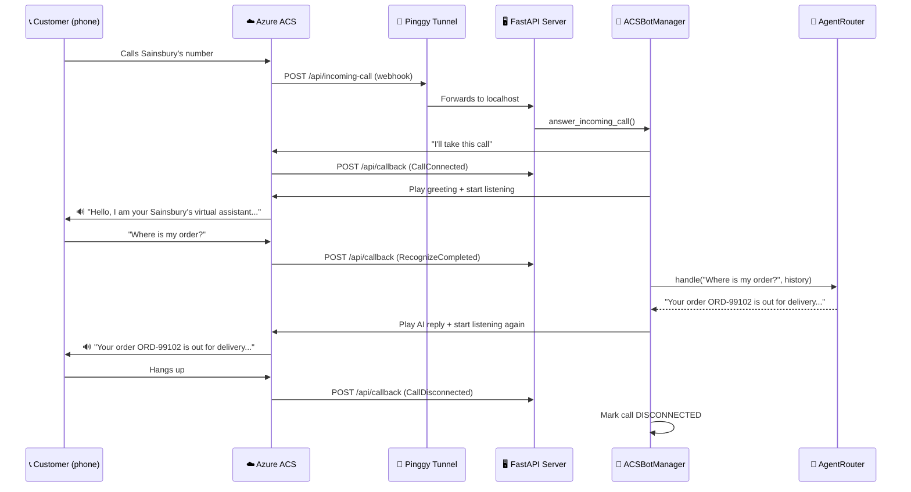
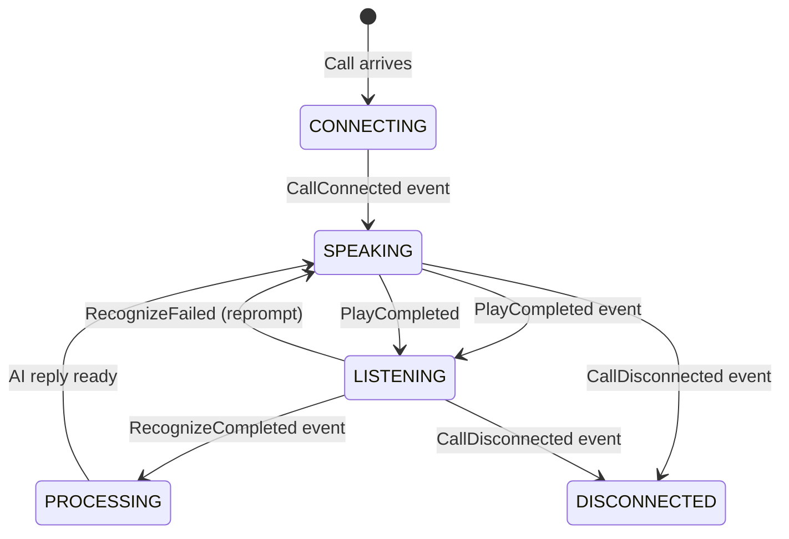

# `acs_bot.py` — Plain-English Explainer
> **For team presentation. Based entirely on the actual source code.**
> File: [`backend/services/acs_bot.py`](file:///c:/Projects/retail-chatbot/backend/services/acs_bot.py)

---

## What Is This File?

`acs_bot.py` makes the chatbot answer **real phone calls**.

When a customer calls Sainsbury's phone line, this file handles:
- Picking up the call
- Playing a greeting in a British AI voice
- Listening to what the customer says
- Passing that speech to the AI brain (`AgentRouter`)
- Speaking the AI's reply back to the caller
- Repeating this loop until the call ends

It uses **Azure Communication Services (ACS)** — Microsoft's cloud telephony platform — to manage the actual phone infrastructure.

---

## The Big Picture



---

## Part 1 — `sanitize_text_for_tts()` (Lines 14–36)

### What it does
Cleans up the AI's text reply so it sounds natural when spoken aloud.

The AI reply is written for a **screen** (markdown, emojis, product grids). This function strips all that out before handing it to the text-to-speech engine.

### Example — Before and After

**AI generated reply (for chat screen):**
```
**Your order ORD-99102** 🚚
• Estimated delivery: Today 2pm–4pm
• Driver: Mike
• Stop 3 of 12

<product-grid>[{"name":"Milk","price":1.40}]</product-grid>

Your customer ID is CUST-00421 — have a great day! 😊
```

**After `sanitize_text_for_tts()`:**
```
Your order is out for delivery. Estimated delivery: Today 2pm 4pm. Driver: Mike. Stop 3 of 12. Have a great day!
```

### Step-by-step cleanups (from the code):

| Step | What it removes | Code |
|---|---|---|
| 1 | `<product-grid>…</product-grid>` blocks | `re.sub(r'<product-grid>.*?</product-grid>', ...)` |
| 2 | All other HTML/XML tags | `re.sub(r'<[^>]+>', ...)` |
| 3 | Customer/Store IDs (`CUST-00421`, `STR-003`) | `re.sub(r'\bCUST-\d+\b', ...)` |
| 4 | Curly quotes → straight quotes | `.replace("'", "'")` |
| 5 | `**bold**`, `*italic*`, backticks | `.replace("**", "")` |
| 6 | `•` bullet points | `re.sub(r'^\s*[•\-*]\s*', ...)` |
| 7 | Emojis and non-ASCII | `re.sub(r'[^\x00-\x7F]+', ' ', ...)` |
| 8 | Extra whitespace | `re.sub(r'\s+', ' ', ...).strip()` |

---

## Part 2 — `ACSBotManager` Class (Lines 38–295)

This is the **main class**. One instance is created when the server starts and lives for the lifetime of the app.

### `__init__()` — Startup (Lines 39–64)

What happens when the server boots:

```python
self.active_calls = {}   # In-memory store of all live call sessions
self.connection_string   # Read from .env → ACS_CONNECTION_STRING
self.public_callback_url # Read from .env → PUBLIC_CALLBACK_URL (Pinggy tunnel)
```

Then it creates two Azure clients:
- `CallAutomationClient` — controls calls (play audio, listen, hang up)
- `CommunicationIdentityClient` — manages user identities for VOIP

It also creates or loads a **Bot Identity** — a unique ACS user ID that represents the AI bot in a call. This is how ACS knows which participant is the bot vs. the human caller.

```
Bot Identity Example: 8:acs:a1fb0563-..._0000001a-1234-abcd-9876-xyz...
```

---

### `get_token_for_user()` — VOIP Token (Lines 66–85)

**Who calls it:** `GET /api/token` endpoint in `main.py` — called by the **browser** when the user clicks the 📞 call button in the chat widget.

**What it does:** Issues a short-lived ACS access token so the browser can join a VOIP call directly.

```python
# Returns this JSON to the browser:
{
  "token": "eyJhbGciOiJSUzI1NiI...",   # 24-hour VOIP token
  "user_id": "8:acs:..._00001a-...",   # New identity for this browser user
  "bot_user_id": "8:acs:..._00001b-...", # The bot's identity
  "expires_on": "2026-07-03T07:30:00"
}
```

The browser uses `@azure/communication-calling` SDK with this token to place the VOIP call directly into ACS.

---

### `answer_incoming_call()` — Pick Up the Phone (Lines 87–108)

**Who calls it:** `POST /api/incoming-call` endpoint — triggered by ACS when a PSTN/VOIP call arrives.

**What it does:** Tells ACS to connect the call and instructs it to send all future call events to our webhook URL.

```python
callback_uri = "https://hwfro-20-244-46-127.run.pinggy-free.link/api/callback"

self.call_automation_client.answer_call(
    incoming_call_context = "<token from ACS event>",
    callback_url = callback_uri,                 # "Send me all events here"
    cognitive_services_endpoint = "https://retail-ai-poc-services.cognitiveservices.azure.com/"
)
```

> **Why the Pinggy tunnel?** The server runs locally (`localhost:8000`). ACS is a cloud service — it can't reach `localhost`. Pinggy creates a public URL that forwards to localhost. This is the `PUBLIC_CALLBACK_URL` in `.env`.

---

### `handle_callback_events()` — The Main Event Loop (Lines 110–241)

This is the **heart** of the file. Every time something happens on the call, ACS posts a webhook event here.

The method loops through events and reacts to each one:

#### Event 1: `Microsoft.Communication.CallConnected`

> **Translation:** "The call is now connected."

```python
greeting_text = "Hello, I am your Sainsbury's virtual assistant. How can I help you today?"

# Store this in call history
self.active_calls[server_call_id]["history"] = [
    {"role": "assistant", "content": greeting_text}
]
self.active_calls[server_call_id]["status"] = "SPEAKING"

# Play greeting AND start listening at the same time
await self._speak_and_recognize(call_connection_client, text=greeting_text)
```

---

#### Event 2: `Microsoft.Communication.RecognizeCompleted`

> **Translation:** "The customer finished speaking. Here is what they said."

This is the **busiest event** — it's the full AI turn cycle:

```python
# Step 1: Extract what the customer said
speech_text = event_data["speechResult"]["speech"]
# Example: "Where is my delivery for order 99102?"

# Step 2: Mark status as PROCESSING
self.active_calls[server_call_id]["status"] = "PROCESSING"

# Step 3: Send to AgentRouter with full call history
history = self.active_calls[server_call_id]["history"]
result = await agent_router.handle(
    message = "Where is my delivery for order 99102?",
    history = history,       # All previous turns in this call
    is_voice = True          # Fast path — short replies, no markdown
)
reply_text = result["reply"]
# Example reply: "Your order is currently on stop 3 of 12. Expected delivery is between 2 and 4 PM today."

# Step 4: Save the exchange to call history
history.append({"role": "user",      "content": "Where is my delivery for order 99102?"})
history.append({"role": "assistant", "content": reply_text})

# Step 5: Sanitize for TTS (strips markdown/emojis)
tts_text = sanitize_text_for_tts(reply_text)

# Step 6: Speak the reply and listen for the next turn
await self._speak_and_recognize(call_connection_client, text=tts_text)
```

---

#### Event 3: `Microsoft.Communication.RecognizeFailed`

> **Translation:** "We couldn't hear what the customer said" (background noise, silence, audio issue).

```python
reprompt_text = "I'm sorry, I didn't catch that. Could you repeat it?"
await self._speak_and_recognize(call_connection_client, text=reprompt_text)
```

The bot politely asks again and re-starts the listener.

---

#### Event 4: `PlayCompleted` / `PlayFailed`

> **Translation:** "The bot finished speaking."

```python
self.active_calls[server_call_id]["status"] = "LISTENING"
```

Just updates the status. The listener was already started alongside the playback in `_speak_and_recognize`.

---

#### Event 5: `Microsoft.Communication.CallDisconnected`

> **Translation:** "The customer hung up."

```python
self.active_calls[server_call_id]["status"] = "DISCONNECTED"
```

Marks the call as ended. The conversation history is retained in memory (until server restart).

---

### `_speak_and_recognize()` — Play + Listen (Lines 243–295)

This is called every turn to **simultaneously play audio to the caller and start the speech listener**. This is how barge-in works (caller can interrupt the bot mid-sentence).

**Step 1: Find the caller**
The method gets the call's participant list and filters out the bot itself:

```python
for target in props.targets:
    if target.id != self.bot_user_id:   # "Is this NOT the bot?"
        caller = target                  # This is the human caller
        break
```

There are 3 fallback strategies to locate the caller (targets → call_source → list_participants).

**Step 2: Play audio + start listener**
```python
play_prompt = TextSource(
    text  = "Your order is on stop 3 of 12...",
    voice_name = "en-GB-SoniaNeural"   # British female neural voice
)

call_connection_client.start_recognizing_media(
    input_type           = RecognizeInputType.SPEECH,
    target_participant   = caller,
    play_prompt          = play_prompt,   # Play this while also listening
    interrupt_prompt     = True,           # Caller can speak to interrupt the bot
    speech_language      = "en-GB",
    initial_silence_timeout = 10,          # Wait 10s for caller to start speaking
    end_silence_timeout     = 2            # Stop listening after 2s of silence
)
```

> **Key design:** `start_recognizing_media` does **both things at once** — it plays the prompt to the caller while simultaneously activating speech recognition. This means the caller can interrupt the bot at any time (barge-in). When they do, ACS fires `RecognizeFailed` or a new `RecognizeCompleted` event immediately.

---

## Part 3 — The `active_calls` State Dictionary

This is the in-memory state store. Every live call has an entry keyed by `serverCallId`.

```python
self.active_calls = {
    "serverCallId-abc-123": {
        "status":          "LISTENING",   # CONNECTING → SPEAKING → LISTENING → PROCESSING → DISCONNECTED
        "user_transcript": "Where is my delivery?",
        "ai_response":     "Your order is on stop 3 of 12...",
        "intent":          "delivery",
        "suggestions":     ["Track on map", "Change slot"],
        "history": [
            {"role": "assistant", "content": "Hello, I am your Sainsbury's virtual assistant..."},
            {"role": "user",      "content": "Where is my delivery?"},
            {"role": "assistant", "content": "Your order is on stop 3..."},
        ]
    }
}
```

This state is **polled by the frontend** via `GET /api/call-status?server_call_id=serverCallId-abc-123` so the chat widget UI can show a live transcript of the phone call as it happens.

### Status State Machine



---

## Part 4 — Complete Real-World Example

> **Scenario:** Jamie calls the Sainsbury's line to ask where her delivery is, then asks about a refund.

### What happens, event by event:

```
📞 Jamie dials 0800-SAINSBURYS
```

**1. ACS fires → `POST /api/incoming-call`**
```python
# main.py calls:
await acs_bot_manager.answer_incoming_call(incoming_call_context)
# ACS is now told to send all events to: https://pinggy-tunnel.../api/callback
```

**2. ACS fires → `POST /api/callback` with type `CallConnected`**
```python
# active_calls["sid-1"] created:
{ "status": "CONNECTING" → "SPEAKING", "history": [] }

# Bot plays:
"Hello, I am your Sainsbury's virtual assistant. How can I help you today?"
# + starts listening
```

**3. Jamie says: "Where is my delivery for order 99102?"**

**4. ACS fires → `POST /api/callback` with type `RecognizeCompleted`**
```python
speech_text = "Where is my delivery for order 99102?"
# status → PROCESSING

result = await agent_router.handle(
    message  = "Where is my delivery for order 99102?",
    history  = [{"role": "assistant", "content": "Hello..."}],
    is_voice = True
)
# AI replies:
reply_text = "Your order is currently on stop 3 of 12. Your driver Mike is on his way. Expected between 2 and 4 PM."

# sanitize_text_for_tts removes any markdown/emojis
tts_text = "Your order is currently on stop 3 of 12. Your driver Mike is on his way. Expected between 2 and 4 PM."

# history now:
[
  {"role": "assistant", "content": "Hello, I am your Sainsbury's virtual assistant..."},
  {"role": "user",      "content": "Where is my delivery for order 99102?"},
  {"role": "assistant", "content": "Your order is currently on stop 3 of 12..."},
]

# Bot plays reply + starts listening
```

**5. Jamie says: "And what about my refund?"**

**6. ACS fires → `POST /api/callback` with type `RecognizeCompleted`**
```python
speech_text = "And what about my refund?"

# The FULL history (3 turns) is sent to the AI
result = await agent_router.handle(
    message  = "And what about my refund?",
    history  = [...all 3 previous turns...],  # ← Context memory!
    is_voice = True
)
# AI knows this is about Jamie's order from context
reply_text = "Your refund of 14 pounds 99 for order 97830 was processed on the 28th of June..."
```

**7. Jamie hangs up**

**8. ACS fires → `POST /api/callback` with type `CallDisconnected`**
```python
active_calls["sid-1"]["status"] = "DISCONNECTED"
```

---

## Part 5 — Quick Summary Card

| Question | Answer |
|---|---|
| **What does the file do?** | Manages the full lifecycle of an AI phone call |
| **What Azure service?** | Azure Communication Services (Call Automation) |
| **What voice?** | `en-GB-SoniaNeural` — British Neural TTS |
| **How does the bot hear speech?** | ACS Speech Recognition (not our server — Azure does it) |
| **Where does the AI logic live?** | `AgentRouter.handle()` in `router.py` |
| **How is call state tracked?** | `active_calls{}` dict — one entry per live call |
| **Can caller interrupt the bot?** | Yes — `interrupt_prompt=True` enables barge-in |
| **How does the UI show live transcript?** | `GET /api/call-status` polls `active_calls` |
| **Why Pinggy tunnel?** | ACS needs a public URL to send webhook events to our local server |
| **What if speech fails?** | Bot reprompts: "I didn't catch that, could you repeat?" |
| **Can the bot remember context?** | Yes — full conversation `history` is maintained per call |

---

## Part 6 — Key Files Referenced

| File | Role |
|---|---|
| [`backend/services/acs_bot.py`](file:///c:/Projects/retail-chatbot/backend/services/acs_bot.py) | This file — call lifecycle management |
| [`backend/main.py`](file:///c:/Projects/retail-chatbot/backend/main.py) | Defines `/api/incoming-call` and `/api/callback` routes |
| [`backend/agents/router.py`](file:///c:/Projects/retail-chatbot/backend/agents/router.py) | AI brain called by `handle_callback_events` |
| [`.env`](file:///c:/Projects/retail-chatbot/.env) | `ACS_CONNECTION_STRING`, `PUBLIC_CALLBACK_URL`, `COGNITIVE_SERVICES_ENDPOINT` |
| [`frontend/js/app.js`](file:///c:/Projects/retail-chatbot/frontend/js/app.js) | Browser VOIP call mode using `@azure/communication-calling` |
