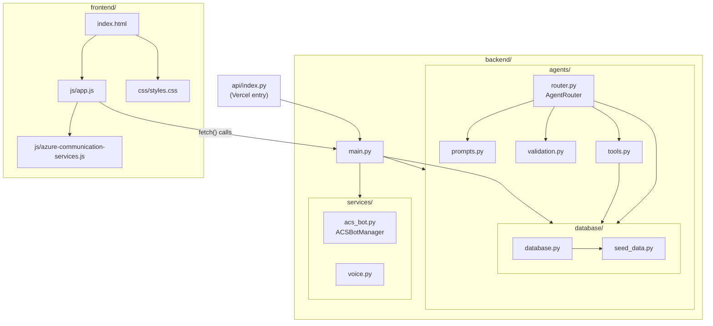
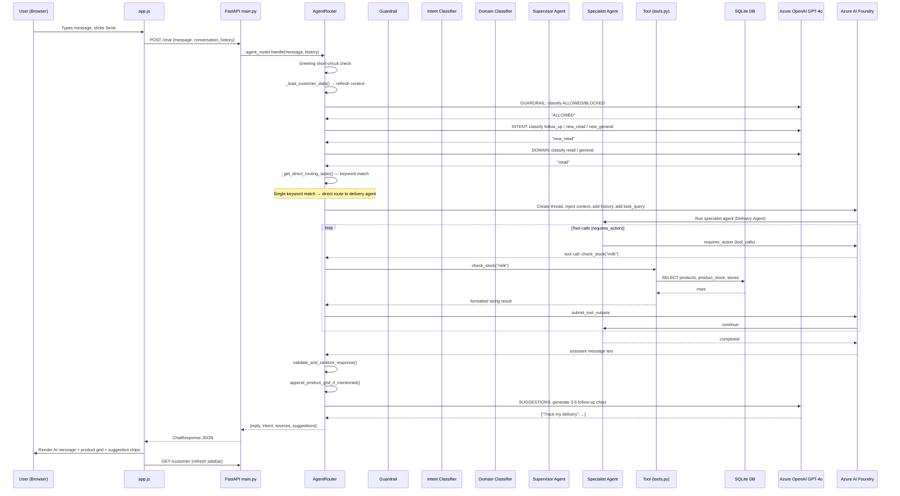
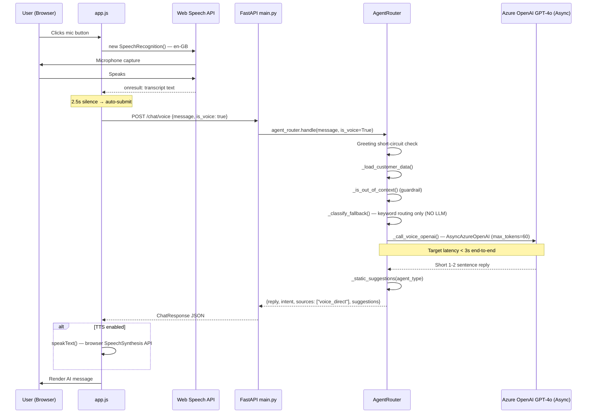
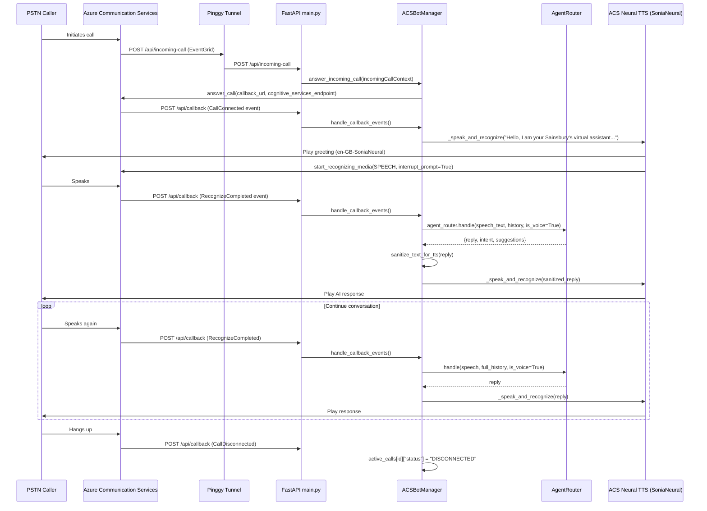
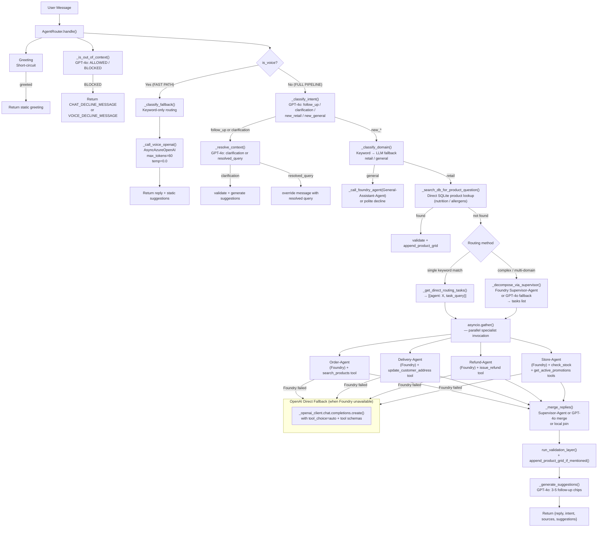
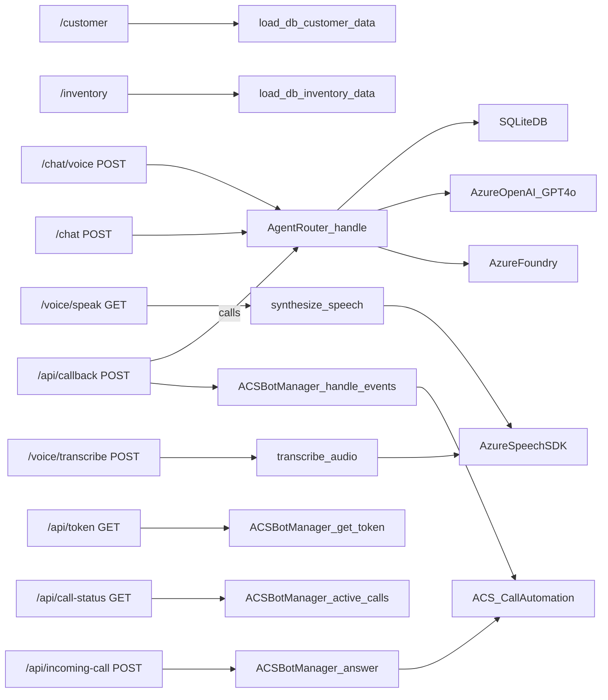
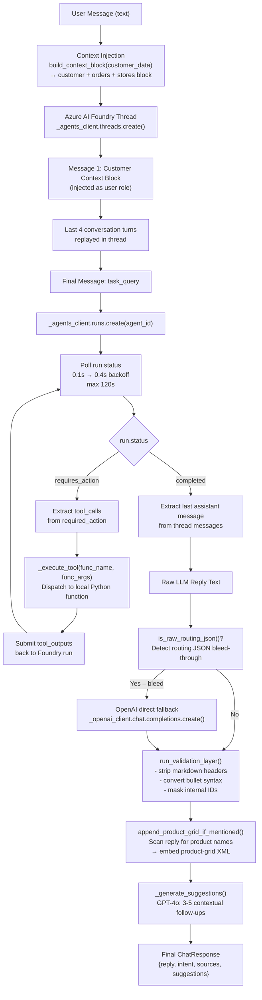
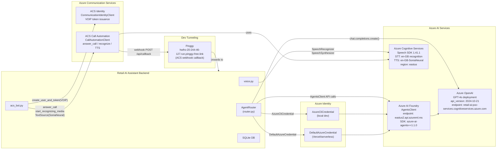
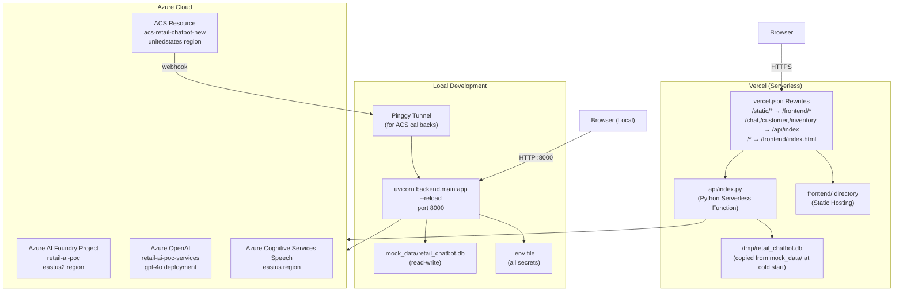

# Retail AI Assistant — Complete Architecture Document

> **Reverse-engineered exclusively from source code. Every component is traced to actual files.**
> Files referenced: `backend/main.py`, `backend/agents/router.py`, `backend/agents/tools.py`, `backend/agents/prompts.py`, `backend/agents/validation.py`, `backend/database/database.py`, `backend/services/acs_bot.py`, `backend/services/voice.py`, `frontend/js/app.js`, `frontend/index.html`, `vercel.json`, `.env`, `requirements.txt`

---

## 1. Executive Summary

The **Retail AI Assistant** is a Sainsbury's-branded customer service chatbot with dual interaction modes: **text chat** and **live phone call (Voice)**. It is built on a Python FastAPI backend that orchestrates a multi-agent system via **Azure AI Foundry**, falling back to direct **Azure OpenAI (GPT-4o)** calls when Foundry agents are unavailable.

The system routes each user query through a 9-step pipeline — intent classification → domain classification → supervisor decomposition → parallel specialist agent invocation → reply merging → validation → suggestion generation — before returning a structured JSON response to the browser.

Voice is handled by two separate paths:
- **Browser microphone → WAV → `/voice/transcribe`** (Web Speech API + Azure Cognitive Services Speech SDK)
- **PSTN phone call → Azure Communication Services (ACS) Call Automation → Agent Router** (real-time TTS with `en-GB-SoniaNeural`)

Data is persisted in a **single-user SQLite database** (`mock_data/retail_chatbot.db`) seeded from Python dicts (`backend/database/seed_data.py`). The app is deployable either locally (FastAPI + uvicorn) or serverlessly to **Vercel** (via `api/index.py`).

---

## 2. Technology Stack

| Layer | Technology | Source |
|---|---|---|
| Frontend | Vanilla HTML/CSS/JS (no framework) | `frontend/index.html`, `frontend/js/app.js`, `frontend/css/styles.css` |
| Backend Framework | FastAPI 0.115.5 + Uvicorn 0.32.1 | `requirements.txt` |
| AI Orchestration | Azure AI Foundry (`azure-ai-agents==1.1.0`) | `backend/agents/router.py` L13 |
| LLM | Azure OpenAI GPT-4o (`openai` package) | `backend/agents/router.py` L12 |
| Authentication | AzureCliCredential / DefaultAzureCredential | `backend/agents/router.py` L14 |
| Voice STT | Azure Cognitive Services Speech SDK 1.41.1 | `backend/services/voice.py` |
| Voice TTS | Azure Neural Voice `en-GB-SoniaNeural` | `backend/services/voice.py` L84, `backend/services/acs_bot.py` L279 |
| Phone Calls | Azure Communication Services (ACS) Call Automation | `backend/services/acs_bot.py` |
| ACS Identity | `azure-communication-identity` | `backend/services/acs_bot.py` L4 |
| Database | SQLite (single-user) | `backend/database/database.py` |
| Environment Config | `python-dotenv` | `backend/main.py` L11 |
| Deployment | Vercel (serverless) | `vercel.json`, `api/index.py` |
| Tunneling (dev) | Pinggy (for ACS callbacks) | `.env` L59 |
| Frontend ACS SDK | `@azure/communication-calling` v1.23.0 | `frontend/package.json` |

---

## 3. Repository Structure

```
retail-chatbot/
├── .env                          # All secrets and configuration
├── vercel.json                   # Vercel routing rewrites
├── requirements.txt              # Python dependencies
├── api/
│   └── index.py                  # Vercel serverless entry point (imports backend/main.py)
├── backend/
│   ├── main.py                   # FastAPI app: all routes, CORS, static files, singleton wiring
│   ├── agents/
│   │   ├── __init__.py           # exports AgentRouter
│   │   ├── router.py             # AgentRouter class: full orchestration (1604 lines)
│   │   ├── tools.py              # Database tool functions (check_stock, search_products, etc.)
│   │   ├── prompts.py            # All LLM system prompts
│   │   └── validation.py        # Response sanitization, markdown cleanup
│   ├── database/
│   │   ├── __init__.py           # exports init_db, seed_db, load_db_*
│   │   ├── database.py           # SQLite DDL, CRUD, load/save functions (822 lines)
│   │   └── seed_data.py          # Static seed data (CUSTOMER_SEED, INVENTORY_SEED)
│   └── services/
│       ├── __init__.py           # exports transcribe_audio, synthesize_speech, ACSBotManager
│       ├── voice.py              # Azure Speech SDK: transcribe_audio(), synthesize_speech()
│       └── acs_bot.py            # ACSBotManager: Call Automation webhook handler
├── frontend/
│   ├── index.html                # Single-page app (~87KB, all UI components inline)
│   ├── css/
│   │   └── styles.css            # All CSS (~39KB)
│   └── js/
│       ├── app.js                # All frontend JS (1821 lines)
│       ├── azure-sdk.js          # ACS SDK shimming (263B)
│       └── azure-communication-services.js  # Bundled ACS SDK (~5.5MB)
└── mock_data/
    ├── retail_chatbot.db         # SQLite database (seeded at startup)
    └── test_results.json         # Test runner output
```

---

## 4. High-Level Architecture Diagram

```mermaid
flowchart LR
    User["👤 User\n(Browser)"]
    Phone["📞 PSTN Caller"]

    subgraph Frontend["Frontend (Vanilla JS SPA)"]
        UI["index.html + app.js"]
        WSA["Web Speech API\n(STT)"]
    end

    subgraph Backend["Backend (FastAPI / Uvicorn)"]
        Main["main.py\nFastAPI App"]
        AgentRouter["AgentRouter\n(router.py)"]
        
        subgraph Pipeline["Orchestration Pipeline"]
            Guardrail["Guardrail Check\n_is_out_of_context()"]
            IntentClassifier["Intent Classifier\n_classify_intent()"]
            DomainClassifier["Domain Classifier\n_classify_domain()"]
            ContextResolver["Context Resolver\n_resolve_context()"]
            Supervisor["Supervisor Router\n_decompose_via_supervisor()"]
            Validator["Validator\nrun_validation_layer()"]
        end

        subgraph Agents["Azure AI Foundry Agents"]
            OrderAgent["Order-Agent"]
            DeliveryAgent["Delivery-Agent"]
            RefundAgent["Refund-Agent"]
            StoreAgent["Store-Agent"]
            GeneralAgent["General-Assistant-Agent"]
            SupervisorAgent["Supervisor-Agent"]
        end

        subgraph Tools["Local Tool Functions (tools.py)"]
            CheckStock["check_stock()"]
            SearchProducts["search_products()"]
            GetPromotions["get_active_promotions()"]
            IssueRefund["issue_refund()"]
            UpdateAddress["update_customer_address()"]
        end

        VoiceService["voice.py\ntranscribe_audio()\nsynthesize_speech()"]
        ACSBot["acs_bot.py\nACSBotManager"]
    end

    subgraph Database["SQLite Database"]
        DB[("retail_chatbot.db")]
    end

    subgraph Azure["Azure Services"]
        AzureOpenAI["Azure OpenAI\nGPT-4o\n(api_version: 2024-10-21)"]
        AzureFoundry["Azure AI Foundry\nAgentsClient"]
        AzureSpeech["Azure Cognitive Services\nSpeech SDK"]
        ACS["Azure Communication Services\nCall Automation + Identity"]
    end

    User -->|"HTTP/WebSocket"| UI
    UI -->|"POST /chat"| Main
    UI -->|"POST /voice/transcribe"| Main
    UI -->|"GET /voice/speak"| Main
    UI -->|"GET /customer"| Main
    UI -->|"GET /api/token"| Main
    Phone -->|"PSTN"| ACS

    Main --> AgentRouter
    Main --> VoiceService
    Main --> ACSBot

    AgentRouter --> Guardrail --> IntentClassifier --> DomainClassifier
    DomainClassifier --> ContextResolver
    DomainClassifier --> Supervisor
    Supervisor --> OrderAgent & DeliveryAgent & RefundAgent & StoreAgent & GeneralAgent

    OrderAgent & DeliveryAgent & RefundAgent & StoreAgent --> Tools
    Tools --> DB

    AgentRouter --> Validator

    AgentRouter -->|"Direct fallback"| AzureOpenAI
    Agents -->|"Foundry run"| AzureFoundry
    AzureFoundry --> AzureOpenAI

    VoiceService --> AzureSpeech
    ACSBot --> ACS
    ACSBot -->|"handle_callback"| AgentRouter

    AgentRouter --> DB
```



---

## 5. Folder Dependency Diagram



---

## 6. Request Lifecycle Diagram (Chat Path)



---

## 7. Voice Path — Request Lifecycle



---

## 8. Phone Call (ACS) — Request Lifecycle



---

## 9. AI Agent Architecture



---

## 10. API Architecture

All routes are defined in [`backend/main.py`](file:///c:/Projects/retail-chatbot/backend/main.py).

### Endpoint Inventory

| Route | Method | Controller | Service/Module | Response Model |
|---|---|---|---|---|
| `/` | GET | `serve_frontend()` | `StaticFiles` | `FileResponse(index.html)` |
| `/health` | GET | `health()` | — | `{"status": "ok"}` |
| `/customer` | GET | `get_customer()` | `database.load_db_customer_data()` | Customer dict |
| `/inventory` | GET | `get_inventory()` | `database.load_db_inventory_data()` | Inventory dict |
| `/chat` | POST | `chat()` | `AgentRouter.handle()` | `ChatResponse` |
| `/chat/voice` | POST | `chat_voice()` | `AgentRouter.handle(is_voice=True)` | `ChatResponse` |
| `/voice/transcribe` | POST | `voice_transcribe()` | `transcribe_audio()` | `TranscribeResponse` |
| `/voice/speak` | GET | `voice_speak(text)` | `synthesize_speech()` | `audio/wav` bytes |
| `/api/token` | GET | `get_token()` | `ACSBotManager.get_token_for_user()` | ACS token dict |
| `/api/call-status` | GET | `get_call_status(server_call_id)` | `ACSBotManager.active_calls` | Call status dict |
| `/api/incoming-call` | POST | `incoming_call()` | `ACSBotManager.answer_incoming_call()` | `{"status"}` |
| `/api/callback` | POST | `call_callback()` | `ACSBotManager.handle_callback_events()` | `{"status": "ok"}` |
| `/api/save_results` | POST | `save_results()` | file write | `{"status": "success"}` |
| `/static/*` | GET | StaticFiles mount | `frontend/` directory | Static assets |

### API Dependency Diagram



---

## 11. Database ER Diagram

```mermaid
erDiagram
    customer {
        TEXT id PK
        TEXT name
        TEXT email
        TEXT phone
        TEXT loyalty_tier
        INTEGER loyalty_points
        TEXT registered_since
        TEXT address_line1
        TEXT address_city
        TEXT address_postcode
        TEXT address_country
    }

    orders {
        TEXT order_id PK
        TEXT customer_id FK
        TEXT date
        TEXT status
        REAL total
        TEXT payment_method
        TEXT delivery_method
        TEXT delivery_slot
        TEXT delivery_delivered_at
        TEXT delivery_driver
        INTEGER delivery_current_stop
        INTEGER delivery_total_stops
        TEXT delivery_eta
        TEXT delivery_live_tracking_url
        TEXT delivery_store
        TEXT collected_at
    }

    order_items {
        INTEGER id PK
        TEXT order_id FK
        TEXT name
        INTEGER qty
        REAL price
    }

    refunds {
        TEXT order_id PK_FK
        TEXT reason
        TEXT requested_on
        REAL amount
        TEXT status
        TEXT method
        TEXT completed_on
        TEXT reference
    }

    stores {
        TEXT id PK
        TEXT name
        TEXT address
        REAL lat
        REAL lng
        TEXT type
        TEXT phone
        TEXT opening_hours
    }

    products {
        TEXT id PK
        TEXT name
        TEXT description
        REAL price
        TEXT category
        TEXT subcategory
        TEXT brand
        TEXT sku
        TEXT barcode
        TEXT aisle
        TEXT allergens
        TEXT nutritional_info
        TEXT tags
        INTEGER is_on_promotion
        TEXT discount
        REAL customer_rating
        INTEGER review_count
        INTEGER best_seller
        INTEGER store_recommended
        INTEGER vegan
        INTEGER gluten_free
        INTEGER organic
        INTEGER high_protein
        TEXT diet_tags
        INTEGER popularity_score
    }

    product_stock {
        TEXT product_id PK_FK
        TEXT store_id PK_FK
        INTEGER quantity
    }

    promotions {
        TEXT offer_id PK
        TEXT offer_name
        TEXT discount
        TEXT applicable_categories
        TEXT applicable_products
        TEXT coupon_code
        TEXT expiry
        TEXT loyalty_requirement
        INTEGER offer_priority
    }

    customer ||--o{ orders : "places"
    orders ||--|{ order_items : "contains"
    orders ||--o| refunds : "may have"
    products ||--o{ product_stock : "stocked at"
    stores ||--o{ product_stock : "holds"
```

---

## 12. AI Processing Flow



---

## 13. External Integrations Diagram



---

## 14. Deployment Architecture



**Environment Variables (from `.env`):**

| Variable | Purpose | Verified Source |
|---|---|---|
| `AZURE_AI_FOUNDRY_API_KEY` | Foundry API auth key | `.env` L5 |
| `AZURE_TENANT_ID` | Azure tenant for AzureCliCredential | `.env` L9 |
| `AZURE_AI_FOUNDRY_PROJECT_ENDPOINT` | AgentsClient endpoint | `.env` L13 |
| `AZURE_OPENAI_ENDPOINT` | AzureOpenAI base URL | `.env` L17 |
| `AZURE_AI_FOUNDRY_DEPLOYMENT_NAME` | GPT-4o deployment name | `.env` L23 |
| `AZURE_AGENT_ORDER_NAME` | Foundry agent name → resolved to `asst_*` ID | `.env` L38 |
| `AZURE_AGENT_REFUND_NAME` | Foundry agent name | `.env` L39 |
| `AZURE_AGENT_DELIVERY_NAME` | Foundry agent name | `.env` L40 |
| `AZURE_AGENT_STORE_NAME` | Foundry agent name | `.env` L41 |
| `AZURE_AGENT_SUPERVISOR_NAME` | Foundry agent name | `.env` L42 |
| `AZURE_AGENT_GENERAL_NAME` | Foundry agent name | `.env` L43 |
| `AZURE_SPEECH_KEY` | Azure Cognitive Services speech key | `.env` L49 |
| `AZURE_SPEECH_REGION` | Speech region (`eastus`) | `.env` L50 |
| `CORS_ORIGIN` | CORS allowed origin | `.env` L55 |
| `ACS_CONNECTION_STRING` | ACS resource connection string | `.env` L58 |
| `PUBLIC_CALLBACK_URL` | Pinggy tunnel URL for ACS webhooks | `.env` L59 |
| `COGNITIVE_SERVICES_ENDPOINT` | Cognitive Services endpoint for ACS call | `.env` L60 |

---

## 15. Component Interaction Matrix

| Component | Uses | Called By | Purpose |
|---|---|---|---|
| `frontend/js/app.js` | `/chat`, `/customer`, `/voice/transcribe`, `/voice/speak`, `/api/token`, `/api/call-status` endpoints; Web Speech API; browser SpeechSynthesis | User browser | Full UI logic: chat, voice, phone call mode, sidebar, product grid rendering |
| `backend/main.py` | `AgentRouter`, `ACSBotManager`, `transcribe_audio`, `synthesize_speech`, `load_db_customer_data`, `load_db_inventory_data` | HTTP requests from frontend; ACS EventGrid webhooks | FastAPI app, route definitions, singleton wiring |
| `backend/agents/router.py` (AgentRouter) | `AzureOpenAI`, `AsyncAzureOpenAI`, `AgentsClient`, `database.*`, `prompts.*`, `validation.*`, `tools.*` | `main.py` chat endpoints; `acs_bot.py` callback handler | Core orchestration: 9-step pipeline, intent/domain classification, agent routing, merging, validation, suggestions |
| `backend/agents/tools.py` | `database.load_db_inventory_data()`, `database.load_db_customer_data()`, `database.save_db_customer_data()`, `database.get_connection()` | `AgentRouter._execute_tool()` | Database-backed tool implementations dispatched by Foundry tool calls |
| `backend/agents/prompts.py` | — (pure constants/functions) | `AgentRouter` | All LLM system prompts (domain, intent, context resolver, supervisor, merge, suggestions, voice, guardrail) |
| `backend/agents/validation.py` | — | `AgentRouter._run_validation_layer()`, `AgentRouter._is_raw_routing_json()` | Response sanitization: strip markdown, mask IDs, detect routing JSON bleed |
| `backend/database/database.py` | `sqlite3`, `seed_data.py` | `AgentRouter`, `main.py`, `tools.py` | SQLite DDL, seed, CRUD for customer/orders/products/stores/promotions |
| `backend/database/seed_data.py` | — | `database.seed_db()` | Static Python dicts with demo customer, orders, and inventory data |
| `backend/services/voice.py` | `azure.cognitiveservices.speech` SDK | `main.py` (`/voice/transcribe`, `/voice/speak`) | STT: WAV → transcript; TTS: text → WAV bytes |
| `backend/services/acs_bot.py` (ACSBotManager) | `azure.communication.identity`, `azure.communication.callautomation`, `AgentRouter` | `main.py` (`/api/token`, `/api/incoming-call`, `/api/callback`) | Phone call lifecycle: answer, speak+recognize loop, conversation history, TTS sanitization |
| `api/index.py` | `backend.main.app` | Vercel serverless runtime | Vercel entry point — exposes FastAPI app as a serverless function |
| `Azure AI Foundry` | Azure OpenAI GPT-4o | `AgentRouter._call_foundry_agent()`, `AgentRouter._decompose_via_supervisor()` | Runs specialist agents (Order, Delivery, Refund, Store, General, Supervisor) with injected context and tools |
| `Azure OpenAI GPT-4o` | — | `AgentRouter` (direct client for classification + fallback), `Azure AI Foundry` | Domain/intent classification, context resolution, suggestions, voice replies, fallback agent responses |
| `Azure Cognitive Services Speech` | — | `voice.py`, `acs_bot.py` | STT en-GB recognition, TTS en-GB-SoniaNeural synthesis |
| `Azure Communication Services` | Azure Cognitive Services (for TTS in calls) | `acs_bot.py` | PSTN call answering, Call Automation, VOIP token issuance |
| `SQLite DB` | — | `database.py` | Persistence: customer profile, orders, items, refunds, products, stores, promotions, stock |

---

## 16. Execution Trace — "Where is my delivery?"

A complete function-level trace of a real retail query through all layers.

```
User types: "Where is my delivery for order ORD-99102?"
↓
[frontend/js/app.js] sendFromInput() → sendMessage("Where is my delivery...")
  └── fetch(`${API_BASE}/chat`, {method: "POST", body: {...}})
↓
[backend/main.py] chat(request: ChatRequest)
  └── agent_router.handle(message, history, is_voice=False)
↓
[backend/agents/router.py] AgentRouter.handle()
  ├── cleaned_msg check → not a greeting
  ├── _load_customer_data() → load_db_customer_data() → SQLite SELECT
  ├── build_context_block(customer_data) → formatted context string
  ├── _is_out_of_context("Where is my delivery...") 
  │     └── openai_client.chat.completions.create(GUARDRAIL_SYSTEM_PROMPT) → "ALLOWED"
  ├── _classify_intent("Where is my delivery...", history)
  │     └── no assistant history → _classify_domain() → keyword "delivery" matches _RETAIL_KEYWORDS → "retail"
  │     └── returns "new_retail"
  ├── is_follow_up = False
  ├── _classify_domain(...) → keyword "delivery" in _RETAIL_KEYWORDS → "retail"
  ├── _search_db_for_product_question() → no product info signal → returns None
  ├── _get_direct_routing_tasks("Where is my delivery for order ORD-99102?")
  │     └── text.lower() → "delivery" matches _DIRECT_ROUTING_KEYWORDS["delivery"]
  │     └── matched_agents = ["delivery"] (single match)
  │     └── returns [{"agent": "delivery", "task_query": "Where is my delivery..."}]
  ├── tasks = [{"agent": "delivery", "task_query": "Where is my delivery..."}]
  ├── call_agent(task) via asyncio.gather()
  │   └── agent_id = self._agent_ids["delivery"]  (resolved at startup from Foundry)
  │   └── _call_foundry_agent(agent_id, context, "Where is my delivery...", history)
  │       ├── _agents_client.threads.create() → thread_id
  │       ├── _agents_client.messages.create(thread_id, role="user", content=context)
  │       ├── _agents_client.messages.create(thread_id, role="user", content=task_query)
  │       ├── _agents_client.runs.create(thread_id, agent_id) → run
  │       ├── Poll loop (0.1s → 0.4s backoff):
  │       │     └── run.status == "completed" (no tool calls for this query)
  │       └── Extract assistant reply from messages.list(thread_id)
  │           → "Your delivery for order ORD-99102 is currently on stop 3 of 12..."
  ├── merged = replies[0]  (single agent, no merge needed)
  ├── run_validation_layer(message, merged)
  │     └── validate_and_sanitize_response() → strip any markdown headers, mask IDs
  ├── append_product_grid_if_mentioned(validated)
  │     └── scan reply for product names → none mentioned → reply unchanged
  ├── _generate_suggestions("Where is my delivery...", reply, "delivery", history)
  │     └── openai_client.chat.completions.create(SUGGESTIONS_SYSTEM_PROMPT) 
  │     → ["Track delivery on map", "Change delivery slot", "Contact driver", ...]
  └── return {"reply": "...", "intent": "delivery", "sources": ["delivery_agent"], "suggestions": [...]}
↓
[backend/main.py] return ChatResponse(reply, intent, sources, suggestions)
↓
[frontend/js/app.js] response.json() → data
  ├── appendAIMessage(data.reply, data.intent, data.suggestions)
  │     └── formatAIText() → parse product-grid XML, render bullet lists
  │     └── render suggestion chips
  └── fetchCustomerData() → GET /customer → refresh sidebar
```

---

## 17. Architecture Review

### 17.1 Tight Coupling Issues

| Finding | Location | Evidence |
|---|---|---|
| **AgentRouter holds everything** | `router.py` (1604 lines) | Domain classification, intent classification, context resolution, Foundry orchestration, tool dispatch, voice path, suggestions, validation delegation — all in one class. Single Responsibility Principle is violated. |
| **Tool functions bound as class methods via assignment** | `router.py` L134–139 | `check_stock = check_stock` from `tools.py` assigned at class body level. Functions in `tools.py` accept `self` as first arg but are not defined inside the class. Unusual pattern that breaks type checking and IDE navigation. |
| **`database` imported inside functions** | `tools.py` L92, L493, `router.py` L391 | `from database import ...` inside function bodies avoids circular imports but hides the dependency and prevents static analysis. |
| **ACSBotManager holds agent_router reference** | `acs_bot.py` L182 | `agent_router.handle()` called inside the ACS callback handler. The service layer directly calls the orchestration layer — coupling in the wrong direction. |

### 17.2 Duplicate Logic

| Finding | Location |
|---|---|
| Keyword lists duplicated across `_RETAIL_KEYWORDS`, `_GENERAL_KEYWORDS`, `_DIRECT_ROUTING_KEYWORDS`, and `_classify_fallback()` | `router.py` L60–123, L994–1033 |
| LLM classification prompt for domain repeated in both `_classify_domain()` and referenced via `CLASSIFY_DOMAIN_SYSTEM_PROMPT` | `router.py` L451, `prompts.py` L5 |
| JSON fence stripping (`re.sub(r"^```(?:json)?\\n?"` ... `r"\\n?```$"`) repeated 4 times | `router.py` L948–949, L978–979, L610–611, L1177–1178 |

### 17.3 Dead Code / Unused

| Finding | Location |
|---|---|
| `frontend/js/azure-sdk.js` (263B) — essentially empty, the real SDK is in `azure-communication-services.js` | `frontend/js/azure-sdk.js` |
| `current_agents_backup.json` at project root — stale backup file not referenced in code | root |
| `scratch/` directory at project root — appears to be scratch notes |  |
| `backend/tests/` directory exists but no test files were listed | `backend/tests/` |
| `ACS_BOT_IDENTITY` env var referenced in `acs_bot.py` L56 but not in `.env` — dead or optional path | `.env` |

### 17.4 Security Risks

> [!CAUTION]
> **CRITICAL: Live secrets committed to `.env`**
> The `.env` file contains real Azure API keys, ACS connection strings, and speech keys. This file must be added to `.gitignore` immediately and all keys rotated. (`AZURE_AI_FOUNDRY_API_KEY`, `AZURE_SPEECH_KEY`, `ACS_CONNECTION_STRING` are all real credentials.)

| Risk | Location |
|---|---|
| CORS set to `*` in `.env` | `.env` L55, `main.py` L35 |
| Pinggy tunnel URL for ACS callback is publicly guessable | `.env` L59 |
| SQLite database committed to repo at `mock_data/retail_chatbot.db` | `mock_data/` |
| No authentication on any API endpoint — any caller can query customer data via `/customer` | `main.py` — all routes |
| No rate limiting on `/chat` — potential for abuse/cost explosion | `main.py` |

### 17.5 Scalability Issues

| Issue | Details |
|---|---|
| **Single customer, single-user DB** | `load_db_customer_data()` always fetches `LIMIT 1` from the customer table. The architecture cannot serve multiple users. |
| **AgentRouter singleton holds customer_data state** | `self.customer_data` and `self.context` are instance variables refreshed per-request but shared across concurrent requests (race conditions under load). |
| **SQLite for production** | SQLite does not support concurrent writes. Under concurrent requests, writes (`save_db_customer_data`) will serialize or fail. |
| **Foundry thread-per-request** | Each chat message creates a new Foundry thread and run. Thread cleanup/deletion is not implemented. Threads will accumulate in the Foundry project. |
| **No caching** | Customer data and inventory are loaded from SQLite on every request. No in-memory cache or TTL. |

### 17.6 Performance Bottlenecks

| Issue | Details |
|---|---|
| **Sequential LLM calls for text chat** | A single text query may trigger: guardrail call → intent classification → domain classification → context resolution → supervisor decomposition → agent run → suggestions generation = up to **6 sequential GPT-4o calls** before returning. |
| **Synchronous Foundry SDK in thread pool** | All `_agents_client.*` calls are wrapped in `loop.run_in_executor(None, ...)` — blocking the default thread pool. |
| **5.5MB ACS SDK bundled into frontend** | `azure-communication-services.js` is 5.5MB, loaded on every page visit. Not code-split or lazy-loaded. |
| **`build_context_block()` queries SQLite on every request** | Store data is re-fetched from DB every request via `load_db_inventory_data()` inside `build_context_block()`. |

### 17.7 Missing Abstractions

| Gap | Recommendation |
|---|---|
| No interface/protocol for agents | Agents are resolved by name string dict; no formal agent protocol class. Makes adding new agents error-prone. |
| No dependency injection | `AgentRouter` constructs all Azure clients internally. Impossible to mock for unit tests. |
| No conversation/session management | Conversation history is sent from the client on every request. Server holds no session state for the chat path. |
| No structured logging | `print()` used throughout `router.py`; `logging` used inconsistently in `acs_bot.py`. |
| No request ID / trace correlation | Cannot correlate a failed request across guardrail → intent → agent → tool calls. |

---

## 18. Refactoring Recommendations

### Priority 1 — Immediate (Security)
1. **Rotate all secrets** in `.env` — API keys and connection strings are live.
2. **Remove `.env` from git history** and add to `.gitignore`.
3. **Add authentication** to `/customer`, `/inventory`, `/chat` endpoints (even a static bearer token for a demo).
4. **Restrict CORS** to the specific Vercel domain, not `*`.

### Priority 2 — High (Architecture)
5. **Split `AgentRouter`** into separate classes: `ClassifierService`, `FoundryOrchestrator`, `VoiceOrchestrator`, `SuggestionService`.
6. **Extract duplicate keyword lists** into a single `KEYWORDS` constants module imported by `router.py` and `tools.py`.
7. **Extract JSON fence stripping** into a single `strip_json_fences(text: str) -> str` utility function.
8. **Fix tool binding** — move `tools.py` functions into a `ToolDispatcher` class with proper dependency injection instead of assigning functions as class attributes.
9. **Add multi-user support** — add a `user_id` parameter to all database functions and endpoints.

### Priority 3 — Medium (Performance)
10. **Cache inventory data** — product catalog rarely changes; use an in-process TTL cache (e.g., `functools.lru_cache` with a 5-minute TTL).
11. **Parallelize LLM classification calls** — guardrail + intent + domain classification can run concurrently via `asyncio.gather`.
12. **Lazy-load ACS SDK** — split or lazy-import the 5.5MB `azure-communication-services.js` only when the phone call UI is activated.
13. **Delete Foundry threads** after each conversation to avoid accumulation in the Foundry project.

### Priority 4 — Low (Maintainability)
14. **Replace `print()` with structured logging** throughout `router.py`.
15. **Add request tracing ID** — generate a UUID per request and pass it through all log lines.
16. **Add unit tests** for `tools.py`, `validation.py`, `prompts.py`, and `_classify_fallback()`.
17. **Migrate SQLite to PostgreSQL** for production multi-user deployment.
