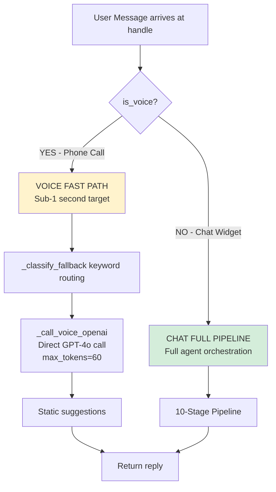
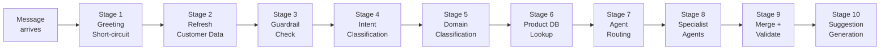
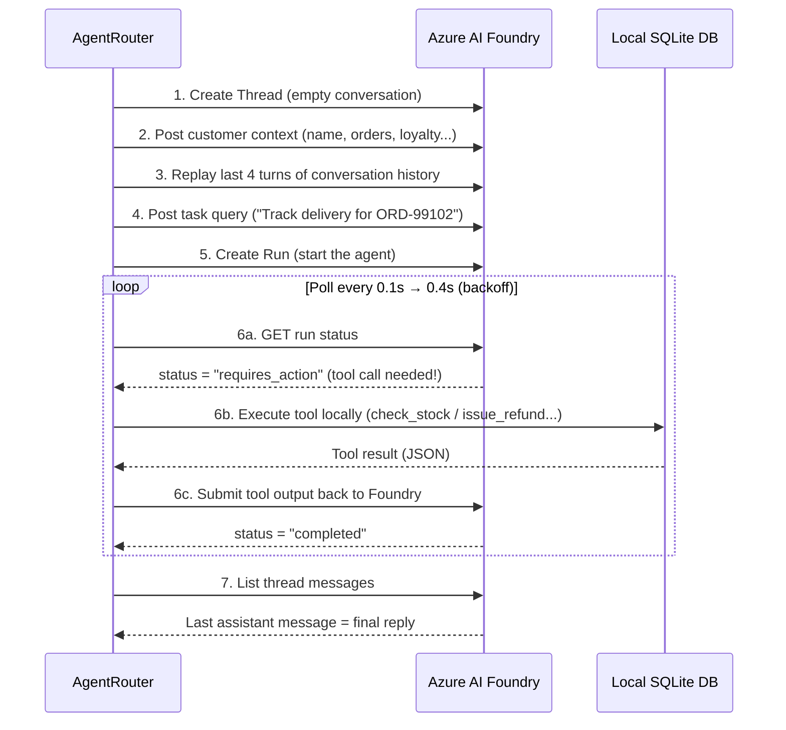
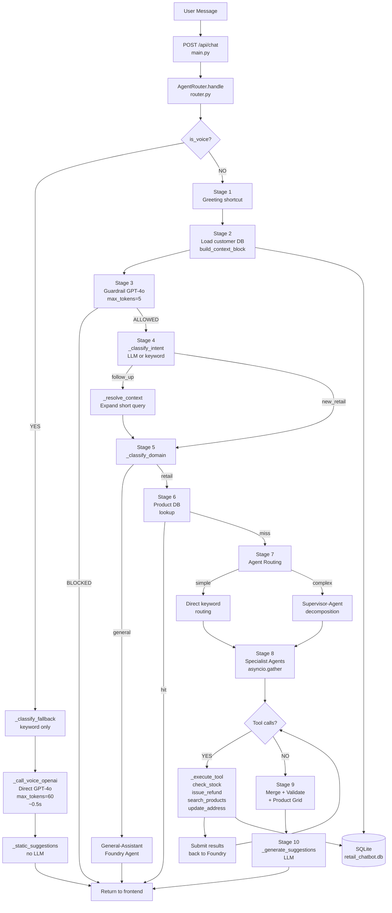

# How A User Question Is Processed — Backend Deep Dive
> **For team architect presentation.**  
> All examples are grounded in actual source code: [`backend/agents/router.py`](file:///c:/Projects/retail-chatbot/backend/agents/router.py)

---

## 0. Entry Point — `POST /api/chat`

Every user message arrives at:

```python
# backend/main.py
@app.post("/api/chat")
async def chat(req: ChatRequest):
    result = await agent_router.handle(
        message = req.message,      # "Where is my delivery for order 99102?"
        history = req.history,      # [ {role, content}, ... ] — full session
        is_voice = False            # True only for phone calls
    )
    return ChatResponse(
        reply       = result["reply"],
        intent      = result["intent"],
        suggestions = result["suggestions"],
        sources     = result["sources"]
    )
```

**Data contract IN:**
```json
{
  "message":  "Where is my delivery for order 99102?",
  "history":  [],
  "customer_id": "CUST-00421"
}
```

**Data contract OUT:**
```json
{
  "reply":       "Your order ORD-99102 is out for delivery...",
  "intent":      "delivery",
  "suggestions": ["Track on map", "Change delivery slot", "Call driver"],
  "sources":     ["delivery_agent"]
}
```

---

## 1. Two Execution Paths — Voice vs Chat

The system has **two completely separate pipelines** depending on the `is_voice` flag:



**Why two paths?**
- Voice requires response in < 1 second to feel natural on a phone call
- Chat can afford 3–8 seconds for richer, more detailed responses from specialist agents

---

## 2. The Chat Full Pipeline — 10 Stages



---

### Stage 1 — Instant Greeting Short-Circuit

**Before any AI is called**, the message is checked against a hardcoded set of greetings:

```python
cleaned_msg = re.sub(r'[^\w\s]', '', message).lower().strip()

if cleaned_msg in ("hello", "hi", "hey", "good morning", ...):
    return {
        "reply": "Hello! How can I help you today? 😊",
        "intent": "store",
        "sources": ["local_greeting"],
        "suggestions": ["Track my order", "Find nearest store", "Check product stock"],
    }
```

**Why:** Zero latency. No LLM call for common pleasantries.

---

### Stage 2 — Refresh Customer Context

```python
customer_data = self._load_customer_data()   # Read from retail_chatbot.db (SQLite)
self.context  = build_context_block(customer_data)
```

`build_context_block()` serialises the full customer record into a compact text block that will be injected into every AI agent call:

**Example `context` string (what the AI sees):**
```
Customer: Jamie Thornton (CUST-00421)
Email: jamie.thornton@example.co.uk
Phone: +44 7911 123456
Loyalty: Gold, 3240 points
Address: 14 Maple Street, London, N1 6PL

Orders:
- ORD-99102: Whole Milk, Sourdough Bread, Free Range Eggs x12, Cheddar | Status: In Transit
  | Delivery: Standard Home Delivery status=In Transit slot=Today 2pm-4pm
    driver=Mike stop=3/12 eta=2:30 PM url=https://track.sainsburys.co.uk/ORD-99102
  | Total: £42.50

- ORD-97830: Mature Cheddar Cheese, Greek Yoghurt | Status: Delivered
  | Refund: Processing GBP14.99 (ref REF-77821, reason: Mouldy cheese)
  | Total: £14.99
```

---

### Stage 3 — Guardrail Check

```python
if self._is_out_of_context(message):
    return CHAT_DECLINE_MESSAGE   # "I'm your Sainsbury's retail assistant..."
```

Calls GPT-4o with the `GUARDRAIL_SYSTEM_PROMPT`:
> *"You are a strict content filter for a Sainsbury's retail assistant. Reply BLOCKED if the message is completely unrelated to retail, food, shopping, orders, deliveries, refunds, or store operations."*

**Examples:**
| Message | Guardrail decision | Result |
|---|---|---|
| `"Who won the 2024 World Cup?"` | `BLOCKED` | Returns decline message |
| `"Where is my delivery?"` | `ALLOWED` | Continues pipeline |
| `"Write me a Python script"` | `BLOCKED` | Returns decline message |
| `"Is sourdough gluten free?"` | `ALLOWED` | Continues pipeline |

LLM call: `max_tokens=5, temperature=0.0` — returns just `"ALLOWED"` or `"BLOCKED"`.

---

### Stage 4 — Intent Classification

```python
intent = self._classify_intent(message, history, is_voice=False)
# Returns one of: "new_retail", "new_general", "follow_up", "clarification_confirmation"
```

**Decision tree:**
```
1. No conversation history → MUST be "new_retail" or "new_general"
2. Message in acknowledgement list ("yes", "ok", "sure", "go ahead") → "clarification_confirmation"
3. Has history → LLM call to classify intent with last 5 turns of context
```

**LLM prompt sent (when history exists):**
```
CONVERSATION HISTORY:
ASSISTANT: Your order ORD-99102 is currently on stop 3 of 12...
USER: What about the refund?

USER MESSAGE: What about the refund?
```
**LLM returns:** `"follow_up"` — because "What about the refund?" refers to previous context.

**Why this matters:** If `intent == "follow_up"`, the system runs `_resolve_context()` to turn the short follow-up into a **standalone, self-contained query** before routing it.

---

### Stage 4b — Context Resolution (for follow-up messages only)

```python
if is_follow_up:
    resolution = await self._resolve_context(message, history)
```

`_resolve_context()` calls GPT-4o with the last 5 turns and asks it to resolve what the follow-up message really means:

**Example:**
```
ASSISTANT: "Your order ORD-99102 is on stop 3..."
USER:      "What about the refund?"
```
→ LLM resolves to:
```json
{
  "type": "resolved_query",
  "query": "What is the status of the refund for order ORD-97830?"
}
```

The resolved query is then used for the rest of the pipeline as if the user had typed the full question.

---

### Stage 5 — Domain Classification

```python
domain = self._classify_domain(message, history, is_voice=False)
# Returns: "retail" or "general"
```

**Three-level decision (fastest-first):**

```
Level 1 — Keyword match (no LLM):
  message contains "refund", "delivery", "stock", "nectar", "vegan"... → "retail"
  
Level 2 — Keyword match (no LLM):
  message contains "weather", "football", "politics", "recipe"... → "general"

Level 3 — LLM call (only if ambiguous):
  GPT-4o call with max_tokens=5 → "retail" or "general"

Default: → "retail" (safe default)
```

---

### Stage 6 — Product Database Lookup (shortcut)

```python
db_result = self._search_db_for_product_question(message)
if db_result:
    return db_result  # Skip all agents, answer from local SQLite directly
```

If the message is a **nutrition or allergen question**, the system looks up `retail_chatbot.db` directly and formats a catalog card — **bypassing all Foundry agents entirely** for speed and accuracy.

**Triggered by keywords:** `"calories"`, `"protein"`, `"allergen"`, `"gluten free"`, `"vegan"`, `"ingredients"`, etc.

**Example trigger:**
> `"How much protein is in the sourdough bread?"`

**DB response built directly:**
```
**Sainsbury's Sourdough Bread** – Sainsbury's
  • Price: £1.65
  • Availability: In Stock
  • Rating: 4.4/5 (1,247 reviews)
  • Nutritional Info (per 100g):
      – Calories: 233kcal
      – Protein: 8.5g
      – Carbohydrates: 44g
      – Fat: 1.2g
  • Allergens: Wheat, Gluten
  • Dietary Tags: vegan
```

---

### Stage 7 — Agent Routing

Two routing strategies — the system picks the **faster one first**:

#### Strategy A: Direct Keyword Routing (fast, no LLM)

```python
tasks = self._get_direct_routing_tasks(message)
```

Checks `_DIRECT_ROUTING_KEYWORDS` dict. If the message clearly maps to **exactly one agent** and has no transition words (`and`, `also`, `but`):

```python
_DIRECT_ROUTING_KEYWORDS = {
    "refund":   ["refund", "return", "damaged", "mouldy", "money back", ...],
    "delivery": ["delivery", "track", "driver", "slot", "eta", "van", ...],
    "store":    ["store", "stock", "aisle", "nutrition", "vegan", "promotion", ...],
    "order":    ["order", "payment", "purchase", "nectar points", "receipt", ...],
}
```

**Example:**
- `"Where is my delivery?"` → matches `delivery` only → `[{"agent": "delivery", "task_query": "Where is my delivery?"}]`
- `"I want a refund and also track my delivery"` → has `" and "` → **skips direct routing**, goes to Supervisor

#### Strategy B: Supervisor Decomposition (for complex queries)

```python
tasks = await self._decompose_via_supervisor(message, history)
```

Calls the **Foundry Supervisor-Agent** with the user message and asks it to decompose into a routing plan:

**Prompt sent to Supervisor-Agent:**
```
CONVERSATION HISTORY:
USER: I want to track my delivery but also check my refund status

CURRENT USER MESSAGE: I want to track my delivery but also check my refund status

Decompose this into routing tasks.
Respond ONLY with a valid JSON array of objects with 'agent' and 'task_query' keys.
Available agents: order, delivery, refund, store.
No markdown, no explanation.
```

**Supervisor-Agent returns:**
```json
[
  {"agent": "delivery", "task_query": "Track delivery for the customer's most recent order"},
  {"agent": "refund",   "task_query": "Check refund status for the customer's most recent order"}
]
```

---

### Stage 8 — Specialist Agent Invocation

Each task from Stage 7 is sent to the appropriate **Azure AI Foundry Agent** (a fully hosted, persistent AI agent with its own system prompt, tools, and conversation thread).

```python
# All tasks run in PARALLEL
replies = await asyncio.gather(*[call_agent(t) for t in tasks])
```

**Inside each agent call — the 7-step Foundry thread lifecycle:**



**Example thread messages (what Foundry sees internally):**

```
[USER]:      Customer: Jamie Thornton (CUST-00421) ... [full context block]
[USER]:      Track delivery for ORD-99102
[ASSISTANT]: (calls tool: check_stock is NOT relevant here, delivery agent has no tools)
             Your order ORD-99102 is currently on stop 3 of 12. Your driver Mike is en route.
             Estimated arrival: 2:30 PM – 3:00 PM today. 
             Live tracking: https://track.sainsburys.co.uk/ORD-99102
```

**Available specialist agents and their tools:**

| Agent | Name in Foundry | Tools available |
|---|---|---|
| `order` | `Order-Agent` | `search_products` |
| `delivery` | `Delivery-Agent` | `update_customer_address` |
| `refund` | `Refund-Agent` | `issue_refund` |
| `store` | `Store-Agent` | `check_stock`, `get_active_promotions` |
| `general` | `General-Assistant-Agent` | none |
| `supervisor` | `Supervisor-Agent` | none (routing only) |

**Tool dispatch example (Refund-Agent calls `issue_refund`):**

```python
# Foundry signals: requires_action
# tool call: issue_refund(order_id="ORD-97830", reason="Mouldy cheese", amount=14.99)

result = self._execute_tool("issue_refund", {
    "order_id": "ORD-97830",
    "reason":   "Mouldy cheese",
    "amount":   14.99
})
# → Writes to SQLite, returns:
# "Refund of £14.99 issued for order ORD-97830. Reference: REF-77821. 
#  Expected back to your original payment method within 3–5 business days."
```

---

### Stage 9 — Merge + Validate

#### Merge (only needed for multi-agent responses)

```python
merged = await self._merge_replies(message, tasks, list(replies))
```

- **Single reply** → returned directly
- **Multiple replies** → Supervisor-Agent merges them into one cohesive response

**Example merge input:**
```
Original customer question: Track my delivery and check my refund

--- Part 1 (Agent: delivery) ---
Your order ORD-99102 is on stop 3 of 12. ETA 2:30 PM.

--- Part 2 (Agent: refund) ---
Your refund REF-77821 for £14.99 is currently being processed.

Merge these specialist replies into a single, cohesive, well-formatted customer response.
```

**Supervisor-Agent output:**
```
Here's a summary of your recent activity:

**Delivery Update** — Order ORD-99102  
Your delivery is on its way! Your driver Mike is currently on stop 3 of 12 and is 
expected to arrive between 2:30 PM and 3:00 PM today.
🔗 Track live: https://track.sainsburys.co.uk/ORD-99102

**Refund Update** — Order ORD-97830  
Your refund of £14.99 (Ref: REF-77821) is being processed and should be returned 
to your original payment method within 3–5 business days.
```

#### Validation Layer

```python
validated = await self._run_validation_layer(message, merged)
```

Calls `validate_and_sanitize_response()` from `validation.py` — strips any raw JSON, routing artifacts, or safety issues from the final reply before returning it to the user.

#### Product Grid Injection

```python
if domain != "general":
    validated = self.append_product_grid_if_mentioned(validated)
```

If the reply mentions specific products, a `<product-grid>[...]</product-grid>` block is appended for the frontend to render as a visual card grid.

---

### Stage 10 — Suggestion Generation

```python
suggestions = await self._generate_suggestions(message, validated, primary_intent, history)
```

Calls GPT-4o with:
- The user's last message
- The AI's full reply  
- The intent category
- Last 4 turns of conversation history

**Prompt sent:**
```
CONVERSATION HISTORY: [last 4 turns]
LAST USER MESSAGE: Where is my delivery?
ASSISTANT REPLY: Your order ORD-99102 is on stop 3 of 12...
INTENT CATEGORY: delivery
```

**GPT-4o returns (JSON array):**
```json
["Track on map", "Change delivery slot", "Update my address", "Contact the driver"]
```

Deduplication + length check (3–5 items) is applied before returning.

**Fallback (if LLM fails):**
```python
_STATIC_SUGGESTIONS = {
    "delivery": ["Track my delivery", "Change delivery slot", "Update delivery address"],
    "refund":   ["Check refund status", "How long does a refund take?", "Request a replacement"],
    "store":    ["Check product stock", "Show store hours", "Active promotions"],
    ...
}
```

---

## 3. Three Complete Worked Examples

---

### Example A — Simple Delivery Query

> **User:** `"Where is my delivery for order 99102?"`

```
Stage 1: Not a greeting → continue
Stage 2: Load Jamie's customer data from DB
Stage 3: Guardrail → ALLOWED (contains "delivery")
Stage 4: No history → domain check → "new_retail"
Stage 5: "delivery" keyword → domain = "retail"
Stage 6: No nutrition/allergen keywords → skip DB lookup
Stage 7: "delivery" keyword matches DIRECT_ROUTING → tasks = [{"agent": "delivery", "task_query": "Where is my delivery for order 99102?"}]
Stage 8: Call Delivery-Agent in Foundry:
         → Thread created
         → Context injected (Jamie + ORD-99102 with driver=Mike, stop=3/12, eta=2:30PM)
         → Agent replies: "Your order ORD-99102 is on stop 3 of 12. ETA 2:30 PM."
         (No tool call needed — data was in context block)
Stage 9: Single reply → no merge needed
         Validation → OK
         No products → no grid injected
Stage 10: Suggestions generated for "delivery" intent
```

**Final response:**
```json
{
  "reply":       "Your order ORD-99102 is currently on stop 3 of 12, with an estimated arrival...",
  "intent":      "delivery",
  "sources":     ["delivery_agent"],
  "suggestions": ["Track on map", "Change delivery slot", "Update my address"]
}
```

---

### Example B — Multi-Intent Query

> **User:** `"I want a refund for my mouldy cheese and also track my delivery"`

```
Stage 1: Not a greeting → continue
Stage 2: Load customer data
Stage 3: Guardrail → ALLOWED
Stage 4: No history → "new_retail"
Stage 5: "refund" + "delivery" keywords → domain = "retail"
Stage 6: No nutrition keywords → skip
Stage 7: Message contains " and " → SKIP direct routing
         → call _decompose_via_supervisor()
         → Supervisor-Agent returns:
           [
             {"agent": "refund",   "task_query": "Issue refund for mouldy cheese in most recent delivered order"},
             {"agent": "delivery", "task_query": "Track delivery status of current active order"}
           ]
Stage 8: Both agents called IN PARALLEL (asyncio.gather)
         → Refund-Agent: calls tool issue_refund(order_id="ORD-97830", reason="Mouldy cheese", amount=14.99)
           → DB updated, REF-77821 created
           → Reply: "Refund of £14.99 has been issued..."
         → Delivery-Agent: reads context
           → Reply: "Your order ORD-99102 is on stop 3 of 12..."
Stage 9: TWO replies → Supervisor-Agent merges into single cohesive response
         Validation → OK
Stage 10: Suggestions generated
```

**Final response:**
```json
{
  "reply":       "Here's a summary...\n\n**Refund**: £14.99 issued...\n**Delivery**: Stop 3 of 12...",
  "intent":      "refund",
  "sources":     ["refund_agent", "delivery_agent"],
  "suggestions": ["Check refund status", "Track on map", "Contact driver"]
}
```

---

### Example C — Out-Of-Context Request

> **User:** `"Can you write me a Python script to scrape a website?"`

```
Stage 1: Not a greeting → continue
Stage 2: Load customer data
Stage 3: Guardrail → BLOCKED (programming + scraping → unrelated to retail)
```

**Immediately returns:**
```json
{
  "reply":   "I'm your Sainsbury's retail assistant, here to help with shopping, products, orders...",
  "intent":  "general",
  "sources": ["guardrail_decline"],
  "suggestions": ["Track my order", "Find nearest store", "Check product stock"]
}
```

**Zero Foundry agents were invoked. The LLM call was only 5 tokens.**

---

## 4. Voice Fast Path — Full Trace

> **Caller says:** `"Where is my delivery?"`

```
handle(message="Where is my delivery?", history=[...], is_voice=True)

Stage 1: Not a greeting → continue
Stage 2: Load customer data
Stage 3: Guardrail → ALLOWED
Stage 4: is_voice=True → VOICE FAST PATH (skip intent/domain LLM classification)

_classify_fallback("Where is my delivery?")
→ Matches "delivery" keyword → agent_type = "delivery"

_call_voice_openai("Where is my delivery?", customer_data, history)
→ Builds compact voice prompt with customer summary (no markdown!)
→ Direct async GPT-4o call: max_tokens=60, temperature=0.0
→ Returns in ~0.4–0.8 seconds

_static_suggestions("delivery")
→ Returns pre-defined list, no LLM call
```

**Final response (< 1 second total):**
```json
{
  "reply":       "Your order is on stop 3 of 12, expected between 2:30 and 3 PM.",
  "intent":      "delivery",
  "sources":     ["voice_direct"],
  "suggestions": ["Track my delivery", "Change delivery slot", "Update delivery address"]
}
```

---

## 5. Full Architecture Map



---

## 6. Summary Card for Architect

| Concern | Design Decision |
|---|---|
| **Latency - Voice** | Bypass all Foundry agents. Direct GPT-4o call, `max_tokens=60`. Target < 1s. |
| **Latency - Chat** | Keyword routing skips LLM classification for obvious queries. DB shortcut for nutrition questions. |
| **Multi-intent queries** | Supervisor-Agent decomposes into sub-tasks. Specialist agents run **in parallel** with `asyncio.gather`. |
| **Context injection** | Customer data serialised into `build_context_block()` and injected as first message in every Foundry thread. |
| **Tool execution** | Foundry agents declare tools (JSON schema). Our server executes them locally against SQLite. Results submitted back to Foundry to continue the run. |
| **Guardrails** | Dedicated GPT-4o call at `max_tokens=5` before any routing. Returns `BLOCKED` or `ALLOWED`. |
| **Follow-up resolution** | LLM-powered context resolver expands vague follow-ups ("What about the refund?") into full standalone queries before routing. |
| **Fallback chain** | Every stage has a fallback: Foundry → Direct OpenAI → Keyword match → Hardcoded reply |
| **Suggestions** | Generated by GPT-4o using last reply + intent + history. Falls back to static map if LLM fails. |
| **Product grid** | Injected as `<product-grid>[JSON]</product-grid>` — parsed and rendered by the frontend as visual cards. |
| **State** | No server-side session. Full conversation `history` sent on every request. |
| **Database** | Single SQLite file (`retail_chatbot.db`) with customer, orders, inventory tables. |

---

## 7. Key Files for Architects

| File | Role |
|---|---|
| [`backend/agents/router.py`](file:///c:/Projects/retail-chatbot/backend/agents/router.py) | 🧠 Full orchestration — ALL stages live here |
| [`backend/agents/tools.py`](file:///c:/Projects/retail-chatbot/backend/agents/tools.py) | 🔧 Tool implementations — DB reads/writes |
| [`backend/agents/validation.py`](file:///c:/Projects/retail-chatbot/backend/agents/validation.py) | ✅ Response validation + sanitization |
| [`backend/agents/prompts.py`](file:///c:/Projects/retail-chatbot/backend/agents/prompts.py) | 📝 All LLM system prompts |
| [`backend/main.py`](file:///c:/Projects/retail-chatbot/backend/main.py) | 🌐 FastAPI routes — entry point |
| [`backend/database.py`](file:///c:/Projects/retail-chatbot/backend/database.py) | 🗄️ SQLite read/write helpers |
