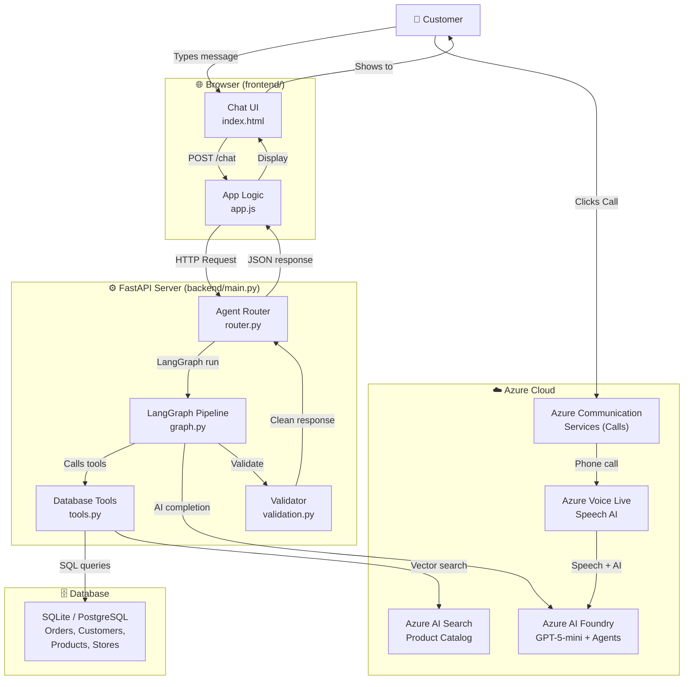
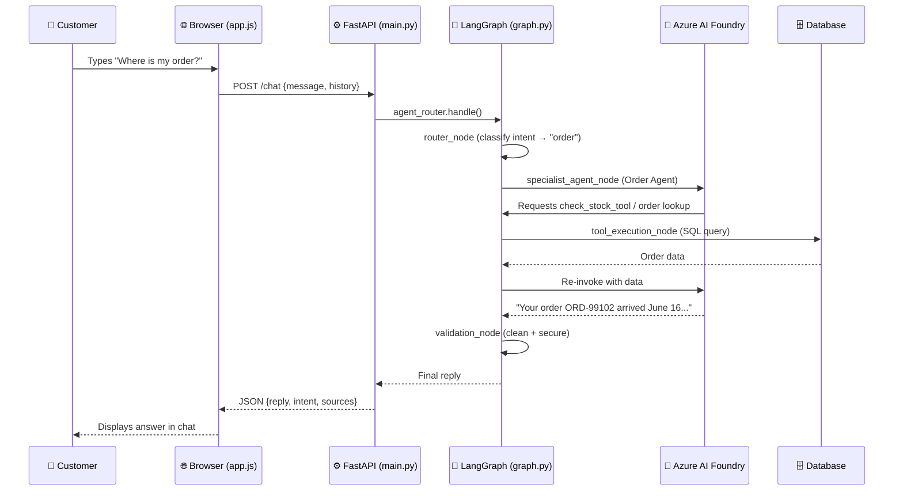
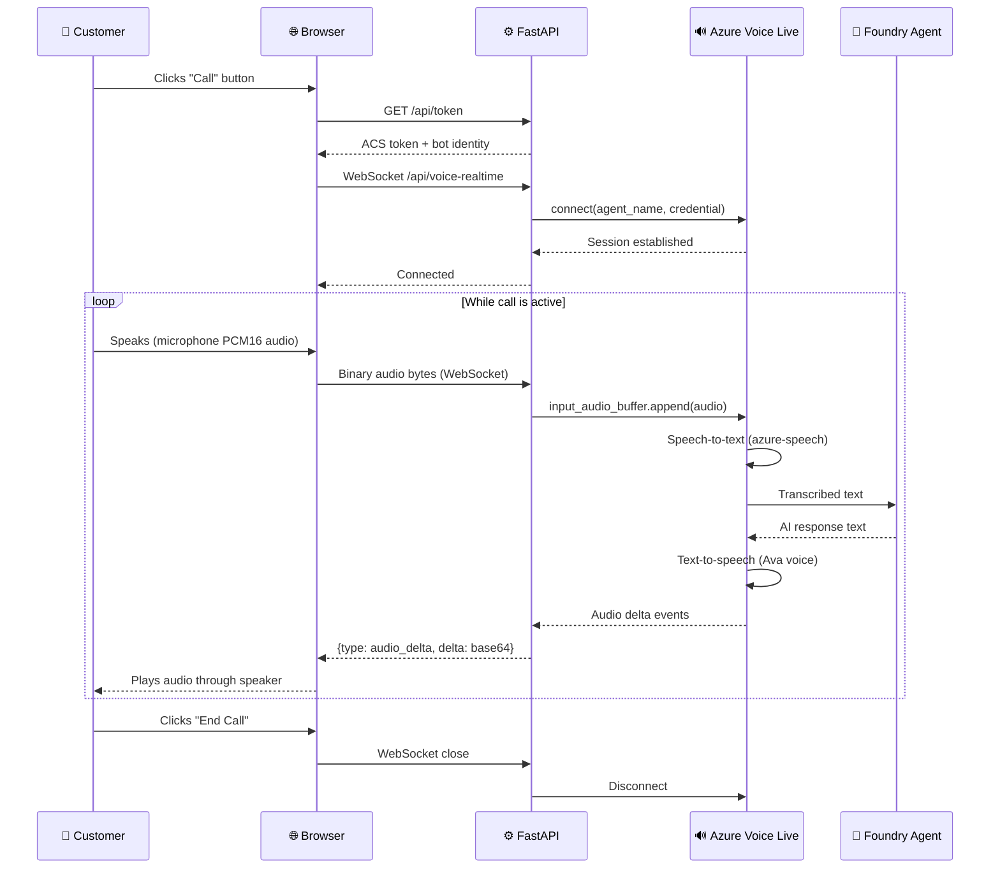
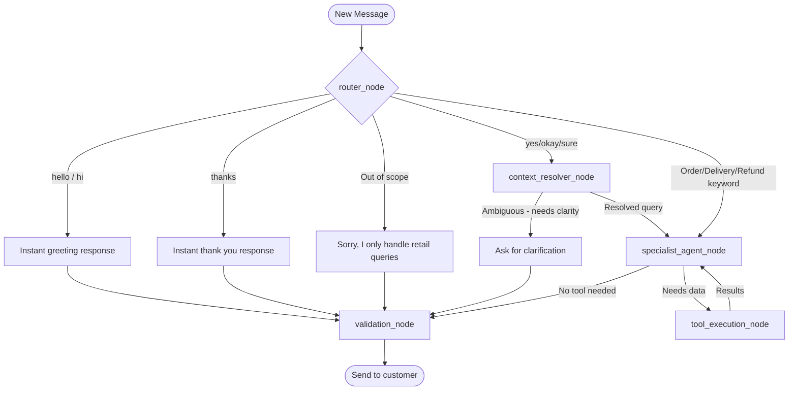
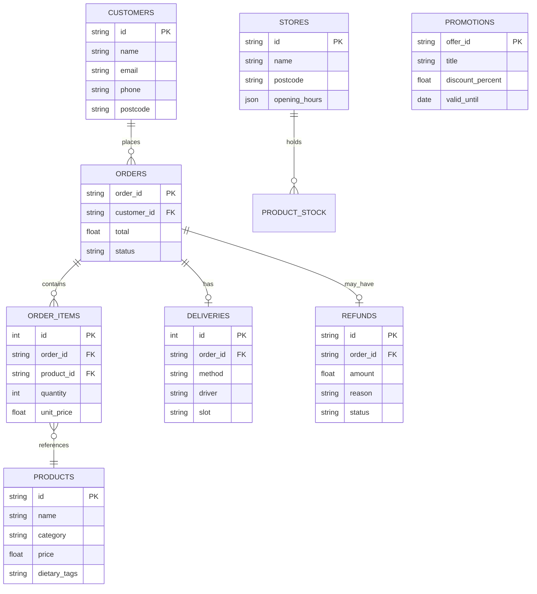
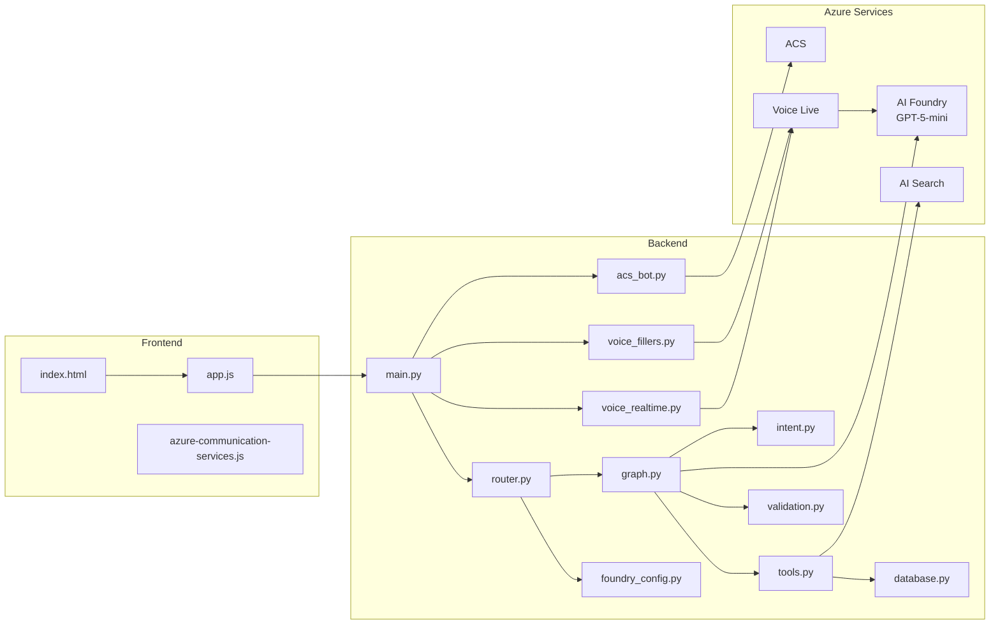

# 🗺️ Architecture Diagrams — Simple Visual Explanations

---

## High-Level Architecture

---

## What Each Layer Does (Simple Explanation)

| Layer | Job | Think of it as... |
|-------|-----|------------------|
| **Browser / Frontend** | Shows the chat UI, captures voice | The storefront window |
| **FastAPI Server** | Receives requests, coordinates everything | The receptionist |
| **LangGraph** | Decides what to do and in what order | The team manager |
| **Azure AI Foundry** | The actual AI that writes answers | The expert staff |
| **Database** | Stores real customer and order data | The filing cabinet |
| **Azure AI Search** | Finds products by meaning not just keywords | The smart catalogue |
| **Azure Voice Live** | Converts speech ↔ text in real time | The phone interpreter |
| **Azure ACS** | Connects and manages real phone calls | The telephone exchange |

---

## Request Flow — Chat Message

---

## Voice Call Flow — Browser

---

## LangGraph Decision Tree

---

## Database Schema (Simplified)

---

## Component Diagram

