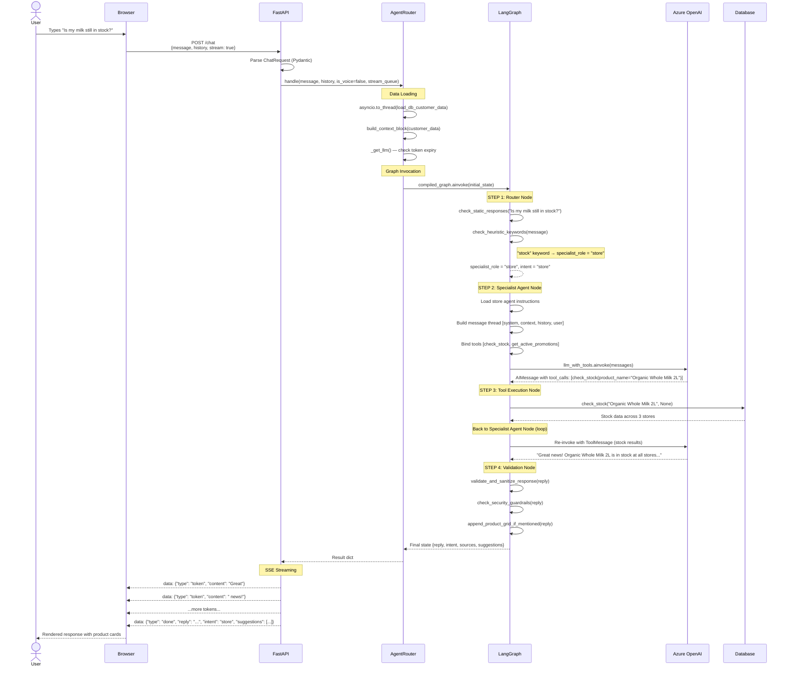
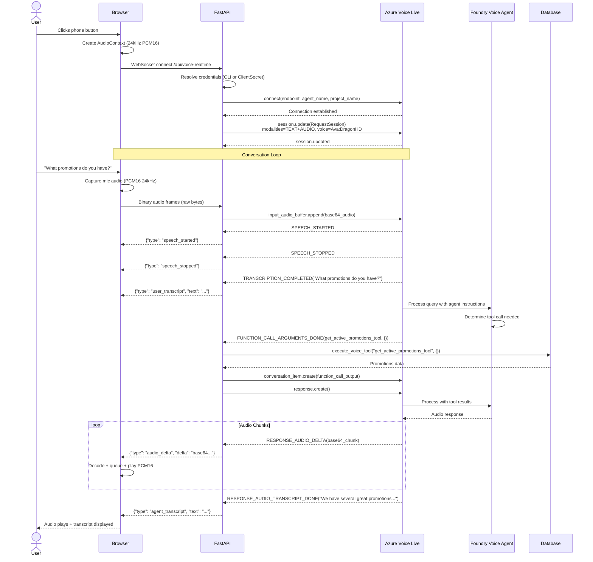
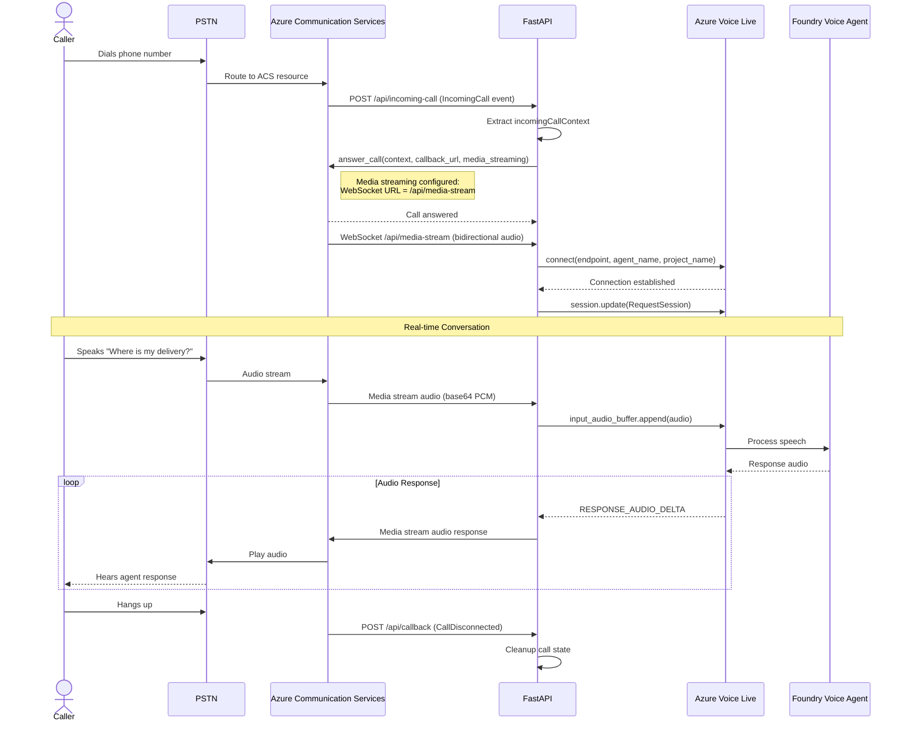
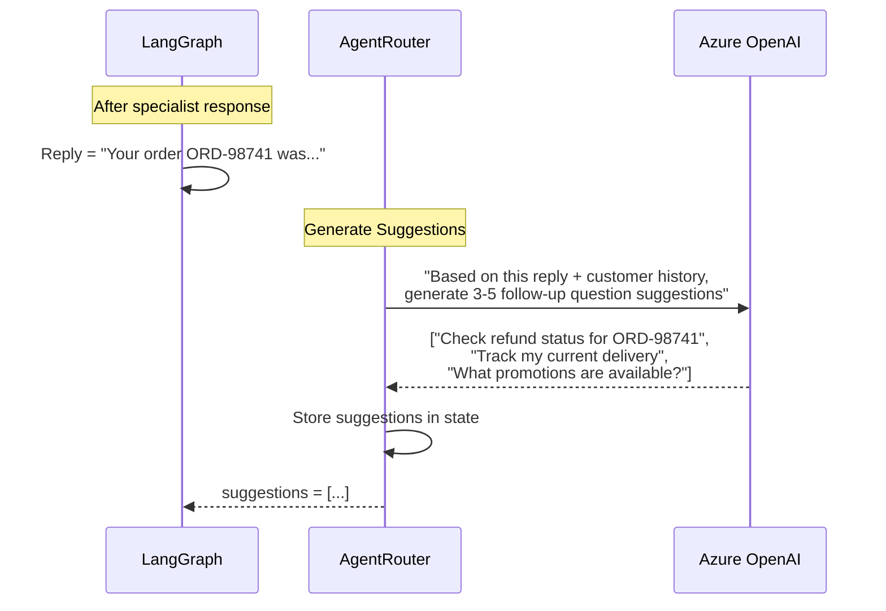
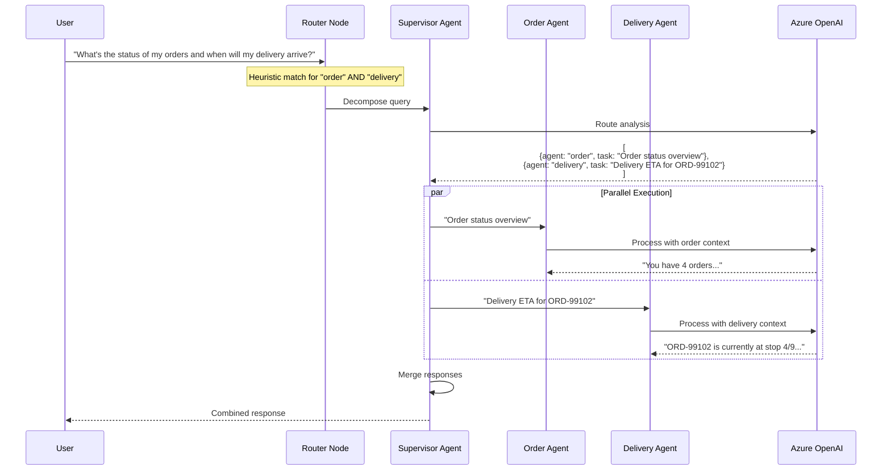
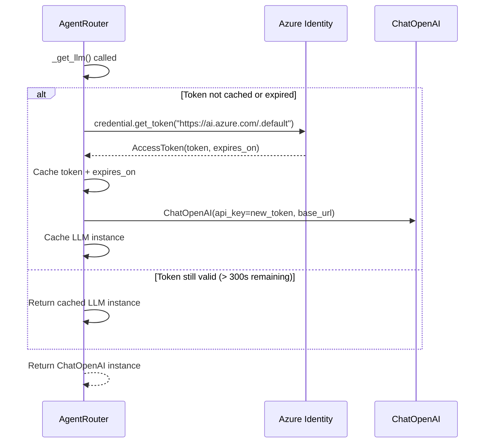
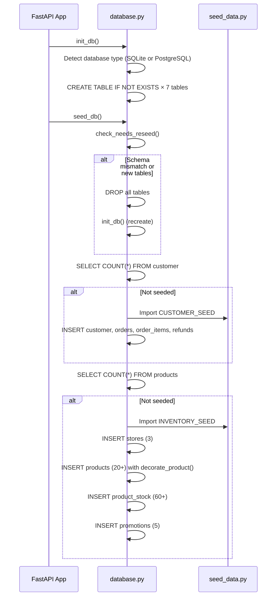
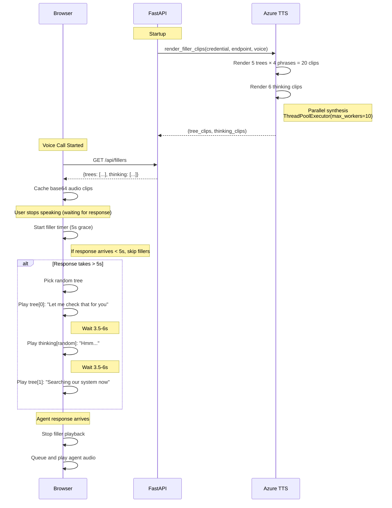

# Architecture

## End-to-End Request Flows

### 1. Chat Request — Full Lifecycle

### 2. Voice Request — Browser Voice-to-Voice

### 3. Phone Call — PSTN via ACS

### 4. Suggestion Generation Flow

After each agent response, the system generates follow-up suggestion chips:

### 5. Multi-Agent Routing

For complex queries requiring multiple specialist agents:

### 6. Token Refresh Flow

### 7. Database Initialisation Flow

### 8. Filler Audio System Flow

