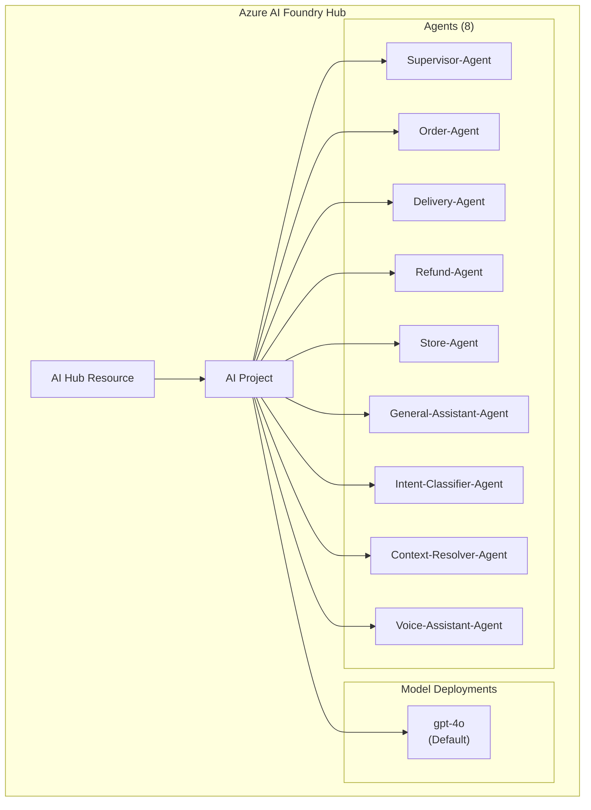
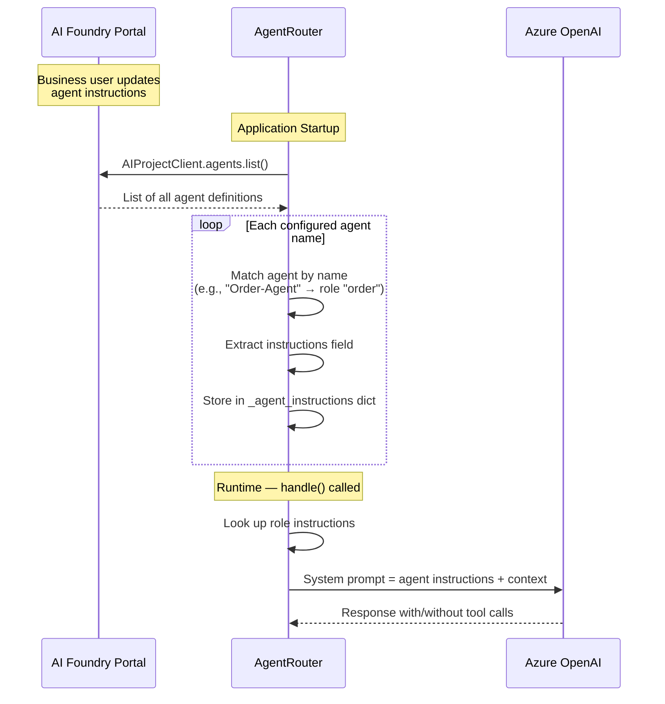

# Azure AI Foundry Integration

## 1. Overview

Azure AI Foundry serves as the **central AI management platform** for the Retail AI Assistant. It provides:
- Agent definition and instruction management
- Model deployment hosting
- Tool registration on agents
- OpenAI-compatible API endpoint
- Integration with Azure Voice Live for agent-mode voice

## 2. Project Structure



## 3. Agent Definitions

### Supervisor-Agent

**Purpose:** Decomposes complex queries into parallel tasks for specialist agents.

**Instructions:** Routes queries to the correct specialist agent(s) by analysing the user's message and returning a JSON array of routing decisions.

**Available Agents:**
- `order` — Account balance, purchases, order history, Nectar points
- `refund` — Refunds, returns, damaged items, refund status
- `delivery` — Tracking, ETA, driver details, address updates
- `store` — Store hours, stock, promotions, product info, nutrition, allergens

**Output Format:**
```json
[{"agent": "delivery", "task_query": "Check delivery ETA for ORD-99102"}]
```

**Tools:** None (routing only)

---

### Order-Agent

**Purpose:** Handles order-related queries — order details, billing, payment, and Nectar points.

**Instructions:** Uses customer context to view order history and loyalty points. Addresses the customer by first name.

**Tools:**
- `search_products` — Search the product catalog

---

### Delivery-Agent

**Purpose:** Handles delivery tracking, driver details, slot updates, and address changes.

**Instructions:** Uses delivery details in customer context (driver, slot, ETA, tracking URL) to inform the customer. Offers address update via tool.

**Tools:**
- `update_customer_address` — Updates postcode and delivery address

---

### Refund-Agent

**Purpose:** Handles refund requests, status inquiries, and returns processing.

**Instructions:** Verifies order delivery status before issuing refunds. Explains return policies clearly.

**Tools:**
- `issue_refund` — Processes refund for a delivered order

---

### Store-Agent

**Purpose:** Handles store information, product availability, promotions, and dietary queries.

**Instructions:** Assists with store hours, stock checks, Click & Collect, promotions, and nutritional information.

**Tools:**
- `check_stock` — Checks product stock across stores
- `get_active_promotions` — Lists active promotions

---

### General-Assistant-Agent

**Purpose:** Handles greetings, small talk, and out-of-domain queries.

**Instructions:** Politely declines non-retail queries. Only handles retail-related customer support.

**Tools:** None

---

### Intent-Classifier-Agent

**Purpose:** Classifies the intent of ambiguous user messages.

**Instructions:** Analyses the message and conversation history to determine the correct routing label.

**Tools:** None

---

### Context-Resolver-Agent

**Purpose:** Resolves ambiguous follow-up messages using conversation history.

**Instructions:** Determines whether the user is confirming a specific option or needs clarification.

**Tools:** None

---

### Voice-Assistant-Agent

**Purpose:** Serves as the system prompt for Azure Voice Live agent-mode sessions.

**Instructions:** Provides voice-specific conversational style and tool usage guidelines.

**Tools:** Registered via Voice Live session configuration

## 4. Agent Instruction Flow



## 5. Configuration

All Foundry configuration is centralised in `foundry_config.py`:

```python
@dataclass(frozen=True)
class FoundryConfig:
    project_endpoint: str    # AI Foundry project endpoint
    api_key: str             # API key for authentication
    openai_endpoint: str     # Azure OpenAI endpoint
    deployment_name: str     # GPT-4o deployment name
    tenant_id: str           # Azure tenant ID
    agent_names: AgentNames  # Named agent mapping

@dataclass(frozen=True)
class AgentNames:
    order: str               # "Order-Agent"
    delivery: str            # "Delivery-Agent"
    refund: str              # "Refund-Agent"
    store: str               # "Store-Agent"
    general: str             # "General-Assistant-Agent"
    intent_classifier: str   # "Intent-Classifier-Agent"
    context_resolver: str    # "Context-Resolver-Agent"
    voice_assistant: str     # "Voice-Assistant-Agent"
```

### Environment Variables

| Variable | Purpose |
|----------|---------|
| `AZURE_AI_FOUNDRY_PROJECT_ENDPOINT` | Project endpoint URL |
| `AZURE_AI_FOUNDRY_API_KEY` | API key for authentication |
| `AZURE_OPENAI_ENDPOINT` | Azure OpenAI endpoint |
| `AZURE_AI_FOUNDRY_DEPLOYMENT_NAME` | Model deployment name (default: "gpt-4o") |
| `AZURE_TENANT_ID` | Azure tenant for credential scoping |
| `AZURE_AGENT_ORDER_NAME` | Order agent name (default: "Order-Agent") |
| `AZURE_AGENT_DELIVERY_NAME` | Delivery agent name |
| `AZURE_AGENT_REFUND_NAME` | Refund agent name |
| `AZURE_AGENT_STORE_NAME` | Store agent name |
| `AZURE_AGENT_GENERAL_NAME` | General agent name |
| `AZURE_AGENT_INTENT_NAME` | Intent classifier agent name |
| `AZURE_AGENT_CONTEXT_NAME` | Context resolver agent name |
| `AZURE_AGENT_VOICE_NAME` | Voice assistant agent name |

## 6. Authentication

The system supports two authentication methods:

### Service Principal (Production)

```python
ClientSecretCredential(
    tenant_id=AZURE_TENANT_ID,
    client_id=AZURE_CLIENT_ID,
    client_secret=AZURE_CLIENT_SECRET
)
```

### Azure CLI (Development)

```python
AzureCliCredential(tenant_id=AZURE_TENANT_ID)
```

Token refresh is handled automatically with a 300-second expiry buffer.

## 7. Guardrails and Responsible AI

### System-Level Guardrails

Agent instructions include explicit constraints:
- **General Agent** refuses non-retail queries (coding, math, stories, etc.)
- **Refund Agent** verifies delivery status before processing refunds
- **All agents** are instructed to stay within their domain scope

### Response Validation

The validation layer (`validation.py`) applies additional guardrails:

1. **Sensitive Pattern Detection** — Blocks leakage of:
   - Environment variable keys (`AZURE_`, `DB_`, `API_KEY`, etc.)
   - Agent IDs (`asst_*`)
   - Internal customer IDs (`CUST-*`)
   - Connection strings
   - Bearer tokens

2. **PII Protection** — Prevents the LLM from exposing:
   - System environment variables
   - Database credentials
   - API keys or secrets

3. **Content Filtering** — Azure AI Foundry's built-in content safety filters apply at the model level

## 8. Model Configuration

| Setting | Value |
|---------|-------|
| Model | GPT-4o (or GPT-5.1) |
| Temperature | 0.3 (specialist agents) |
| Max Tokens | Dynamic (based on query complexity) |
| API Version | Latest OpenAI-compatible |
| Streaming | Supported via SSE |

## 9. Tracing and Evaluation

### Azure Monitor Integration

```python
from azure.monitor.opentelemetry import configure_azure_monitor
from azure.ai.agents.telemetry import AIProjectInstrumentor

configure_azure_monitor()
AIProjectInstrumentor().instrument()
```

### Environment Variables for Tracing

```bash
AZURE_EXPERIMENTAL_ENABLE_GENAI_TRACING=true
AZURE_TRACING_GEN_AI_CONTENT_RECORDING_ENABLED=true
```

### Traced Operations

- Agent instruction fetching
- LLM inference calls
- Tool execution
- Token refresh operations
- Voice Live connections

## 10. Tool Registration

Tools are defined in two places:

1. **Foundry Portal** — Tool JSON schemas registered on each agent definition (for agent-mode Voice Live)
2. **Backend Code** — LangChain `@tool` decorated functions or `StructuredTool.from_function()` for LangGraph execution

The `Tools/` directory contains the canonical JSON schema definitions:
- `search_products.json`
- `check_stock.json`
- `issue_refund.json`
- `update_customer_address.json`
- `get_active_promotions.json`

These schemas are registered on the appropriate agents in the AI Foundry Portal and are also used to define the Voice Live `REALTIME_TOOLS` in `voice_realtime.py`.
