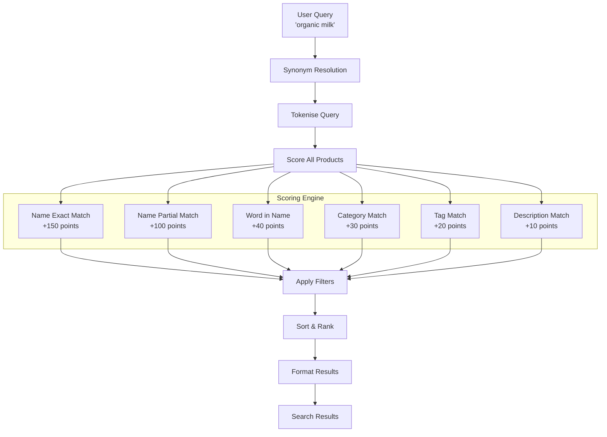
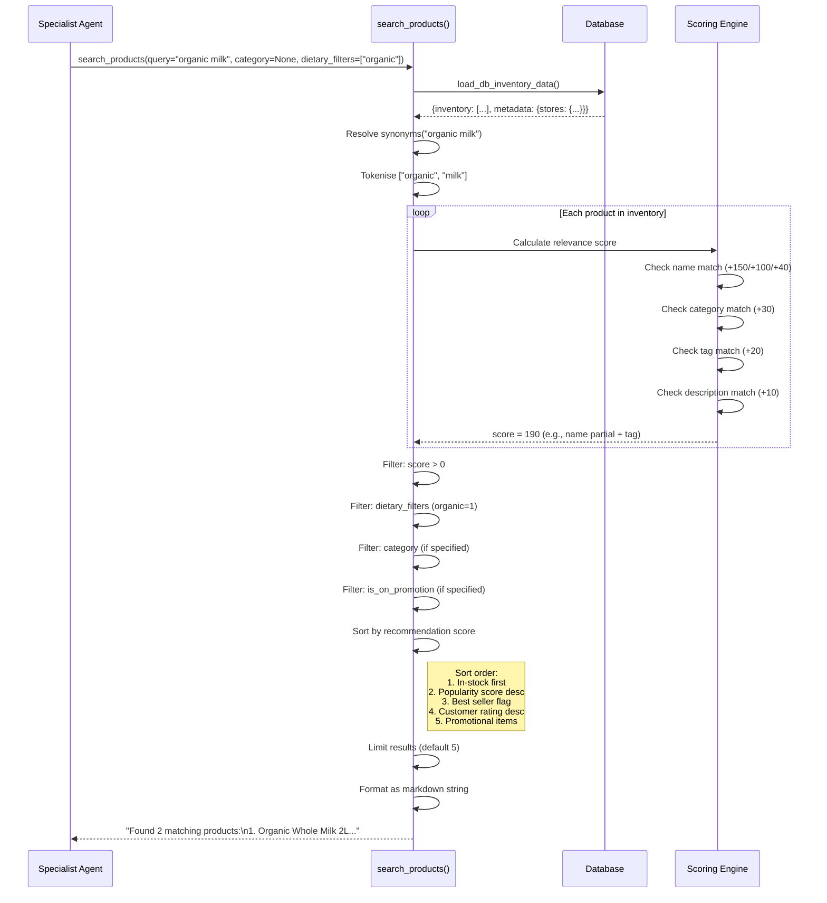
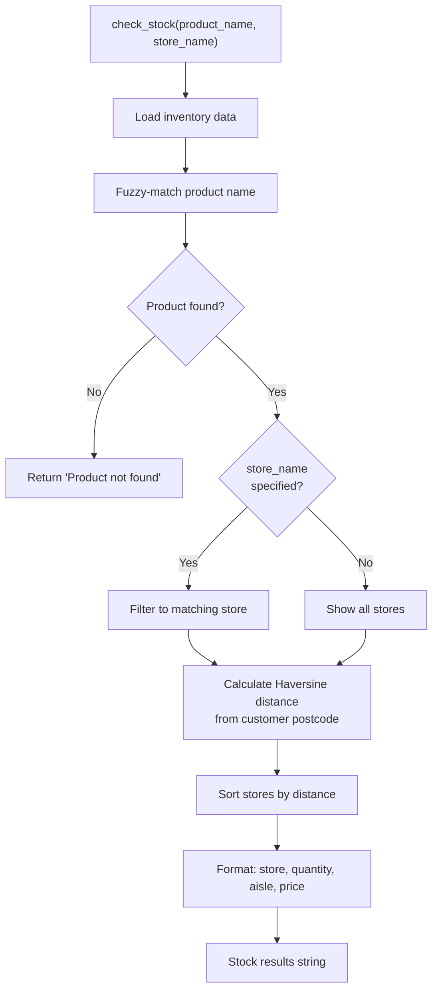
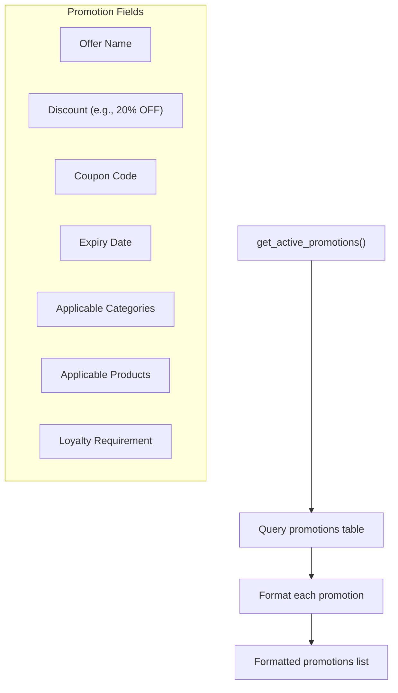
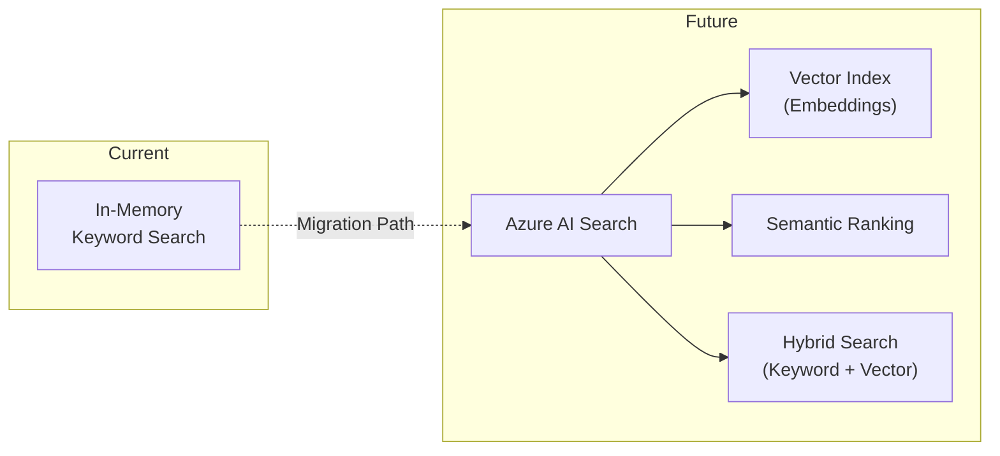

# Azure AI Search

## 1. Overview

The Retail AI Assistant uses an **in-memory product search engine** implemented in `backend/agents/tools.py` rather than Azure AI Search as an external service. The search algorithm provides rich product discovery with synonym resolution, multi-field matching, relevance scoring, dietary filtering, and proximity-based store ranking.

> **Note:** While `azure-search-documents` is listed in `requirements.txt` for future integration, the current implementation uses a custom in-memory search over the SQLite/PostgreSQL product catalog.

## 2. Search Architecture



## 3. Synonym Resolution

The search engine maps common aliases and misspellings to canonical product terms:

| Input Term | Resolves To |
|-----------|-------------|
| `semi-skimmed milk`, `skimmed milk` | `milk` |
| `wholemeal bread`, `white bread`, `loaf` | `bread` |
| `mince`, `beef mince` | `beef` |
| `fish fingers` | `fish` |
| `chips`, `frozen chips` | `potato` |
| `cola`, `soda`, `pop` | `drink` |
| `biscuits`, `cookies` | `biscuit` |
| `nappies`, `nappy` | `baby` |
| `washing up liquid`, `dish soap` | `dishwasher` |
| `loo roll`, `toilet tissue` | `toilet paper` |

## 4. Search Flow



## 5. Filtering Capabilities

### Category Filter

Products are filtered by exact category match:
- Dairy, Bakery, Produce, Pantry, Drinks, Fresh Meat & Fish, Confectionery, Breakfast, Household

### Dietary Filters

| Filter | Database Column | Description |
|--------|----------------|-------------|
| `organic` | `organic` | Certified organic products |
| `vegan` | `vegan` | No animal products |
| `gluten_free` | `gluten_free` | No gluten-containing ingredients |
| `sugar_free` | `sugar_free` | No added or natural sugars |
| `high_protein` | `high_protein` | High protein content |
| `lactose_free` | `lactose_free` | No dairy/lactose |
| `healthy_choice` | `healthy_choice` | Healthy/nutritious items |

### Sorting Options

| Sort Key | Behaviour |
|----------|-----------|
| `price_asc` | Lowest price first |
| `price_desc` | Highest price first |
| `rating` | Highest customer rating first |
| `popularity` | Highest popularity score first |

## 6. Stock Check

The `check_stock` tool provides store-level inventory information:



### Proximity Calculation

The Haversine formula calculates distance between the customer's postcode coordinates and each store:

```python
def _haversine(lat1, lon1, lat2, lon2):
    R = 6371  # Earth radius in km
    dlat = radians(lat2 - lat1)
    dlon = radians(lon2 - lon1)
    a = sin(dlat/2)**2 + cos(radians(lat1)) * cos(radians(lat2)) * sin(dlon/2)**2
    return R * 2 * asin(sqrt(a))
```

### Postcode Geocoding

A built-in mapping converts London postcodes to lat/lng coordinates:

| Postcode Prefix | Latitude | Longitude | Area |
|----------------|----------|-----------|------|
| SW1A | 51.5014 | -0.1419 | Westminster |
| N1 | 51.5362 | -0.1072 | Islington |
| NW1 | 51.5392 | -0.1426 | Camden |
| E15 | 51.5416 | 0.0024 | Stratford |

## 7. Promotion Retrieval

The `get_active_promotions` tool queries the promotions table:



### Seed Promotions

| Offer ID | Name | Discount | Code | Categories | Loyalty Req |
|----------|------|----------|------|------------|-------------|
| OFF-001 | 20% OFF Dairy | 20% OFF | DAIRY20 | Dairy | None |
| OFF-002 | Weekend Organic Sale | 15% OFF | ORGANIC15 | (specific products) | None |
| OFF-003 | Gold Member Special | 10% OFF | GOLD10 | All | Gold |
| OFF-004 | Weekend Offer | 10% OFF | WEEKEND10 | Produce, Bakery | None |
| OFF-005 | Buy 1 Get 1 (BOGO) | BOGO | BOGO | (specific products) | None |

## 8. Product Decoration

When products are seeded into the database, the `decorate_product()` function generates rich metadata deterministically using MD5 hashing:

```mermaid
flowchart TD
    Product["Raw Product"] --> Hash["MD5 hash of product_id"]
    Hash --> Rating["Rating: 4.0 - 4.9"]
    Hash --> Reviews["Reviews: 120 - 2400"]
    Hash --> Popularity["Popularity: 60 - 99"]
    Hash --> BestSeller["Best Seller: pop > 82"]
    Hash --> StoreRec["Store Recommended: h%3"]
    Hash --> StaffPick["Staff Pick: h%8"]
    
    Product --> DietCheck["Dietary Analysis"]
    DietCheck --> Organic["Organic: 'organic' in name"]
    DietCheck --> Vegan["Vegan: no meat/dairy/eggs"]
    DietCheck --> GlutenFree["Gluten Free: no wheat"]
    DietCheck --> SugarFree["Sugar Free: no sweets"]
    DietCheck --> HighProtein["High Protein: meat/eggs/cheese"]
    DietCheck --> LactoseFree["Lactose Free: no dairy"]
    
    Product --> Discount["Discount Calculation"]
    Discount --> PromoPct["10%, 20%, or 30% OFF"]
    Discount --> OldPrice["Calculate old price"]
    
    Product --> FBT["Frequently Bought Together"]
    FBT --> FBTList["Context-specific pairs"]
```



## 9. Future: Azure AI Search Integration

The `azure-search-documents` dependency is included for future vector/semantic search capabilities:



Potential benefits of migrating to Azure AI Search:
- **Semantic understanding** — "healthy snacks" matches products without keyword overlap
- **Vector search** — Embedding-based similarity across product descriptions
- **Faceted navigation** — Category/brand/dietary facets
- **Relevance tuning** — Configurable scoring profiles
- **Scale** — Handles millions of products vs. current in-memory approach
