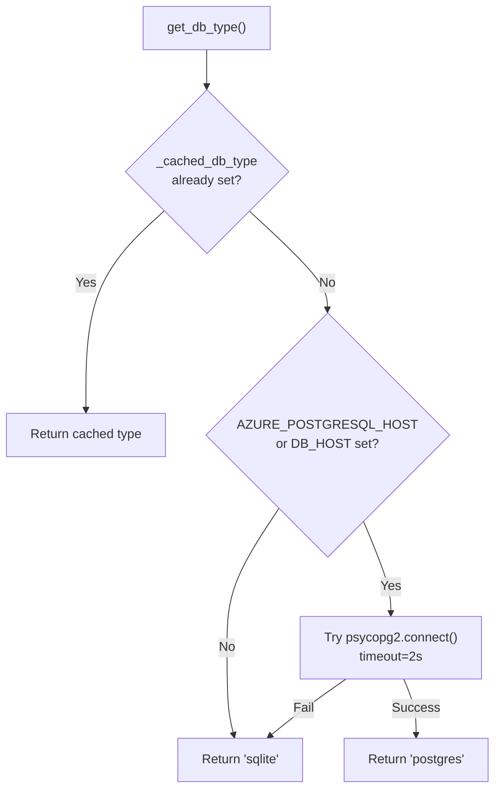
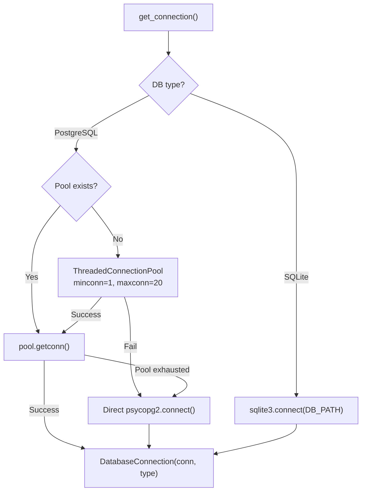
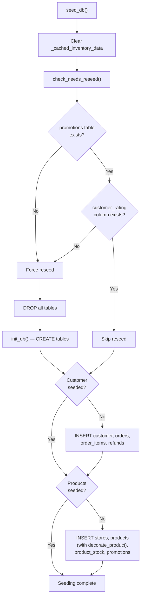

# Database Documentation

## 1. Overview

The database layer provides a **dual-mode abstraction** supporting SQLite for development and Azure PostgreSQL for production. The same application code works with both backends through the `DatabaseConnection` and `DatabaseCursor` wrapper classes.

## 2. ER Diagram

```mermaid
erDiagram
    customer ||--o{ orders : "has"
    orders ||--o{ order_items : "contains"
    orders ||--o| refunds : "may have"
    stores ||--o{ product_stock : "stocks"
    products ||--o{ product_stock : "available at"

    customer {
        TEXT id PK "CUST-00421"
        TEXT name
        TEXT email
        TEXT phone
        TEXT loyalty_tier
        INTEGER loyalty_points
        TEXT registered_since
        TEXT address_line1
        TEXT address_city
        TEXT address_postcode
        TEXT address_country
    }

    orders {
        TEXT order_id PK "ORD-98741"
        TEXT customer_id FK
        TEXT date
        TEXT status "delivered|in_transit|refund_processing|refund_completed"
        REAL total
        TEXT payment_method
        TEXT delivery_method
        TEXT delivery_slot
        TEXT delivery_delivered_at
        TEXT delivery_driver
        INTEGER delivery_current_stop
        INTEGER delivery_total_stops
        TEXT delivery_eta
        TEXT delivery_live_tracking_url
        TEXT delivery_store
        TEXT collected_at
    }

    order_items {
        INTEGER id PK "AUTOINCREMENT"
        TEXT order_id FK
        TEXT name
        INTEGER qty
        REAL price
    }

    refunds {
        TEXT order_id PK_FK
        TEXT reason
        TEXT requested_on
        REAL amount
        TEXT status "processing|completed"
        TEXT method
        TEXT completed_on
        TEXT reference "REF-78934"
    }

    stores {
        TEXT id PK "STR-001"
        TEXT name
        TEXT address
        REAL lat
        REAL lng
        TEXT type "Superstore|Local"
        TEXT phone
        TEXT opening_hours "JSON"
    }

    products {
        TEXT id PK "PRD-001"
        TEXT name
        TEXT description
        REAL price
        TEXT category
        TEXT subcategory
        TEXT brand
        TEXT sku
        TEXT barcode
        TEXT aisle
        TEXT manufacture_date
        TEXT expiry_date
        INTEGER shelf_life_days
        TEXT storage
        TEXT country_of_origin
        TEXT certifications "JSON array"
        TEXT allergens "JSON array"
        TEXT nutritional_info "JSON object"
        TEXT tags "JSON array"
        TEXT weight_volume
        INTEGER is_on_promotion
        TEXT promotion_detail "JSON"
        INTEGER nectar_points
        INTEGER online_available
        INTEGER click_and_collect
        TEXT discount "JSON object"
        REAL customer_rating
        INTEGER review_count
        INTEGER best_seller
        INTEGER store_recommended
        INTEGER staff_pick
        INTEGER healthy_choice
        INTEGER organic
        INTEGER vegan
        INTEGER gluten_free
        INTEGER sugar_free
        INTEGER high_protein
        INTEGER lactose_free
        TEXT diet_tags "JSON array"
        INTEGER popularity_score
        TEXT frequently_bought_together "JSON array"
        INTEGER customer_favorite
        INTEGER seasonal_offer
        INTEGER new_arrival
        INTEGER available
    }

    product_stock {
        TEXT product_id PK_FK
        TEXT store_id PK_FK
        INTEGER quantity
    }

    promotions {
        TEXT offer_id PK "OFF-001"
        TEXT offer_name
        TEXT discount
        TEXT applicable_categories "JSON array"
        TEXT applicable_products "JSON array"
        TEXT coupon_code
        TEXT expiry
        TEXT loyalty_requirement
        INTEGER offer_priority
    }
```

## 3. Tables

### customer

| Column | Type | Description |
|--------|------|-------------|
| `id` | TEXT PK | Customer ID (e.g., CUST-00421) |
| `name` | TEXT | Full name |
| `email` | TEXT | Email address |
| `phone` | TEXT | Phone number |
| `loyalty_tier` | TEXT | Nectar tier (Gold, Silver, etc.) |
| `loyalty_points` | INTEGER | Current Nectar points balance |
| `registered_since` | TEXT | Registration date |
| `address_line1` | TEXT | Street address |
| `address_city` | TEXT | City |
| `address_postcode` | TEXT | Postcode |
| `address_country` | TEXT | Country |

### orders

| Column | Type | Description |
|--------|------|-------------|
| `order_id` | TEXT PK | Order ID (e.g., ORD-98741) |
| `customer_id` | TEXT FK | References customer.id |
| `date` | TEXT | Order date |
| `status` | TEXT | delivered, in_transit, refund_processing, refund_completed |
| `total` | REAL | Order total (£) |
| `payment_method` | TEXT | Payment method description |
| `delivery_method` | TEXT | Home Delivery or Click & Collect |
| `delivery_slot` | TEXT | Delivery time window |
| `delivery_delivered_at` | TEXT | Actual delivery timestamp |
| `delivery_driver` | TEXT | Driver name |
| `delivery_current_stop` | INTEGER | Current delivery stop number |
| `delivery_total_stops` | INTEGER | Total stops in route |
| `delivery_eta` | TEXT | Estimated time of arrival |
| `delivery_live_tracking_url` | TEXT | Live tracking URL |
| `delivery_store` | TEXT | Collection store (for Click & Collect) |
| `collected_at` | TEXT | Collection timestamp |

### order_items

| Column | Type | Description |
|--------|------|-------------|
| `id` | INTEGER PK | Auto-incrementing ID |
| `order_id` | TEXT FK | References orders.order_id |
| `name` | TEXT | Product name |
| `qty` | INTEGER | Quantity ordered |
| `price` | REAL | Unit price (£) |

### refunds

| Column | Type | Description |
|--------|------|-------------|
| `order_id` | TEXT PK/FK | References orders.order_id |
| `reason` | TEXT | Refund reason |
| `requested_on` | TEXT | Request date |
| `amount` | REAL | Refund amount (£) |
| `status` | TEXT | processing or completed |
| `method` | TEXT | Refund method |
| `completed_on` | TEXT | Completion date |
| `reference` | TEXT | Refund reference (e.g., REF-78934) |

### stores

| Column | Type | Description |
|--------|------|-------------|
| `id` | TEXT PK | Store ID (e.g., STR-001) |
| `name` | TEXT | Store name |
| `address` | TEXT | Full address |
| `lat` | REAL | Latitude |
| `lng` | REAL | Longitude |
| `type` | TEXT | Superstore or Local |
| `phone` | TEXT | Phone number |
| `opening_hours` | TEXT | JSON object with mon_sat and sunday hours |

### products

45 columns covering product details, nutritional information, dietary flags, ratings, and availability. See ER diagram above for complete listing.

### product_stock

| Column | Type | Description |
|--------|------|-------------|
| `product_id` | TEXT PK/FK | References products.id |
| `store_id` | TEXT PK/FK | References stores.id |
| `quantity` | INTEGER | Current stock quantity |

### promotions

| Column | Type | Description |
|--------|------|-------------|
| `offer_id` | TEXT PK | Offer ID (e.g., OFF-001) |
| `offer_name` | TEXT | Promotion name |
| `discount` | TEXT | Discount description |
| `applicable_categories` | TEXT | JSON array of categories |
| `applicable_products` | TEXT | JSON array of product IDs |
| `coupon_code` | TEXT | Coupon code |
| `expiry` | TEXT | Expiry date |
| `loyalty_requirement` | TEXT | Required loyalty tier |
| `offer_priority` | INTEGER | Display priority |

## 4. Connection Management

### Database Type Detection



### Connection Pooling (PostgreSQL)



### Connection Return

When `DatabaseConnection.close()` is called:
- **PostgreSQL**: Connection is returned to the pool via `pool.putconn(conn)`
- **SQLite**: Connection is closed directly

## 5. Query Compatibility Layer

The `DatabaseCursor.execute()` method automatically translates SQL dialect:

| SQLite Syntax | PostgreSQL Equivalent |
|---------------|---------------------|
| `?` parameter markers | `%s` parameter markers |
| `INTEGER PRIMARY KEY AUTOINCREMENT` | `SERIAL PRIMARY KEY` |
| `INSERT OR IGNORE INTO stores` | `INSERT INTO stores ... ON CONFLICT (id) DO NOTHING` |
| `INSERT OR IGNORE INTO products` | `INSERT INTO products ... ON CONFLICT (id) DO NOTHING` |
| `INSERT OR IGNORE INTO product_stock` | `INSERT INTO product_stock ... ON CONFLICT (product_id, store_id) DO NOTHING` |
| `INSERT OR IGNORE INTO promotions` | `INSERT INTO promotions ... ON CONFLICT (offer_id) DO NOTHING` |

### Retry Policy

PostgreSQL queries use exponential backoff for transient failures:

```python
max_retries = 3
backoff = 0.5  # seconds

for attempt in range(max_retries):
    try:
        cursor.execute(query, params)
        return
    except (OperationalError, InterfaceError):
        if attempt == max_retries - 1:
            raise
        time.sleep(backoff)
        backoff *= 2  # 0.5s → 1s → 2s
```

## 6. Data Seeding

### Seed Data Structure

The seed data in `seed_data.py` contains:

**CUSTOMER_SEED:**
- 1 customer (Jamie Thornton, CUST-00421, Gold tier, 3240 Nectar points)
- 4 orders with varying statuses:
  - ORD-98741: `refund_completed` (milk was spoiled)
  - ORD-99102: `in_transit` (currently being delivered, stop 4/9)
  - ORD-97830: `refund_processing` (cheddar was mouldy)
  - ORD-96210: `refund_completed` (OJ past use-by date)

**INVENTORY_SEED:**
- 3 stores (Islington Superstore, Camden Local, Stratford Superstore)
- 20+ products across categories (Dairy, Bakery, Produce, Pantry, Drinks, Meat & Fish, etc.)
- Stock levels per store per product
- 5 promotions

### Seeding Flow



## 7. CRUD Operations

### Read Operations

| Function | Purpose | Returns |
|----------|---------|---------|
| `load_db_customer_data()` | Load customer + orders + items + refunds | `{customer: {...}, orders: [...]}` |
| `load_db_inventory_data()` | Load all products + stores + stock | `{metadata: {...}, inventory: [...]}` (cached) |
| `get_connection()` | Get database connection | `DatabaseConnection` |

### Write Operations

| Function | Purpose |
|----------|---------|
| `save_db_customer_data(data)` | Upsert customer + orders + items + refunds |
| `init_db()` | Create all tables |
| `seed_db()` | Seed initial data |

### Caching

`load_db_inventory_data()` uses a module-level cache:
```python
_cached_inventory_data = None

def load_db_inventory_data():
    global _cached_inventory_data
    if _cached_inventory_data is not None:
        return _cached_inventory_data
    # ... load from database ...
    _cached_inventory_data = result
    return result
```

The cache is invalidated when `init_db()` or `seed_db()` is called.

## 8. Serverless Database Handling

For Vercel/Lambda environments where the filesystem is read-only:

```python
if os.environ.get("VERCEL") or os.environ.get("AWS_LAMBDA_FUNCTION_NAME"):
    DB_PATH = "/tmp/retail_chatbot.db"
    if not os.path.exists(DB_PATH) and os.path.exists(ORIGINAL_DB_PATH):
        shutil.copy2(ORIGINAL_DB_PATH, DB_PATH)
```

This copies the pre-seeded SQLite database to the writable `/tmp` directory on first invocation.
