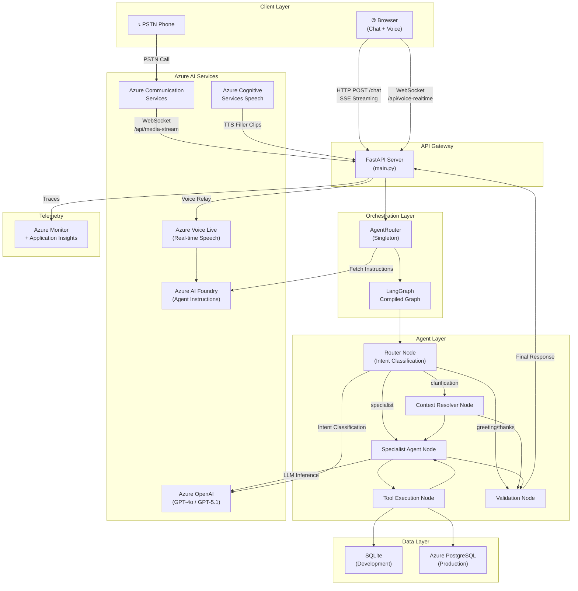
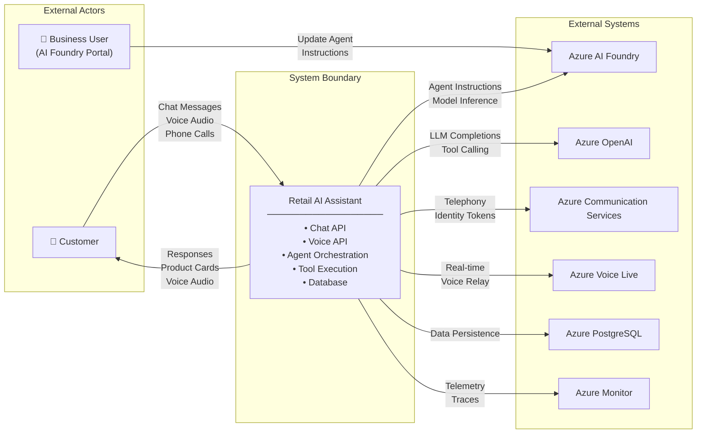
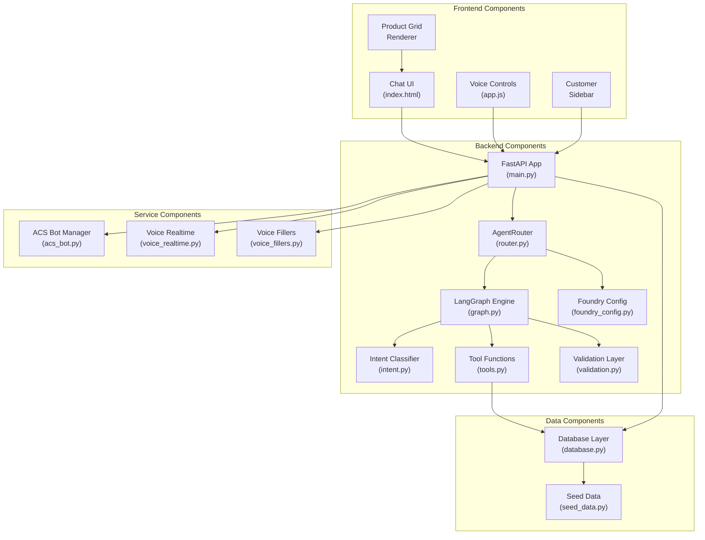
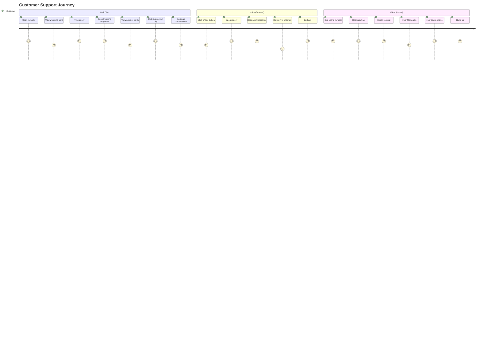
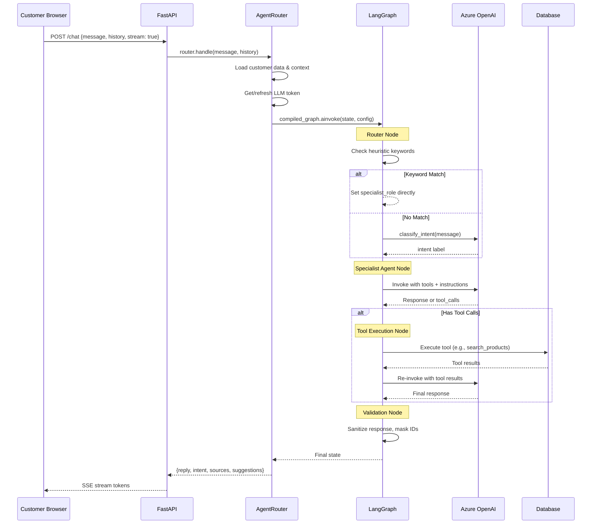
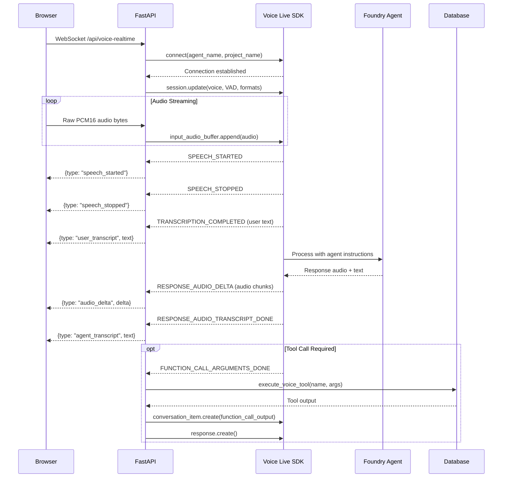
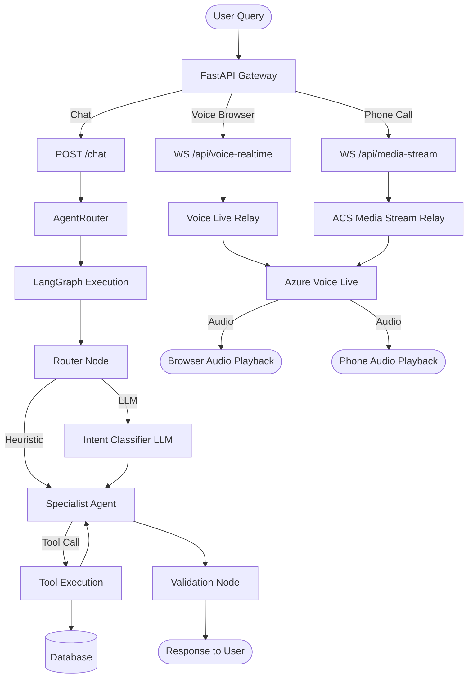
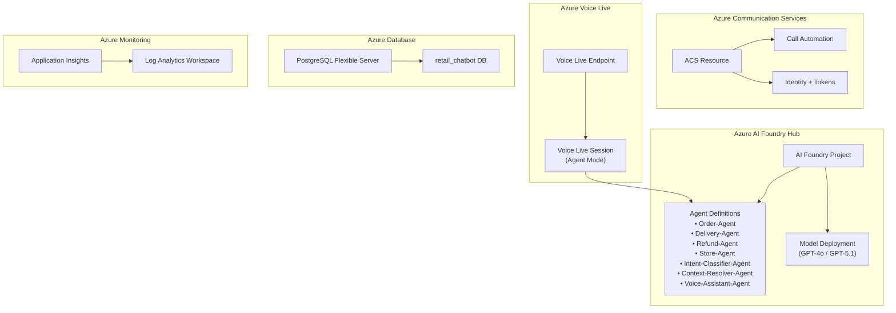
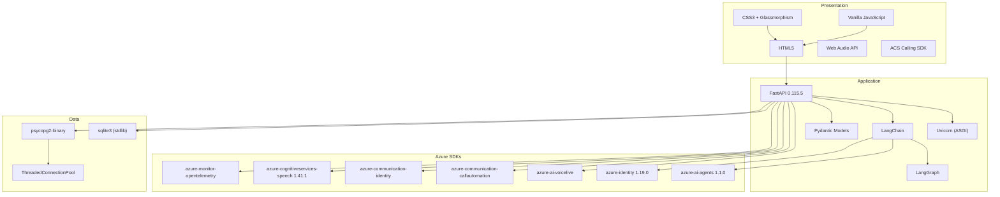
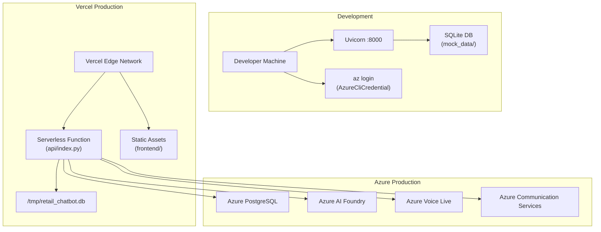

# High-Level Design (HLD)

## 1. Overall Architecture Diagram

## 2. System Context Diagram

## 3. Component Interaction Diagram

## 4. User Journey

## 5. Request Flow

### Chat Request Flow

### Voice Request Flow

## 6. Service Interaction Flow

## 7. External Integrations

| Integration | Protocol | Authentication | Purpose |
|------------|----------|---------------|---------|
| Azure AI Foundry | REST API | AzureCliCredential / ClientSecretCredential | Fetch agent instructions, list agents |
| Azure OpenAI | REST API (via LangChain) | Entra ID Bearer Token | LLM inference, tool calling |
| Azure Voice Live | WebSocket (SDK) | AzureCliCredential / ClientSecretCredential | Real-time voice relay |
| Azure Communication Services | REST API | Connection String | PSTN call handling, identity tokens |
| Azure Cognitive Services Speech | REST API | Bearer Token | TTS for filler audio clips |
| Azure Monitor | OpenTelemetry OTLP | Connection String | Distributed tracing |
| Azure PostgreSQL | TCP (psycopg2) | Username/Password | Production data persistence |

## 8. Azure Architecture Diagram

## 9. Technology Stack Diagram

## 10. Deployment Architecture

