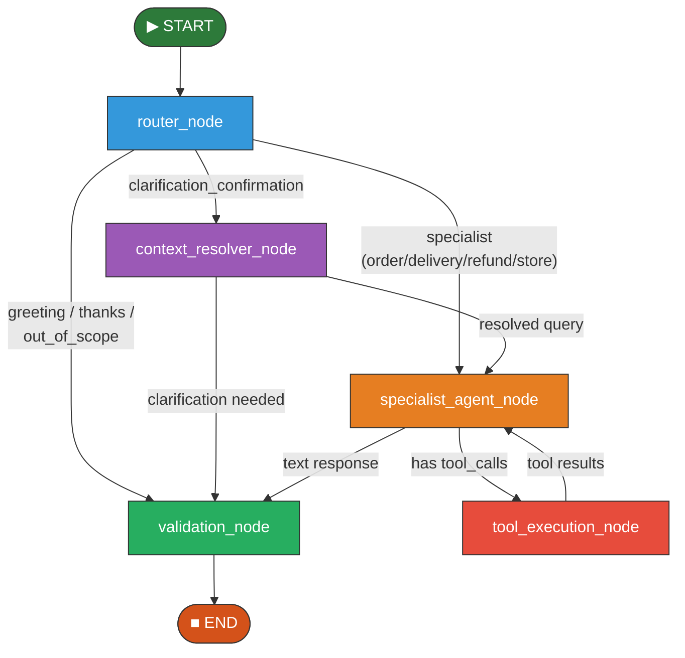
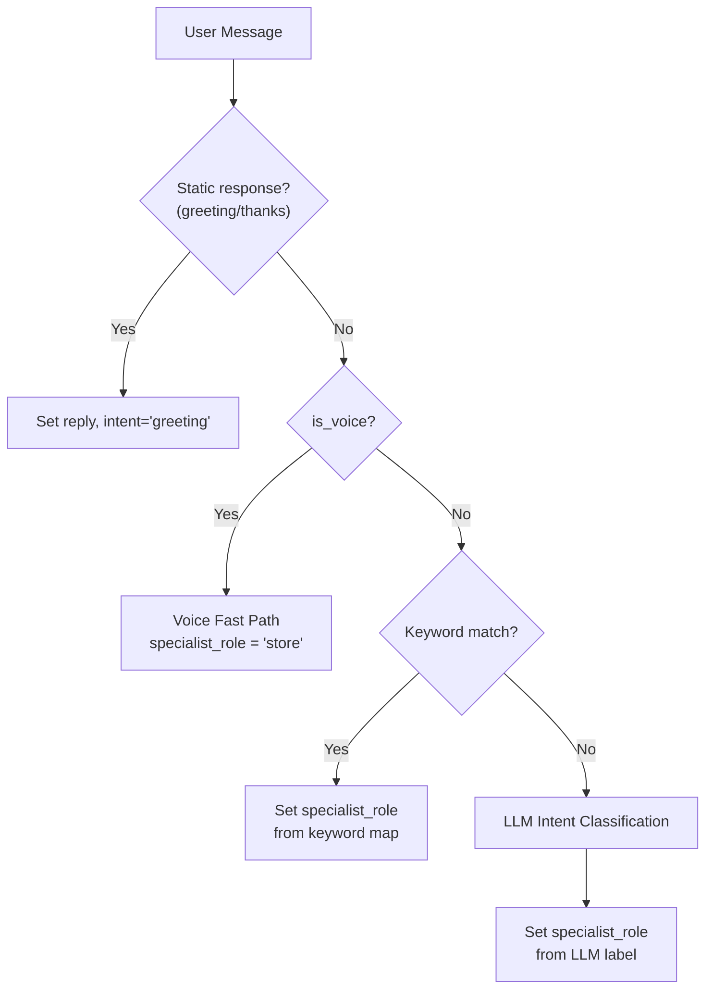
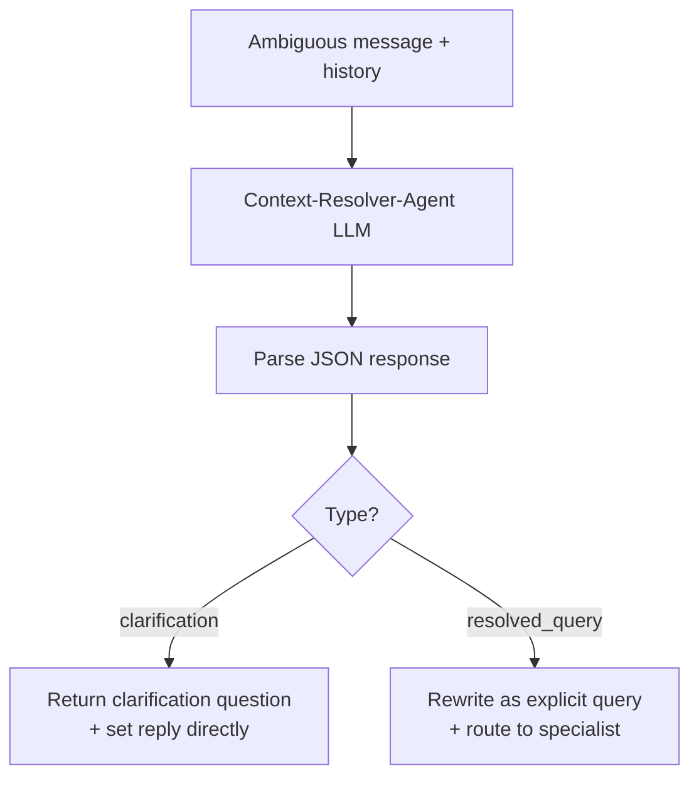
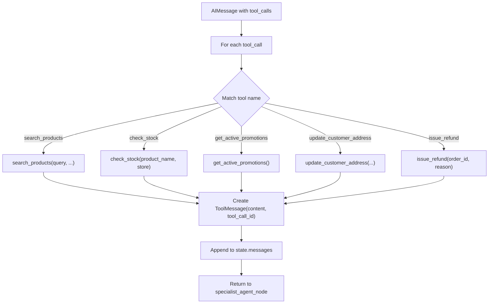
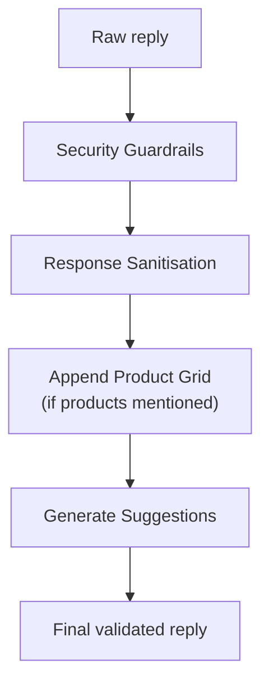

# LangGraph Architecture

## 1. Overview

The Retail AI Assistant uses **LangGraph** to orchestrate a multi-node, stateful agent pipeline. The graph is defined in `backend/agents/graph.py` and compiled once at module load time.

LangGraph was chosen over simple linear agent chains because:
- Complex queries may require **conditional routing** (specialist vs. context resolution vs. static response)
- Tool-calling requires a **looping edge** (specialist → tool → specialist)
- The **state** must be explicitly tracked and mutated across nodes
- Individual nodes can be **debugged and tested** in isolation

## 2. Graph Definition

```python
from langgraph.graph import StateGraph, END

graph = StateGraph(AgentState)

# Add nodes
graph.add_node("router_node", router_node)
graph.add_node("context_resolver_node", context_resolver_node)
graph.add_node("specialist_agent_node", specialist_agent_node)
graph.add_node("tool_execution_node", tool_execution_node)
graph.add_node("validation_node", validation_node)

# Set entry point
graph.set_entry_point("router_node")

# Add conditional edges
graph.add_conditional_edges("router_node", route_after_router)
graph.add_conditional_edges("context_resolver_node", route_after_context)
graph.add_conditional_edges("specialist_agent_node", route_after_specialist)

# Add fixed edges
graph.add_edge("tool_execution_node", "specialist_agent_node")
graph.add_edge("validation_node", END)

compiled_graph = graph.compile()
```

## 3. Graph Visualisation



## 4. State Schema

The graph state is defined as a `TypedDict`:

```python
class AgentState(TypedDict):
    messages: Annotated[List[BaseMessage], add_messages]  # LangChain message accumulator
    message_text: str           # The user's raw message text
    history: List[dict]         # Conversation history [{role, content}, ...]
    customer_data: dict         # Full customer profile + orders
    context_block: str          # Formatted context string for system prompts
    is_voice: bool              # Whether request came from voice channel
    intent: str                 # Classified intent label
    specialist_role: str        # Target specialist agent (order/delivery/refund/store)
    reply: str                  # Final response text
    sources: List[str]          # Source labels for debugging
    suggestions: List[str]      # Follow-up suggestion chips
    handoff_required: bool      # Whether handoff to human agent is needed
    agent_instructions: dict    # Fetched Foundry agent instructions (by role)
    error: Optional[str]        # Error message if something failed
```

### State Flow Through Nodes

| Field | Set By | Used By |
|-------|--------|---------|
| `message_text` | Router (initial) | Router, Context Resolver, Specialist |
| `intent` | Router Node | Routing logic |
| `specialist_role` | Router Node, Context Resolver | Specialist Node |
| `reply` | Specialist Node, Validation Node | Final output |
| `messages` | Specialist Node, Tool Execution Node | LangChain message threading |
| `sources` | All nodes | Debugging / response metadata |
| `suggestions` | Validation Node (via Router) | Frontend suggestion chips |
| `agent_instructions` | Initial state (from Router) | Specialist Node |

## 5. Node Implementations

### 5.1 Router Node

**Purpose:** Classifies the user's intent and determines which path to take.



**Heuristic Keyword Map:**

| Keywords | Routed To |
|----------|-----------|
| `order, purchase, bought, receipt, payment, nectar, loyalty, points` | `order` |
| `delivery, driver, eta, tracking, deliver, slot, dispatch` | `delivery` |
| `refund, return, damaged, spoiled, broken, mouldy, compensation` | `refund` |
| `stock, availability, price, aisle, store, promotion, offer, coupon, dietary, allergen, nutrition, gluten, vegan, organic, product, search, find, browse` | `store` |

**Voice Fast Path:** Voice queries skip intent classification entirely and route directly to `store` agent (the most common voice use case). This reduces latency by ~1-2 seconds.

### 5.2 Context Resolver Node

**Purpose:** Resolves ambiguous follow-up messages (e.g., "yes", "sure", "that one").



**Example:**
- User: "Is milk in stock?" → Agent: "Yes, at Islington and Camden. Want directions?"
- User: "yes"
- Context Resolver: Rewrites to "Give me directions to a store that has milk in stock"

### 5.3 Specialist Agent Node

**Purpose:** Invokes the domain-specific LLM with role instructions, customer context, and tool bindings.

**Implementation:**
1. Load role instructions from `agent_instructions[specialist_role]`
2. Build system message with instructions + customer context + product-grid formatting rules
3. Build message thread from conversation history
4. Bind available tools to the LLM instance
5. Invoke `llm_with_tools.ainvoke(messages)`
6. If response contains `tool_calls`, transition to Tool Execution Node
7. If response is text, transition to Validation Node

**Tool Binding by Role:**

| Role | Tools Available |
|------|----------------|
| `order` | `search_products` |
| `delivery` | `update_customer_address` |
| `refund` | `issue_refund` |
| `store` | `search_products`, `check_stock`, `get_active_promotions` |
| `general` | (none) |

### 5.4 Tool Execution Node

**Purpose:** Executes tool calls made by the specialist agent and returns results.



**Tool Call Lifecycle:**
1. Specialist agent returns `AIMessage` with `tool_calls` array
2. Tool Execution Node parses each tool call's `name` and `args`
3. Executes the corresponding Python function with `AgentRouter` instance
4. Creates a `ToolMessage` with the result string and matching `tool_call_id`
5. Appends `ToolMessage` to state messages
6. Returns to Specialist Agent Node for re-invocation with tool results

### 5.5 Validation Node

**Purpose:** Applies security guardrails, sanitisation, and formatting to the final response.



**Validation Steps:**
1. **Security guardrails** — Check for leaked credentials, API keys, environment variables
2. **ID masking** — Remove internal IDs (CUST-*, asst_*) from responses
3. **Markdown sanitisation** — Clean up formatting for display
4. **Raw JSON detection** — Catch cases where the agent returns raw routing JSON
5. **Product grid injection** — If the reply mentions specific products, append `<product-grid>` XML tags
6. **Suggestion generation** — Generate follow-up question suggestions based on the conversation

## 6. Edge Routing Functions

### `route_after_router(state) → str`

| Condition | Target Node |
|-----------|-------------|
| `intent in ["greeting", "thanks", "out_of_scope"]` | `validation_node` |
| `intent == "clarification_confirmation"` | `context_resolver_node` |
| Otherwise | `specialist_agent_node` |

### `route_after_context(state) → str`

| Condition | Target Node |
|-----------|-------------|
| `reply` is set (clarification response) | `validation_node` |
| `specialist_role` is set (resolved query) | `specialist_agent_node` |

### `route_after_specialist(state) → str`

| Condition | Target Node |
|-----------|-------------|
| Last message has `tool_calls` | `tool_execution_node` |
| Otherwise | `validation_node` |

## 7. Tool Definitions

### search_products

```json
{
  "name": "search_products",
  "description": "Searches and filters the product catalog",
  "parameters": {
    "type": "object",
    "properties": {
      "query": {"type": "string"},
      "category": {"type": "string"},
      "dietary_filters": {"type": "array", "items": {"type": "string"}},
      "sort_by": {"type": "string", "enum": ["price_asc", "price_desc", "rating", "popularity"]},
      "is_on_promotion": {"type": "boolean"},
      "store_name": {"type": "string"},
      "limit": {"type": "integer"}
    }
  }
}
```

### check_stock

```json
{
  "name": "check_stock",
  "description": "Checks stock levels, price, and aisle of a product across stores",
  "parameters": {
    "type": "object",
    "properties": {
      "product_name": {"type": "string"},
      "store_name": {"type": "string"}
    },
    "required": ["product_name"]
  }
}
```

### issue_refund

```json
{
  "name": "issue_refund",
  "description": "Issues a refund for a spoiled or damaged item",
  "parameters": {
    "type": "object",
    "properties": {
      "order_id": {"type": "string"},
      "reason": {"type": "string"},
      "amount": {"type": "number"},
      "method": {"type": "string"}
    },
    "required": ["order_id", "reason", "amount"]
  }
}
```

### update_customer_address

```json
{
  "name": "update_customer_address",
  "description": "Updates the customer's default delivery address",
  "parameters": {
    "type": "object",
    "properties": {
      "line1": {"type": "string"},
      "city": {"type": "string"},
      "postcode": {"type": "string"}
    },
    "required": ["line1", "city"]
  }
}
```

### get_active_promotions

```json
{
  "name": "get_active_promotions",
  "description": "Retrieves active store promotions and discount coupon codes",
  "parameters": {"type": "object", "properties": {}}
}
```

## 8. Error Handling

The graph includes error handling at multiple levels:

1. **Node-level try/except** — Each node catches exceptions and sets `state["error"]`
2. **Fallback responses** — If a specialist agent fails, a generic error message is returned
3. **Tool execution errors** — Tool failures return error strings to the LLM for graceful handling
4. **Token refresh** — If the LLM token expires mid-request, it's automatically refreshed
5. **Graph-level timeout** — LangGraph's `ainvoke()` supports configurable timeouts

## 9. Configuration

The graph uses `RunnableConfig` for execution configuration:

```python
config = {
    "configurable": {
        "thread_id": str(uuid.uuid4()),
        "router": agent_router_instance,
        "stream_queue": optional_stream_queue,
    }
}
```

The `router` key passes the `AgentRouter` instance through the graph, giving all nodes access to:
- Customer data (`router.customer_data`)
- Database functions (`router._load_inventory_data()`)
- Tool implementations (`router.search_products()`, etc.)
- Agent instructions (`router._agent_instructions`)
- LLM instance (`router._get_llm()`)
