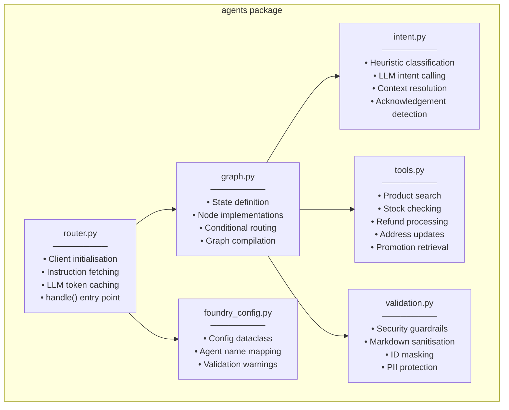
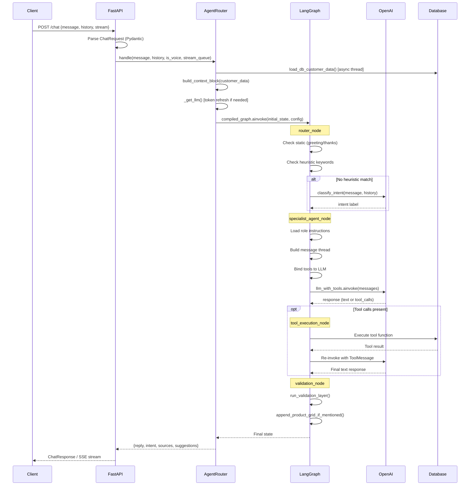
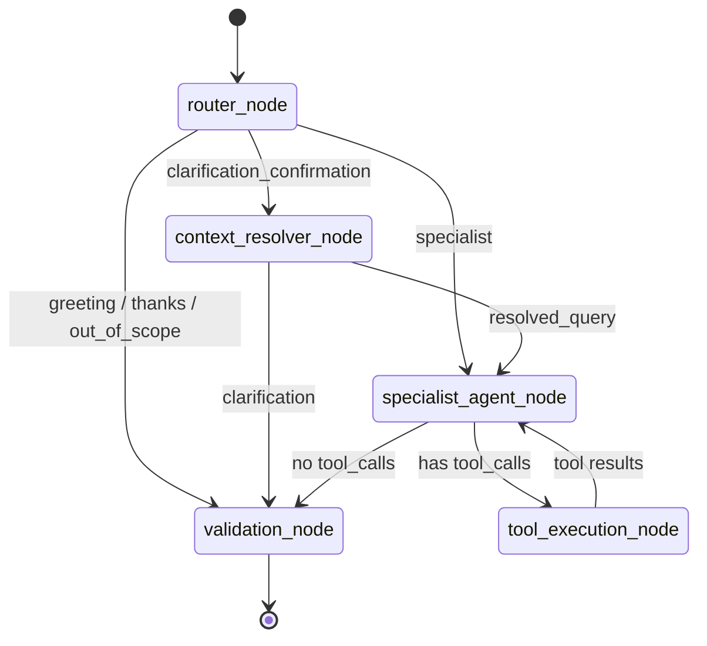
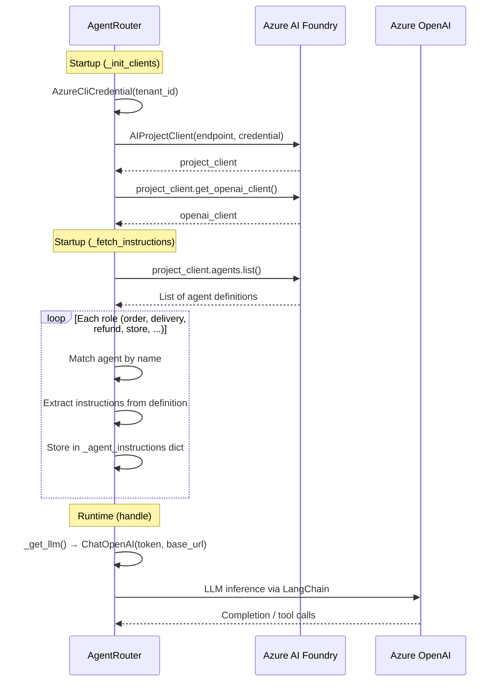
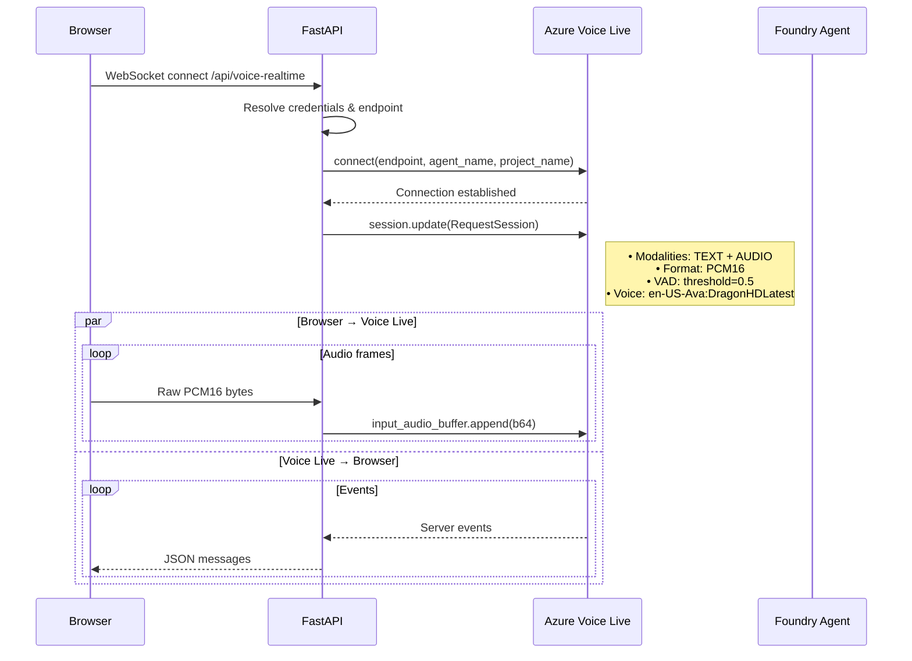
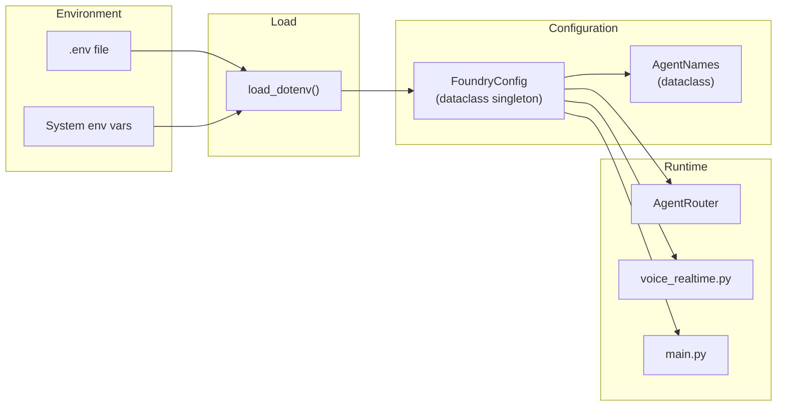
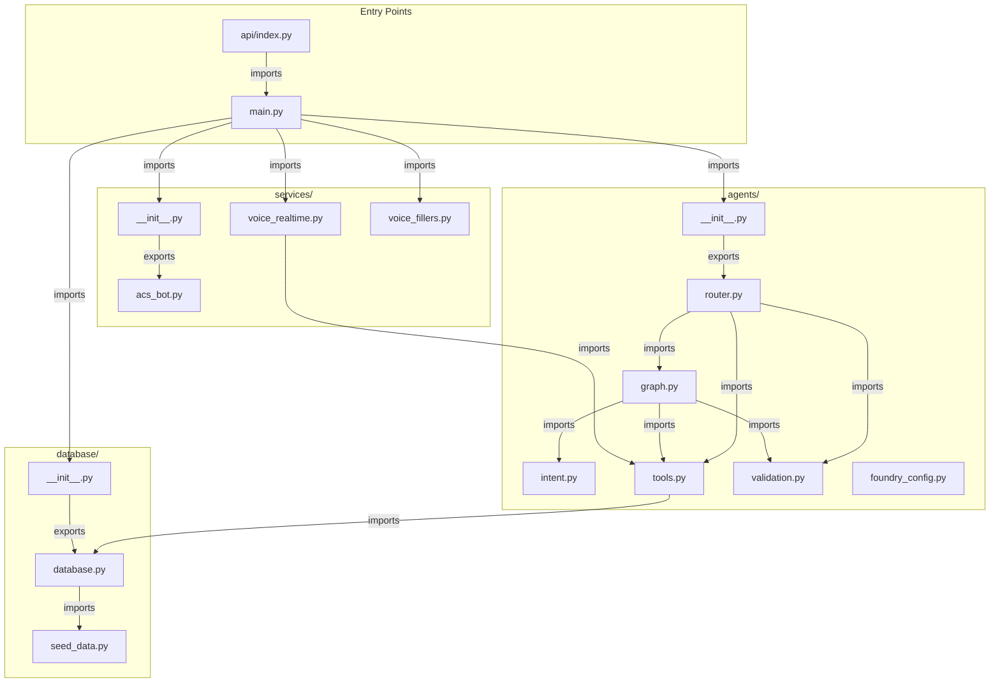
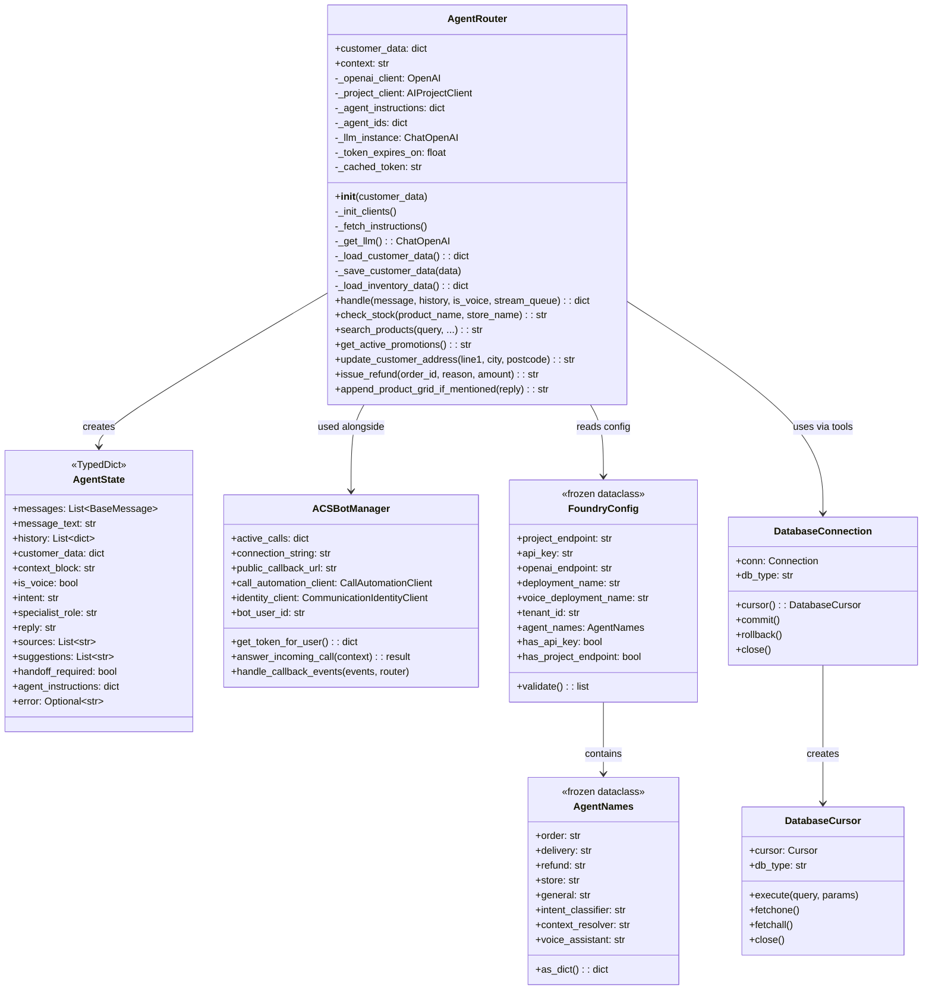
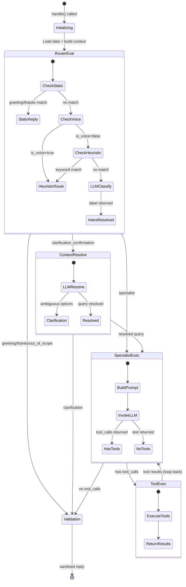
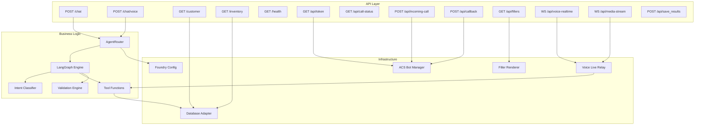

# Low-Level Design (LLD)

## 1. Folder Structure

```
retail-chatbot/
├── .env                              # Environment variables (secrets, endpoints, agent names)
├── .env.example                      # Template for .env configuration
├── .gitignore                        # Git exclusions (venv, .env, __pycache__, .db, node_modules)
├── README.md                         # Project overview and getting started
├── requirements.txt                  # Python dependencies (26 packages)
├── vercel.json                       # Vercel URL rewrite rules for serverless deployment
├── current_agents_backup.json        # Snapshot of Azure AI Foundry agent definitions
│
├── api/                              # Vercel serverless entrypoint
│   ├── index.py                      # Imports and re-exports FastAPI app for Vercel
│   └── requirements.txt              # Vercel-specific Python dependencies
│
├── backend/                          # Python backend application
│   ├── main.py                       # FastAPI app definition, routes, CORS, WebSocket handlers
│   │
│   ├── agents/                       # AI agent orchestration package
│   │   ├── __init__.py               # Exports AgentRouter
│   │   ├── router.py                 # AgentRouter class: client init, instruction fetch, LLM caching, handle()
│   │   ├── graph.py                  # LangGraph state graph: nodes, edges, conditional routing
│   │   ├── intent.py                 # Intent classification (heuristic + LLM) and context resolution
│   │   ├── tools.py                  # Tool function implementations (search, stock, refund, address, promotions)
│   │   ├── validation.py             # Response validation, sanitisation, security guardrails
│   │   └── foundry_config.py         # Centralised Azure AI Foundry configuration dataclass
│   │
│   ├── database/                     # Database abstraction layer
│   │   ├── __init__.py               # Exports init_db, seed_db, load/save functions, get_connection
│   │   ├── database.py               # DDL, connection pooling, CRUD, dual SQLite/PostgreSQL support
│   │   └── seed_data.py              # Hardcoded seed data (customer, orders, 20+ products, 3 stores)
│   │
│   ├── services/                     # External service integrations
│   │   ├── __init__.py               # Exports ACSBotManager
│   │   ├── acs_bot.py                # Azure Communication Services call automation manager
│   │   ├── voice_realtime.py         # Voice Live tool execution, credential resolution, realtime tools
│   │   └── voice_fillers.py          # Pre-rendered TTS filler audio clip system
│   │
│   └── tests/                        # Backend test suite
│       ├── __init__.py               # Test package marker
│       ├── test_followup.py          # Context resolution and follow-up conversation tests
│       ├── test_voice_data.py        # Voice data processing tests
│       └── test_voice_pipeline.py    # Voice pipeline integration tests
│
├── frontend/                         # Browser-based SPA
│   ├── index.html                    # Full Sainsbury's-themed page (2452 lines, all-in-one)
│   ├── css/
│   │   └── styles.css                # Chat widget, glassmorphism, responsive styles
│   ├── js/
│   │   ├── app.js                    # Chat/voice controller, SSE streaming, WebSocket voice, phone call
│   │   ├── azure-sdk.js              # Azure SDK shim/stub (263 bytes)
│   │   └── azure-communication-services.js  # Bundled ACS Web Calling SDK (5.5MB)
│   ├── images/
│   │   └── products/                 # Product image assets
│   ├── test_runner.html              # Automated test runner UI
│   └── test_cases.json               # Test scenario definitions
│
├── mock_data/                        # Persistent data files
│   ├── retail_chatbot.db             # SQLite database (auto-seeded on first run)
│   └── test_results.json             # Test runner output
│
├── Tools/                            # Azure AI Foundry tool definitions (JSON)
│   ├── search_products.json          # Product search tool schema
│   ├── check_stock.json              # Stock check tool schema
│   ├── issue_refund.json             # Refund tool schema
│   ├── get_active_promotions.json    # Promotions tool schema
│   └── update_customer_address.json  # Address update tool schema
│
└── scratch/                          # Temporary development files
```

## 2. File Responsibilities

### Backend Core

| File | Lines | Responsibility |
|------|-------|---------------|
| `main.py` | 792 | FastAPI app setup, all HTTP/WS routes, CORS, static files, telemetry init, filler clip pre-rendering |
| `router.py` | 325 | `AgentRouter` class — client initialisation, instruction fetching, LLM token caching, `handle()` entry point |
| `graph.py` | 509 | LangGraph `StateGraph` definition — 5 nodes, conditional edges, compiled graph singleton |
| `intent.py` | 150 | `classify_intent()` and `resolve_context()` — hybrid heuristic + LLM classification |
| `tools.py` | 645 | 5 tool functions + helpers: `search_products`, `check_stock`, `get_active_promotions`, `update_customer_address`, `issue_refund` |
| `validation.py` | 161 | `validate_and_sanitize_response()`, `check_security_guardrails()`, `run_validation_layer()`, `is_raw_routing_json()` |
| `foundry_config.py` | 161 | `FoundryConfig` and `AgentNames` dataclasses — singleton configuration |

### Database

| File | Lines | Responsibility |
|------|-------|---------------|
| `database.py` | 1051 | DDL schema (7 tables), `DatabaseConnection`/`DatabaseCursor` wrappers, connection pooling, CRUD, inventory caching |
| `seed_data.py` | 6* | Hardcoded Python dicts: `CUSTOMER_SEED` (1 customer, 4 orders) and `INVENTORY_SEED` (20+ products, 3 stores) |

*seed_data.py is 6 lines but contains ~66KB of inline data

### Services

| File | Lines | Responsibility |
|------|-------|---------------|
| `acs_bot.py` | 155 | `ACSBotManager` — identity/token creation, incoming call answering, media streaming, callback event handling |
| `voice_realtime.py` | 177 | Azure credential resolution, `execute_voice_tool()`, `strip_markdown()`, `REALTIME_TOOLS` JSON definitions |
| `voice_fillers.py` | 125 | Filler phrase definitions (5 trees × 4 phrases + 6 thinking clips), TTS synthesis, parallel rendering |

### Frontend

| File | Lines | Responsibility |
|------|-------|---------------|
| `index.html` | 2452 | Full Sainsbury's page: header, hero, product grid, chat widget, phone call UI, customer sidebar |
| `app.js` | 2273 | Chat controller, SSE streaming, voice recording, WebSocket voice relay, phone call mode, product grid rendering |
| `styles.css` | ~900 | Chat widget styling, glassmorphism effects, responsive breakpoints, animations |

## 3. Module Responsibilities



## 4. API Flow



## 5. LangGraph Workflow



## 6. Azure AI Foundry Integration



## 7. Azure Database Integration

```mermaid
flowchart TD
    Start([Application Start]) --> DetectDB{Check DB_HOST<br/>env var}

    DetectDB -->|Set| TryPG[Try PostgreSQL<br/>Connection]
    DetectDB -->|Not Set| UseSQLite[Use SQLite]

    TryPG -->|Success| SetPG[_cached_db_type = postgres]
    TryPG -->|Fail| UseSQLite

    UseSQLite --> SetSQLite[_cached_db_type = sqlite]

    SetPG --> InitPool[Create ThreadedConnectionPool<br/>minconn=1, maxconn=20]
    SetSQLite --> InitSQLite[sqlite3.connect(DB_PATH)]

    InitPool --> GetConn[get_connection()]
    InitSQLite --> GetConn

    GetConn --> DBConn[DatabaseConnection wrapper]
    DBConn --> DBCursor[DatabaseCursor wrapper<br/>• ? → %s translation<br/>• AUTOINCREMENT → SERIAL<br/>• INSERT OR IGNORE → ON CONFLICT<br/>• Retry policy (3 attempts)]
```

## 8. Voice Live Integration



## 9. Authentication Flow

```mermaid
flowchart TD
    Start([Need Azure Credential]) --> CheckEnv{AZURE_CLIENT_ID +<br/>AZURE_CLIENT_SECRET<br/>set?}

    CheckEnv -->|Yes| UseCSC[ClientSecretCredential<br/>(tenant_id, client_id, client_secret)]
    CheckEnv -->|No| UseAzCLI[AzureCliCredential<br/>(tenant_id)]

    UseCSC --> GetToken[credential.get_token<br/>'https://ai.azure.com/.default']
    UseAzCLI --> GetToken

    GetToken --> CacheToken[Cache token + expires_on]
    CacheToken --> CreateLLM[ChatOpenAI<br/>(api_key=token, base_url)]

    CreateLLM --> CheckExpiry{Token expires<br/>in < 300s?}
    CheckExpiry -->|Yes| GetToken
    CheckExpiry -->|No| UseCached[Use cached LLM instance]
```

## 10. Configuration Flow



## 11. Dependency Relationships



## 12. Class Relationships



## 13. State Diagram — LangGraph Execution



## 14. Component Diagram


