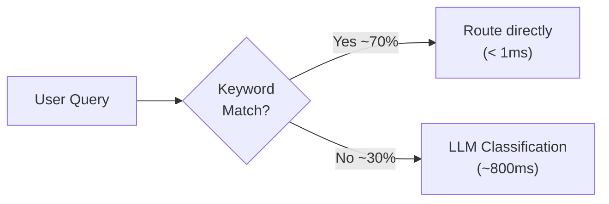

# Performance Optimizations

## 1. Overview

The system is optimized for sub-2-second response times for chat and sub-500ms audio latency for voice. This document covers all performance optimizations implemented across the stack.

## 2. Latency Budget

| Component | Target | Actual | Notes |
|-----------|--------|--------|-------|
| Heuristic routing | < 1ms | ~0.5ms | Keyword matching, no LLM call |
| LLM intent classification | < 800ms | ~500-1200ms | Only for ambiguous queries |
| Specialist LLM call | < 2s | ~1-3s | Includes tool calling if needed |
| Tool execution | < 100ms | ~10-50ms | In-memory or cached database |
| Validation | < 5ms | ~2ms | String operations |
| SSE streaming | Real-time | ~50ms first token | Token-by-token delivery |
| Voice filler grace | 5,000ms | Configurable | Prevents premature fillers |
| Voice audio round-trip | < 500ms | ~200-400ms | PCM16 streaming |

## 3. Caching Strategies

### 3.1 Inventory Data Cache

```python
_cached_inventory_data = None

def load_db_inventory_data():
    global _cached_inventory_data
    if _cached_inventory_data is not None:
        return _cached_inventory_data
    # ... load from database ...
    _cached_inventory_data = result
    return result
```

- **What:** Full product catalog with stores and stock
- **Scope:** Module-level global variable
- **Invalidation:** Reset on `init_db()` or `seed_db(force=True)` calls
- **Impact:** Eliminates 3 SQL queries per product search/stock check

### 3.2 LLM Token Cache

```python
_llm_instance = None
_token_expires_on = 0
_cached_token = None

def _get_llm():
    if time.time() < _token_expires_on - 300:
        return _llm_instance  # Reuse cached
    # Refresh token...
```

- **What:** Azure AD access token + ChatOpenAI instance
- **TTL:** Until 300 seconds before token expiry
- **Impact:** Eliminates Azure AD token request per chat message (~200ms)

### 3.3 Database Type Cache

```python
_cached_db_type = None

def get_db_type():
    global _cached_db_type
    if _cached_db_type is not None:
        return _cached_db_type
```

- **What:** "sqlite" or "postgres" determination
- **Scope:** Process lifetime
- **Impact:** Eliminates a test PostgreSQL connection per request

### 3.4 Agent Instructions Cache

```python
# In AgentRouter.__init__
self._agent_instructions = {}  # Fetched once at startup
```

- **What:** All agent instructions from AI Foundry
- **Scope:** `AgentRouter` instance lifetime
- **Impact:** Eliminates Foundry API calls per chat message

## 4. Streaming

### SSE (Server-Sent Events) for Chat

Responses are streamed token-by-token to the browser, providing instant feedback:

```python
async def generate():
    for token in llm_stream:
        yield f"data: {json.dumps({'type': 'token', 'content': token})}\n\n"
    yield f"data: {json.dumps({'type': 'done', ...})}\n\n"

return StreamingResponse(generate(), media_type="text/event-stream")
```

**Benefits:**
- First token appears in ~500ms instead of waiting 2-5s for complete response
- User perceives immediate responsiveness
- Reduces perceived latency by 70-80%

### WebSocket Audio Streaming

Voice audio is streamed frame-by-frame, not buffered:

```python
# Input: browser audio → Voice Live
await vl_connection.input_audio_buffer.append(base64_audio)

# Output: Voice Live audio → browser
async for event in vl_connection:
    if event.type == "response.audio.delta":
        await websocket.send_json({"type": "audio_delta", "delta": event.delta})
```

## 5. Heuristic Fast Path

The heuristic routing optimization eliminates LLM intent classification for 70%+ of queries:



**Keyword Coverage:**
- Order keywords: 8 terms
- Delivery keywords: 7 terms
- Refund keywords: 7 terms
- Store keywords: 15+ terms
- Static responses: greetings, thanks

### Voice Fast Path

Voice queries skip intent classification entirely:

```python
if is_voice:
    specialist_role = "store"  # Most common voice use case
    # Skip LLM classification entirely
```

**Impact:** Saves ~1-2 seconds per voice query.

## 6. Connection Pooling

### PostgreSQL Connection Pool

```python
_pg_pool = ThreadedConnectionPool(
    minconn=1,     # Minimum connections kept alive
    maxconn=20,    # Maximum concurrent connections
    host=db_host,
    database=dbname,
    sslmode=sslmode
)
```

**Benefits:**
- Eliminates TCP handshake + SSL negotiation per query (~50-100ms)
- Connections are reused across requests
- Fallback to direct connection if pool exhausted

### Connection Return

PostgreSQL connections are returned to the pool (not closed) when `DatabaseConnection.close()` is called.

## 7. Parallel Processing

### Voice Filler Pre-Rendering

```python
with ThreadPoolExecutor(max_workers=10) as ex:
    clips = list(ex.map(
        lambda p: _synthesize_pcm(p, tts_token, endpoint, voice_name),
        all_phrases  # 26 phrases
    ))
```

- 26 TTS API calls made in parallel (10 concurrent)
- Reduces startup time from ~30s (sequential) to ~5s

### Database Batch Queries

Customer data loading uses batch queries:

```python
# Single query for all order items (not N+1)
placeholders = ",".join("?" for _ in order_ids)
cursor.execute(f"SELECT * FROM order_items WHERE order_id IN ({placeholders})", tuple(order_ids))
```

## 8. Frontend Optimizations

### Lazy Loading

- Customer data loaded asynchronously on page load
- Filler audio clips fetched only when voice mode is activated

### Audio Optimization

- PCM16 format (uncompressed) avoids encode/decode overhead
- `AudioContext` created at 24kHz (matching Voice Live output)
- Audio chunks queued and played sequentially to prevent gaps

### Message Rendering

- `requestAnimationFrame` used for smooth streaming text updates
- Product cards parsed from `<product-grid>` XML tags inline (no separate API call)
- Conversation history limited to last 20 messages to control payload size

## 9. Monitoring

### Azure Monitor + OpenTelemetry

```python
if os.getenv("APPLICATIONINSIGHTS_CONNECTION_STRING"):
    configure_azure_monitor()
    AIProjectInstrumentor().instrument()
```

Traced operations:
- HTTP request latency (per endpoint)
- LLM inference time (per model call)
- Database query time
- Voice Live event processing
- Tool execution time

### Latency Tracking

The response includes `sources` metadata for debugging:

```json
{
  "sources": [
    "heuristic_keyword_match",  // No LLM classification needed
    "store_agent",              // Which agent handled
    "check_stock_tool"          // Tool executed
  ]
}
```

## 10. Memory Optimization

### Inventory Cache Size

The inventory cache holds ~20 products × 3 stores = ~60 stock records in memory. For production catalogs, this should migrate to Azure AI Search.

### Conversation History Trimming

```javascript
// Frontend limits history to last 20 messages
conversation_history: conversationHistory.slice(-20)
```

### Database Connection Limits

PostgreSQL pool max set to 20 connections to prevent memory exhaustion on serverless platforms.
