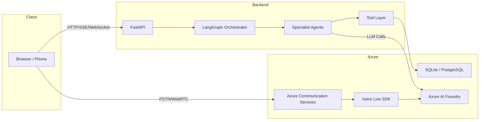

# Sainsbury's Retail AI Assistant — Technical Documentation

> **Version:** 1.0.0 · **Last Updated:** July 2026 · **Status:** Production

This documentation suite provides comprehensive technical coverage of the Retail AI Assistant platform — a multi-agent, voice-enabled customer service chatbot built on Azure AI Foundry. It is designed for developer onboarding, architecture reviews, client presentations, and long-term maintenance.

---

## Documentation Index

| # | Document | Description |
|---|----------|-------------|
| 1 | [Executive Overview](Executive-Overview.md) | Project purpose, business problem, solution, key features, and design decisions |
| 2 | [High-Level Design (HLD)](High-Level-Design.md) | Architecture diagrams, system context, component interactions, and deployment topology |
| 3 | [Low-Level Design (LLD)](Low-Level-Design.md) | Folder structure, module responsibilities, class relationships, and state diagrams |
| 4 | [System Design](System-Design.md) | Backend, frontend, and Azure architecture in detail |
| 5 | [Architecture](Architecture.md) | End-to-end request flows for chat and voice |
| 6 | [LangGraph](LangGraph.md) | Graph architecture, nodes, edges, state management, routing, and tool invocation |
| 7 | [Azure AI Foundry](Azure-AI-Foundry.md) | Projects, agents, instructions, guardrails, models, tracing, and evaluations |
| 8 | [Voice Live](VoiceLive.md) | Voice Live architecture, WebSocket lifecycle, audio streaming, and sequence diagrams |
| 9 | [Azure AI Search](Azure-AI-Search.md) | Indexes, search flow, semantic/hybrid search, and query optimization |
| 10 | [Database](Database.md) | Schema, tables, relationships, ER diagram, query flow, and connection management |
| 11 | [API Reference](API-Reference.md) | Every API endpoint with routes, methods, request/response bodies, and examples |
| 12 | [File Reference](File-Reference.md) | File-by-file documentation of every significant file in the project |
| 13 | [Sequence Diagrams](Sequence-Diagrams.md) | Mermaid sequence diagrams for chat, voice, agent, tool, search, and database flows |
| 14 | [Deployment](Deployment.md) | Environment variables, installation, local dev, production, CI/CD, and Vercel deployment |
| 15 | [Performance](Performance.md) | Optimizations, caching, streaming, connection reuse, latency, and monitoring |
| 16 | [Security](Security.md) | Authentication, authorization, guardrails, PII protection, and responsible AI |
| 17 | [Troubleshooting](Troubleshooting.md) | Common issues with Azure AI Foundry, Voice Live, database, and deployment |
| 18 | [Architecture Decision Records](ADR.md) | Design decisions, alternatives considered, trade-offs, and future improvements |

---

## Quick Start

```bash
# 1. Clone and install
git clone <repo-url>
cd retail-chatbot
python -m venv .venv && .venv\Scripts\activate
pip install -r requirements.txt

# 2. Configure environment
cp .env.example .env
# Fill in Azure credentials in .env

# 3. Run locally
uvicorn backend.main:app --reload --port 8000

# 4. Open browser
# http://localhost:8000
```

See [Deployment Guide](Deployment.md) for full setup instructions.

---

## Architecture at a Glance



---

## Technology Stack

| Layer | Technology |
|-------|-----------|
| Backend Framework | FastAPI (Python 3.11+) |
| AI Orchestration | LangGraph + LangChain |
| AI Models | Azure OpenAI GPT-4o / GPT-5.1 |
| Agent Platform | Azure AI Foundry Agents SDK |
| Voice | Azure Voice Live SDK + Azure Communication Services |
| Database | SQLite (local) / Azure PostgreSQL (production) |
| Frontend | Vanilla HTML/CSS/JS with Web Audio API |
| Deployment | Vercel (serverless) / Uvicorn (local) |
| Telemetry | Azure Monitor + OpenTelemetry |
