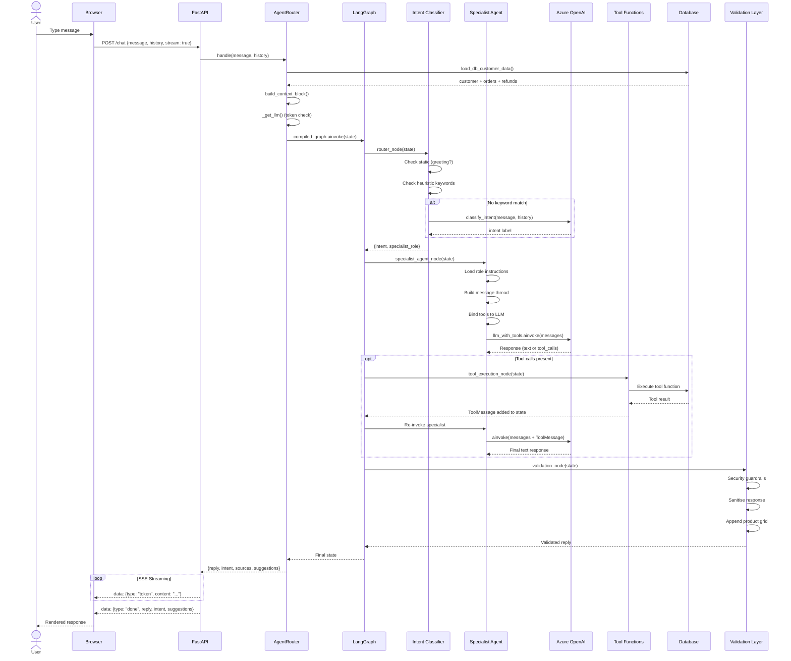
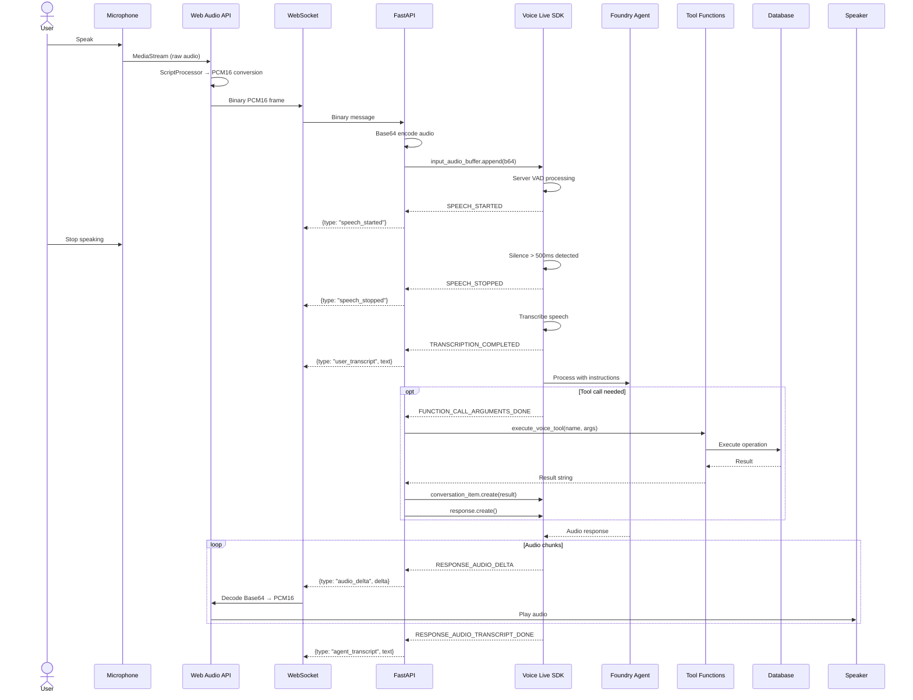
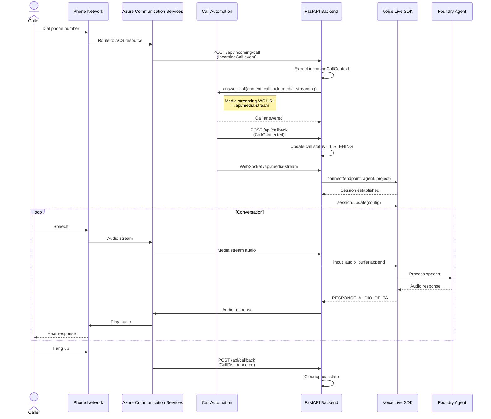
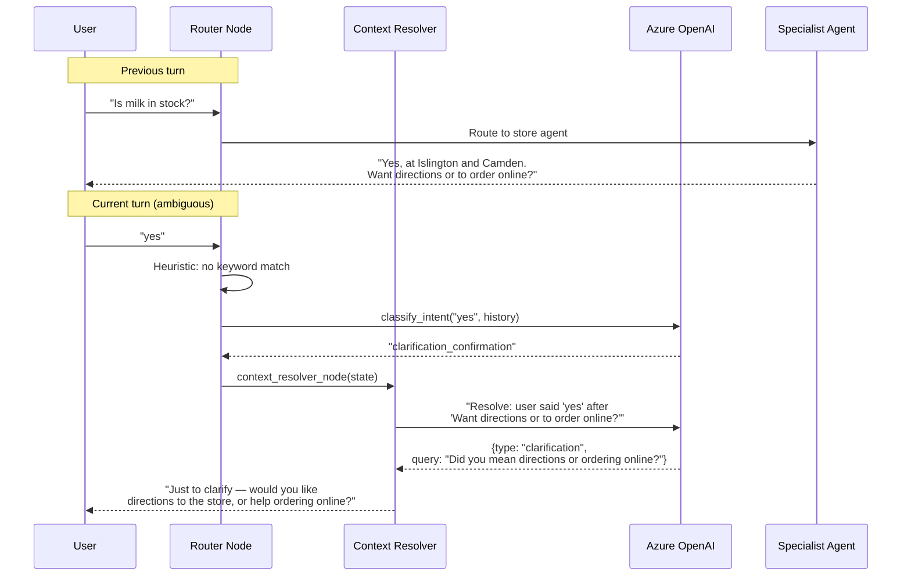
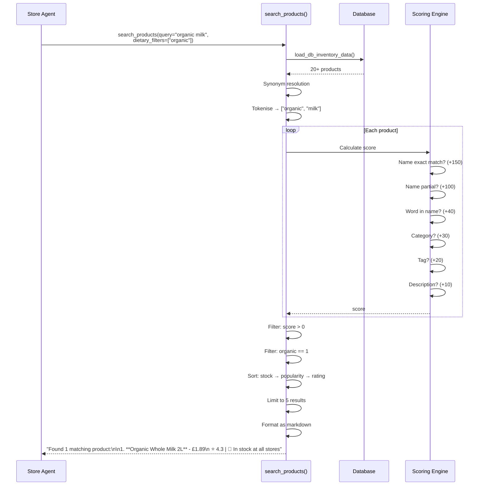
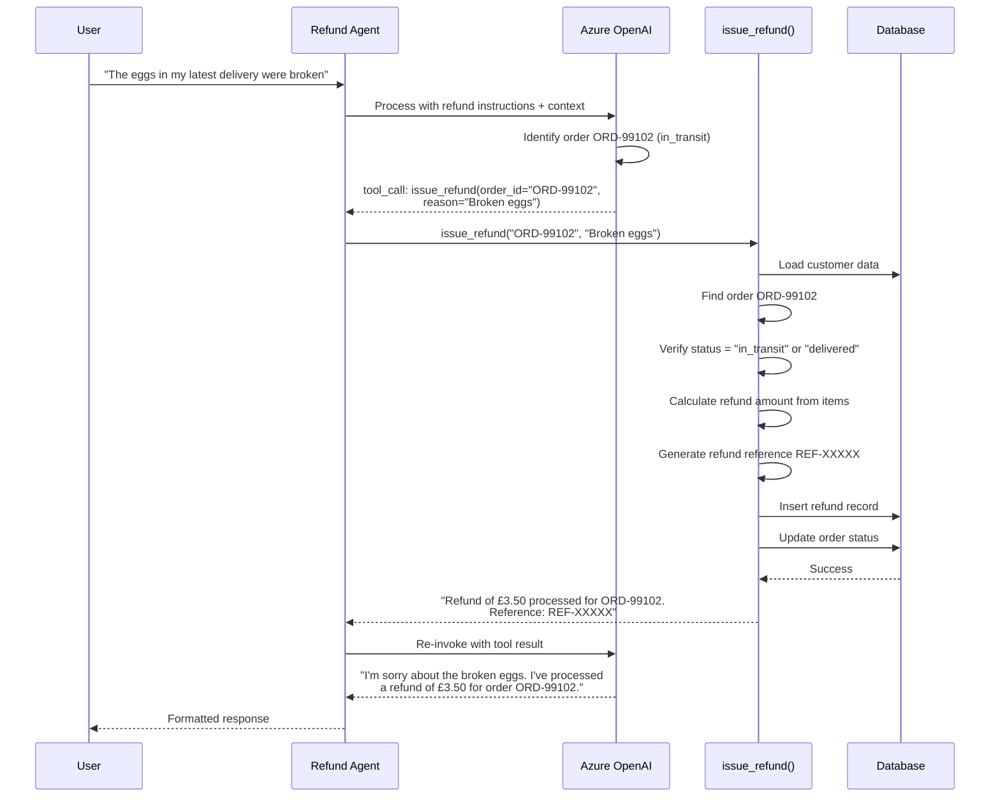
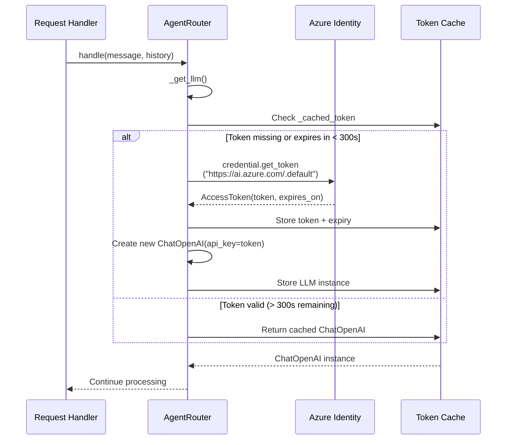
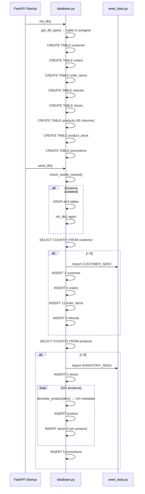
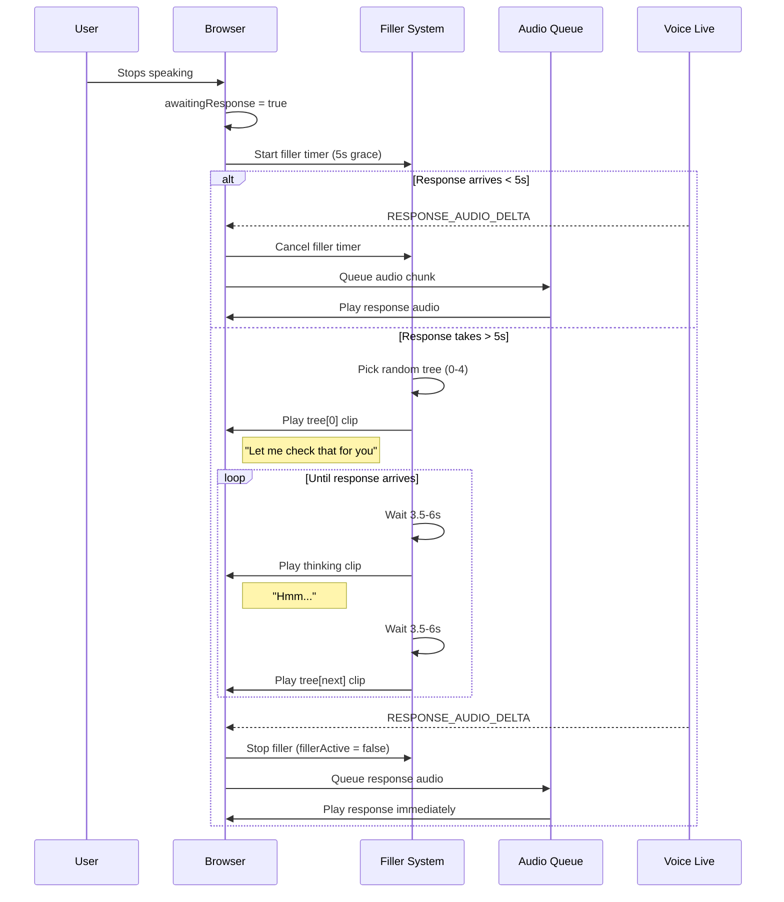
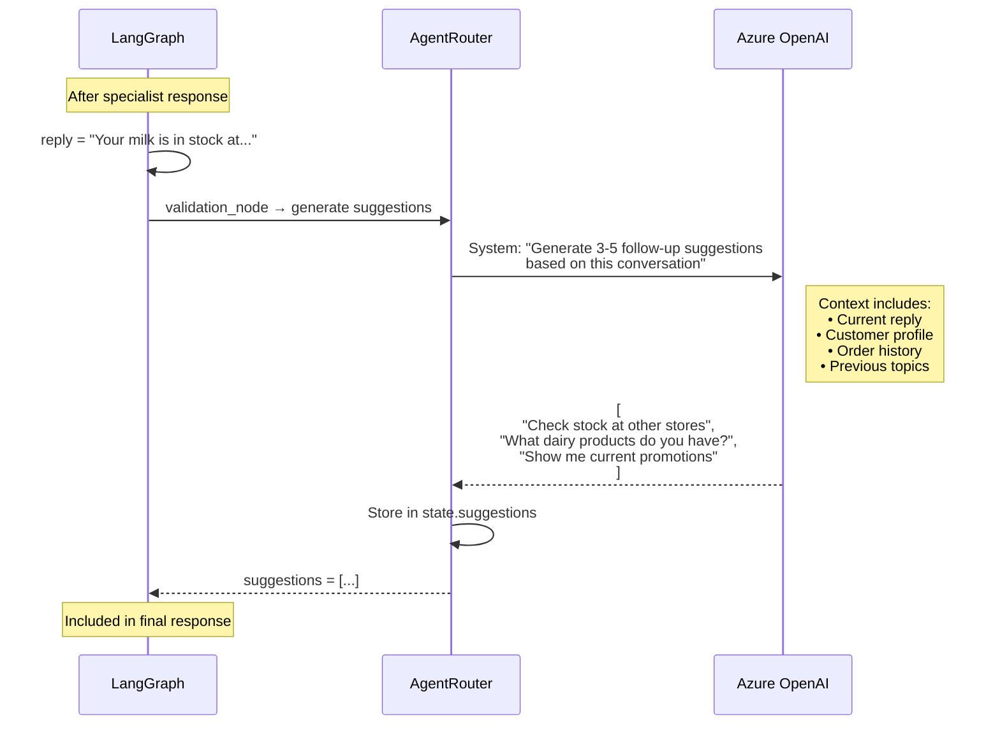

# Sequence Diagrams

This document contains all Mermaid sequence diagrams for the major flows in the system.

---

## 1. Chat Flow — Standard Query

---

## 2. Voice Flow — Browser Voice-to-Voice

---

## 3. Phone Call Flow — PSTN via ACS

---

## 4. Context Resolution Flow

---

## 5. Product Search Flow

---

## 6. Refund Processing Flow

---

## 7. Token Refresh Flow

---

## 8. Database Initialisation Flow

---

## 9. Filler Audio Playback Flow

---

## 10. Suggestion Generation Flow

