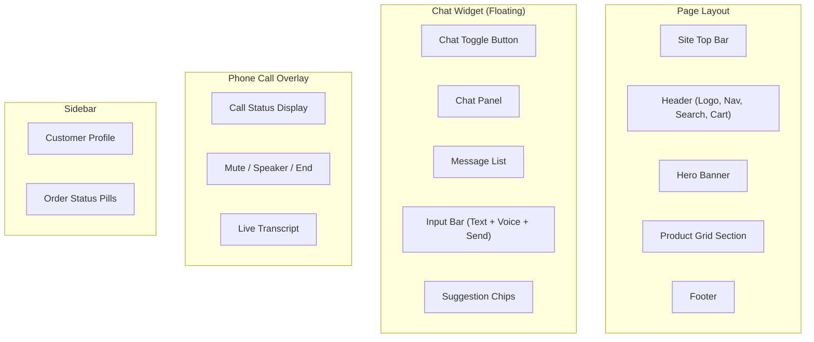
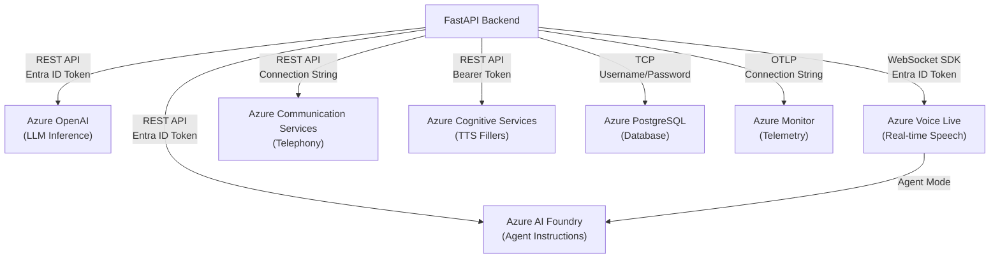

# System Design

## Backend Architecture

### FastAPI Structure

The backend is a single FastAPI application defined in `backend/main.py` (792 lines). FastAPI was chosen for its native async support, automatic OpenAPI documentation, Pydantic validation, and first-class WebSocket support.

```python
app = FastAPI(title="Retail AI Assistant", version="1.0.0")
```

The application initialises in this order:
1. **Environment loading** — `load_dotenv()` reads `.env`
2. **Telemetry setup** — Azure Monitor + OpenTelemetry (if `APPLICATIONINSIGHTS_CONNECTION_STRING` is set)
3. **CORS middleware** — Allows configurable origins via `CORS_ORIGIN`
4. **Static file mounting** — Frontend served at `/static`
5. **Database initialisation** — `init_db()` + `seed_db()` create tables and seed data
6. **Customer data loading** — `load_db_customer_data()` populates initial context
7. **AgentRouter instantiation** — Singleton that connects to Azure AI Foundry
8. **ACSBotManager instantiation** — ACS telephony manager
9. **Voice filler pre-rendering** — TTS synthesis of filler audio clips at startup

### Router Layer

The API layer exposes 13 endpoints:

| Endpoint | Method | Purpose |
|----------|--------|---------|
| `/` | GET | Serve frontend `index.html` |
| `/health` | GET | Health check |
| `/customer` | GET | Reload and return customer data |
| `/inventory` | GET | Reload and return inventory data |
| `/chat` | POST | Main chat endpoint (supports streaming via SSE) |
| `/chat/voice` | POST | Dedicated voice endpoint (ultra-fast path) |
| `/api/save_results` | POST | Save test runner results |
| `/api/token` | GET | Generate ACS VOIP token |
| `/api/call-status` | GET | Get active call transcript/status |
| `/api/incoming-call` | POST | Handle ACS incoming call events |
| `/api/callback` | POST | ACS Call Automation event webhook |
| `/api/fillers` | GET | Serve pre-rendered filler audio clips |
| `/api/voice-realtime` | WS | Browser voice-to-voice relay |
| `/api/media-stream` | WS | ACS media stream relay |

### Services Layer

The services layer (`backend/services/`) provides three key integrations:

1. **ACSBotManager** (`acs_bot.py`) — Manages Azure Communication Services for PSTN telephony:
   - Creates user identities and VOIP tokens
   - Answers incoming calls with bidirectional media streaming
   - Handles Call Automation callback events (connected, disconnected)
   - Configures WebSocket-based media streaming to Voice Live

2. **Voice Realtime** (`voice_realtime.py`) — Handles Voice Live tool execution:
   - Resolves Azure credentials (ClientSecret for production, AzureCLI for development)
   - Executes tool calls made by the Voice Live agent
   - Defines `REALTIME_TOOLS` JSON schemas for the OpenAI Realtime API format

3. **Voice Fillers** (`voice_fillers.py`) — Pre-renders filler audio clips:
   - 5 escalation "trees" of 4 phrases each (e.g., "Let me check that for you...")
   - 6 short "thinking" interjections (e.g., "Hmm...", "Let me see...")
   - Synthesised using Azure TTS with the same voice as Voice Live
   - Rendered in parallel at startup using `ThreadPoolExecutor`

### LangGraph Orchestration

The core orchestration layer is a compiled LangGraph `StateGraph` with 5 nodes. See [LangGraph.md](LangGraph.md) for complete documentation.

**Why LangGraph?** LangGraph provides:
- Explicit state management through `AgentState` TypedDict
- Conditional routing between nodes based on state values
- Built-in support for tool-calling loops (specialist → tool → specialist)
- Async execution with `ainvoke()`
- Debuggable, inspectable graph structure

### AI Layer

The AI layer consists of:

1. **Intent Classification** — Determines whether a query needs a specialist agent, context resolution, or a static response
2. **Context Resolution** — Handles ambiguous follow-up messages by analysing conversation history
3. **Specialist Execution** — Invokes the correct specialist agent with role-specific instructions, customer context, and tool bindings
4. **Tool Calling** — LangChain's native tool-calling interface allows the LLM to invoke Python functions

### Tool Layer

Five tools are available to specialist agents:

| Tool | Purpose | Parameters |
|------|---------|-----------|
| `search_products` | Search product catalog with filters | query, category, dietary_filters, sort_by, is_on_promotion, limit |
| `check_stock` | Check inventory at stores | product_name, store_name |
| `get_active_promotions` | List active promotions | (none) |
| `update_customer_address` | Update delivery address | postcode, new_address |
| `issue_refund` | Process a refund | order_id, reason |

Each tool is implemented as a module-level function in `tools.py` that takes `self` (the `AgentRouter` instance) as its first parameter, giving it access to customer data and database functions.

### Database Layer

The database layer provides a dual-mode abstraction:

- **SQLite** for local development (zero configuration)
- **Azure PostgreSQL** for production (connection pooling with `ThreadedConnectionPool`)

The `DatabaseConnection` and `DatabaseCursor` wrapper classes transparently handle SQL dialect differences:
- `?` → `%s` parameter substitution
- `INTEGER PRIMARY KEY AUTOINCREMENT` → `SERIAL PRIMARY KEY`
- `INSERT OR IGNORE INTO` → `INSERT INTO ... ON CONFLICT DO NOTHING`
- Retry policy with exponential backoff (3 attempts)

### Search Layer

Product search uses an in-memory scoring algorithm:

1. **Synonym resolution** — Maps misspellings and aliases to canonical terms
2. **Multi-field matching** — Searches across name, description, brand, category, subcategory, and tags
3. **Relevance scoring** — Weights exact name matches (150), partial name matches (100), word-in-name (40), category matches (30), tag matches (20), description matches (10)
4. **Recommendation ranking** — Sorts by stock availability, popularity, best seller status, ratings, promotions
5. **Proximity sorting** — For stock checks, Haversine distance calculation sorts stores by proximity to customer postcode

### Voice Layer

Voice functionality operates in two modes:

1. **Browser Voice** (`/api/voice-realtime`) — Direct WebSocket relay between browser and Azure Voice Live in agent mode
2. **ACS Media Stream** (`/api/media-stream`) — Same relay architecture but adapted for ACS WebSocket protocol

Both modes use identical Voice Live session configuration:
- Agent mode (instructions/tools owned by Foundry agent)
- PCM16 audio format (input and output)
- Server VAD with 0.5 threshold, 300ms prefix padding, 500ms silence duration
- Azure Speech transcription model

---

## Frontend Architecture

### Folder Structure

```
frontend/
├── index.html              # Full page: header, hero, products, chat widget, phone UI
├── css/
│   └── styles.css          # Chat widget styling and glassmorphism effects
├── js/
│   ├── app.js              # Main application logic (2273 lines)
│   ├── azure-sdk.js         # Azure SDK shim
│   └── azure-communication-services.js  # Bundled ACS Calling SDK
├── images/
│   └── products/           # Product images
├── test_runner.html        # Automated test runner UI
└── test_cases.json         # Test case definitions
```

### Components

The frontend is a **single-page application** (SPA) with no framework. Key UI components:

1. **Site Header** — Sainsbury's branding with navigation pills (Groceries, Recipes, Nectar, etc.)
2. **Hero Section** — Promotional banner with "Fresh, Delivered" messaging
3. **Product Grid** — Interactive product cards with ratings, badges, and pricing
4. **Chat Widget** — Floating chat panel with:
   - Message input with auto-resize
   - Voice record button (push-to-talk)
   - TTS toggle button
   - Phone call button
   - Suggestion chips
   - Product card rendering within chat
5. **Customer Sidebar** — Shows customer name, ID, loyalty tier, address, and order pills
6. **Phone Call UI** — Full-screen overlay with mute, speaker, and end call controls
7. **Welcome Card** — Initial greeting with quick-action suggestion chips

### State Management

State is managed through module-level variables in `app.js`:

```javascript
let conversationHistory = [];    // Full chat history
let isRecording = false;         // Voice recording state
let isThinking = false;          // Loading/processing state
let isTtsEnabled = false;        // Text-to-speech toggle (persisted in localStorage)
let isInCallMode = false;        // Phone call mode active
let callState = "IDLE";          // Call state machine: IDLE → GREETING → LISTENING → PROCESSING → SPEAKING
let voiceSocket = null;          // WebSocket connection to /api/voice-realtime
let customer = null;             // Customer data from /customer endpoint
let orders = [];                 // Order data for sidebar
```

### API Communication

All API calls use the native `fetch` API:

| Endpoint | Method | Usage |
|----------|--------|-------|
| `/customer` | GET | Load customer data for sidebar |
| `/chat` | POST | Send chat messages (SSE streaming) |
| `/api/token` | GET | Get ACS VOIP token for phone calls |
| `/api/fillers` | GET | Load filler audio clips |
| `/api/voice-realtime` | WebSocket | Real-time voice relay |

### Chat Rendering

The chat uses a custom rendering pipeline:

1. **User messages** — Simple text bubbles with orange accent
2. **AI messages** — Rendered with:
   - Markdown-to-HTML conversion (bold, links, bullet points)
   - `<product-grid>` XML tag detection and rendering as visual product cards
   - Streaming animation (token-by-token display during SSE)
   - Suggestion chips appended after response
3. **Product cards** — Interactive cards showing name, brand, price, rating stars, badges (Best Seller, Store Recommended), availability, and promotional offers

### Voice Interaction

Three voice modes are supported:

1. **Push-to-Talk** — Click microphone button, speak, silence detection auto-stops, transcription sent to `/chat`
2. **Browser Voice-to-Voice** — WebSocket to `/api/voice-realtime`, raw PCM16 audio streamed in both directions
3. **Native Fallback** — Browser `SpeechRecognition` API + `SpeechSynthesis` for environments without WebSocket support

### Streaming

SSE (Server-Sent Events) is used for real-time response streaming:

```javascript
const response = await fetch(`${API_BASE}/chat`, {
  method: "POST",
  body: JSON.stringify({ message, conversation_history, stream: true })
});

const reader = response.body.getReader();
// Process SSE events: token, done, error
```

### UI Architecture



---

## Azure Architecture

### Azure AI Foundry

**Role:** Hosts all agent definitions, instructions, and model deployments.

- **Project:** A Foundry project groups agents and model deployments
- **Agents:** 7+ named agents with role-specific instructions (Order, Delivery, Refund, Store, General, Intent-Classifier, Context-Resolver, Voice-Assistant)
- **Model Deployment:** GPT-4o or GPT-5.1 deployed as a named deployment

**Communication:** The backend uses `AIProjectClient` to list agents and fetch instructions at startup. Runtime LLM calls go through the OpenAI-compatible endpoint via `ChatOpenAI` (LangChain).

### Azure AI Foundry Agents

Each agent is defined in the Azure AI Foundry Portal with:
- **Name** — Matched by the backend at startup (e.g., "Order-Agent")
- **Instructions** — System prompt defining behaviour, constraints, and tool usage
- **Model** — Which deployment to use (GPT-4o)
- **Tools** — Function definitions registered on the agent

The backend fetches these dynamically and uses them as system prompts for LangChain tool-calling.

### Azure Communication Services

**Role:** PSTN telephony infrastructure.

- **Identity Service** — Creates user identities and VOIP access tokens
- **Call Automation** — Answers incoming calls, configures media streaming
- **Media Streaming** — Bidirectional WebSocket audio relay

**Communication:** The `ACSBotManager` uses connection-string-based authentication.

### Azure Voice Live

**Role:** Real-time voice-to-voice with agent-mode integration.

- **Agent Mode** — Voice Live connects to a Foundry agent, which owns instructions and model
- **Session Configuration** — Speech settings (voice, VAD, audio format, transcription)
- **Event-Driven** — Async event stream with audio deltas, transcriptions, tool calls

**Communication:** The `azure-ai-voicelive` SDK provides the `connect()` async context manager.

### Azure PostgreSQL

**Role:** Production database.

- **Connection Pooling** — `ThreadedConnectionPool` with min=1, max=20 connections
- **SSL** — `sslmode=require` for production connections
- **Retry Policy** — Exponential backoff with 3 attempts for transient failures

### Azure Monitor / Application Insights

**Role:** Telemetry and distributed tracing.

- **OpenTelemetry** — `configure_azure_monitor()` sets up the exporter
- **AI Tracing** — `AIProjectInstrumentor` enables GenAI content recording
- **Environment Variables:** `AZURE_EXPERIMENTAL_ENABLE_GENAI_TRACING=true` and `AZURE_TRACING_GEN_AI_CONTENT_RECORDING_ENABLED=true`

### Service Communication Map


