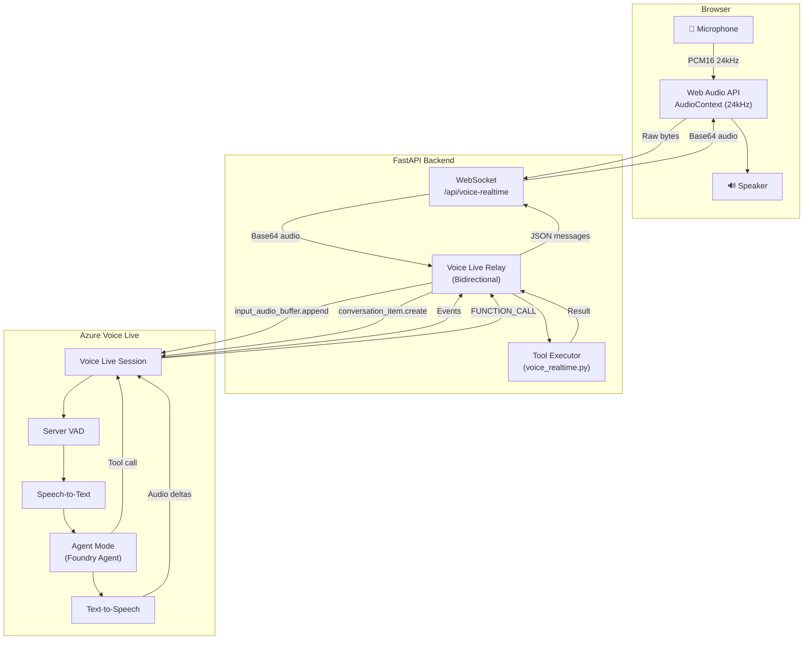
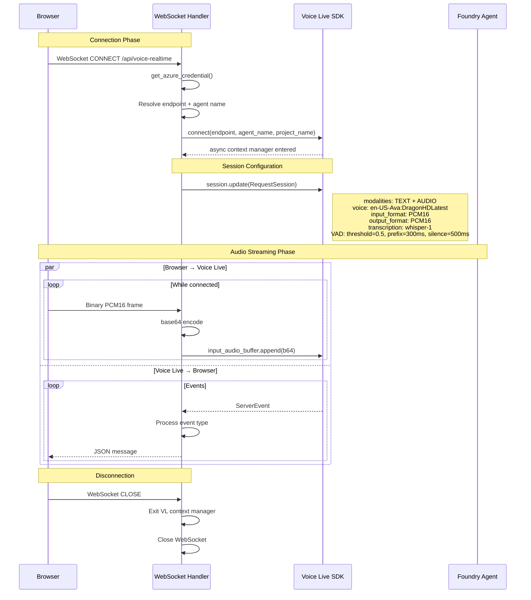
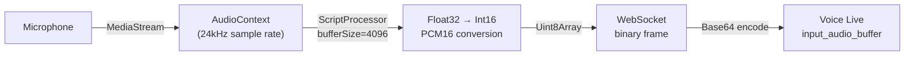
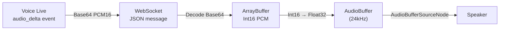
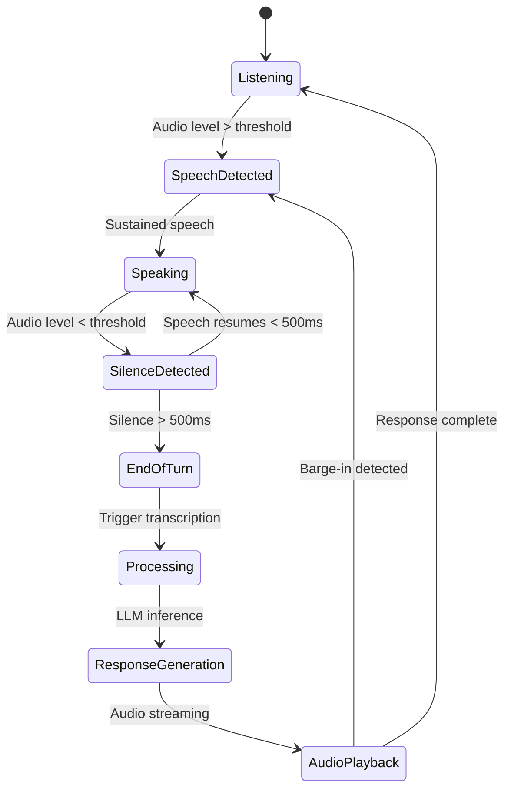
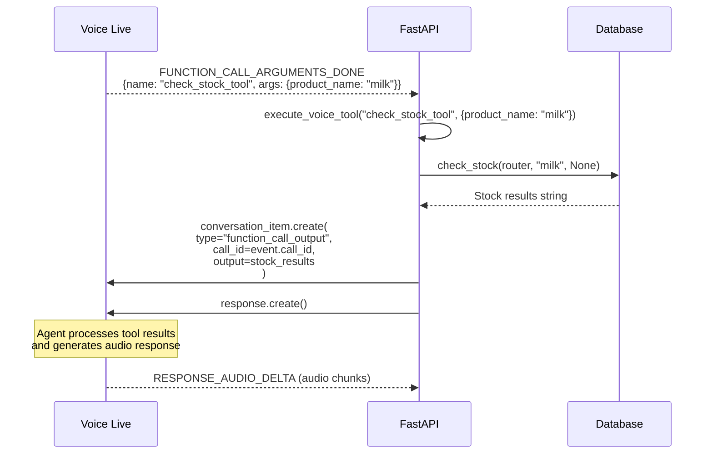
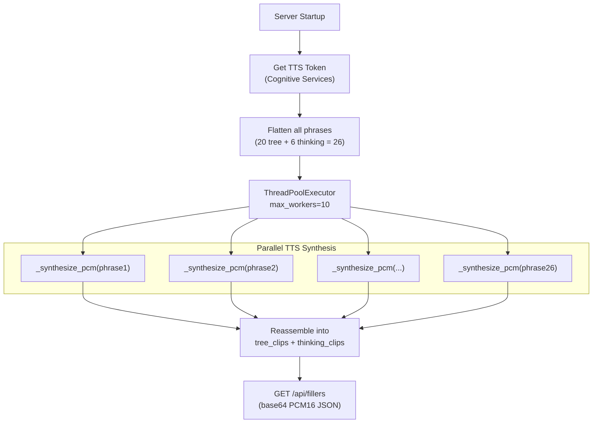
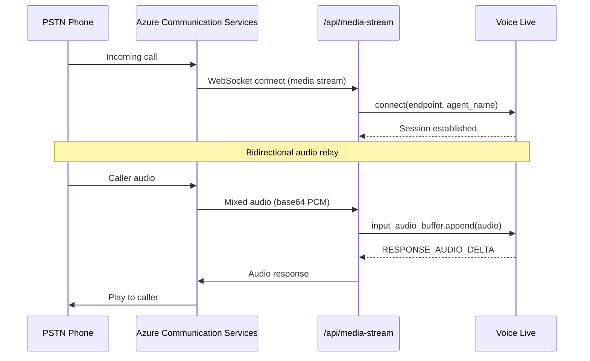
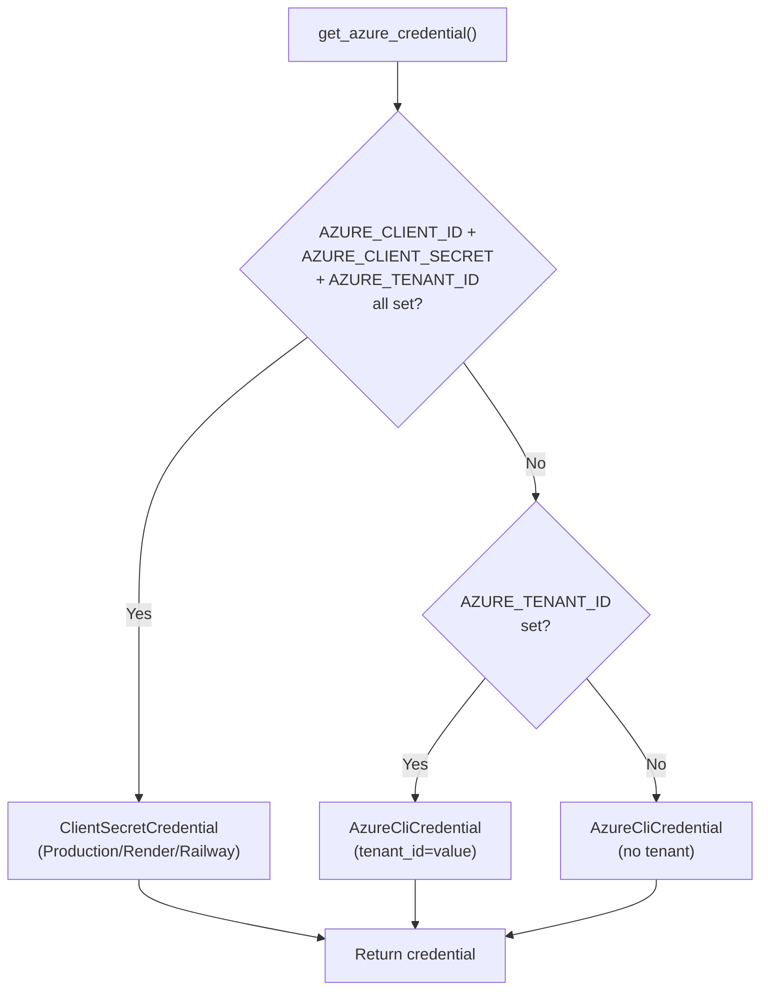

# Voice Live Architecture

## 1. Overview

Azure Voice Live provides **real-time voice-to-voice** capabilities for the Retail AI Assistant. It operates in **Agent Mode**, where the Azure AI Foundry agent owns the instructions, model, and tools — the backend only configures speech parameters and relays audio.

Two voice paths are supported:
1. **Browser Voice** — WebSocket at `/api/voice-realtime` between the browser and Voice Live
2. **ACS Media Stream** — WebSocket at `/api/media-stream` for PSTN telephone calls via Azure Communication Services

## 2. Architecture



## 3. WebSocket Lifecycle



## 4. Event Types

### Incoming Events (Voice Live → Backend)

| Event | Description | Action |
|-------|-------------|--------|
| `SPEECH_STARTED` | User started speaking | Notify browser: `{type: "speech_started"}` |
| `SPEECH_STOPPED` | User stopped speaking | Notify browser: `{type: "speech_stopped"}` |
| `TRANSCRIPTION_COMPLETED` | User speech transcribed | Send: `{type: "user_transcript", text}` |
| `RESPONSE_AUDIO_DELTA` | Audio response chunk | Send: `{type: "audio_delta", delta}` |
| `RESPONSE_AUDIO_TRANSCRIPT_DELTA` | Partial agent text | Send: `{type: "transcript_delta", delta}` |
| `RESPONSE_AUDIO_TRANSCRIPT_DONE` | Complete agent text | Send: `{type: "agent_transcript", text}` |
| `RESPONSE_DONE` | Response complete | Send: `{type: "response_done"}` |
| `FUNCTION_CALL_ARGUMENTS_DONE` | Tool call ready | Execute tool, return result |
| `ERROR` | Error occurred | Send: `{type: "error", message}` |

### Outgoing Commands (Backend → Voice Live)

| Command | Description |
|---------|-------------|
| `input_audio_buffer.append(audio)` | Send user audio chunk |
| `input_audio_buffer.clear()` | Clear audio buffer (on barge-in) |
| `conversation_item.create(...)` | Add tool result to conversation |
| `response.create()` | Trigger agent response after tool execution |
| `session.update(config)` | Update session configuration |

## 5. Audio Pipeline

### Input Audio (User → Agent)



### Output Audio (Agent → User)



### Audio Format

| Parameter | Value |
|-----------|-------|
| Sample Rate | 24,000 Hz |
| Bit Depth | 16-bit signed integer |
| Channels | 1 (mono) |
| Encoding | PCM (raw, uncompressed) |
| Endianness | Little-endian |

## 6. Voice Activity Detection (VAD)

Server-side VAD is configured in the session update:

```python
RequestSession(
    turn_detection=RequestTurnDetection(
        type="server_vad",
        threshold=0.5,           # Sensitivity (0.0 = most sensitive)
        prefix_padding_ms=300,   # Audio before speech detection
        silence_duration_ms=500  # Silence before end-of-turn
    )
)
```



## 7. Tool Execution in Voice Mode

When the Voice Live agent invokes a tool, the flow is:



### Available Voice Tools

| Tool Name | Maps To | Description |
|-----------|---------|-------------|
| `search_products_tool` | `search_products()` | Search product catalog |
| `check_stock_tool` | `check_stock()` | Check inventory levels |
| `get_active_promotions_tool` | `get_active_promotions()` | List promotions |
| `update_customer_address_tool` | `update_customer_address()` | Update delivery address |
| `issue_refund_tool` | `issue_refund()` | Process a refund |
| `transfer_to_human_agent_tool` | (inline handler) | Handoff to human agent |

## 8. Voice Filler System

To eliminate dead silence while the agent processes queries, the system pre-renders filler audio clips at startup:

### Filler Trees (5 escalation sequences)

Each tree is a 4-step escalation sequence. One tree is chosen per wait to prevent repetition:

| Step | Tree 1 | Tree 2 | Tree 3 |
|------|--------|--------|--------|
| 1 | "Alright, let me check that for you." | "Sure, let me look into this for you." | "Good question, let me dig into that." |
| 2 | "Searching our system now." | "Going through the details now." | "Checking my sources on this." |
| 3 | "Almost there, give me a moment." | "Bear with me, nearly got it." | "Hold on, piecing it together." |
| 4 | "Okay, just pulling it all together." | "Right, just finalising your answer." | "Nearly there, thanks for your patience." |

### Thinking Interjections (6 clips)

Short sounds sprinkled between tree steps for natural feel:
- "Hmm..."
- "Mmm, let me see..."
- "Uh, one moment..."
- "Hmm, okay..."
- "Let me think..."
- "Right..."

### Timing

| Parameter | Value | Purpose |
|-----------|-------|---------|
| Grace period | 5,000ms | Skip fillers if response arrives quickly |
| Min gap between fillers | 3,500ms | Prevent overlapping |
| Max gap between fillers | 6,000ms | Keep conversation alive |

### Rendering Pipeline



## 9. ACS Media Stream Integration

For PSTN phone calls, the same Voice Live session is established but audio comes from ACS instead of the browser:



## 10. Credential Resolution


