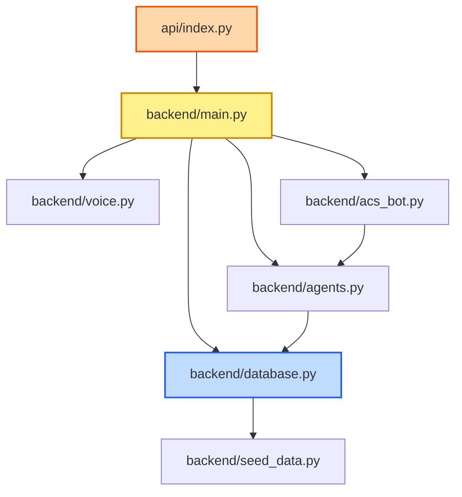
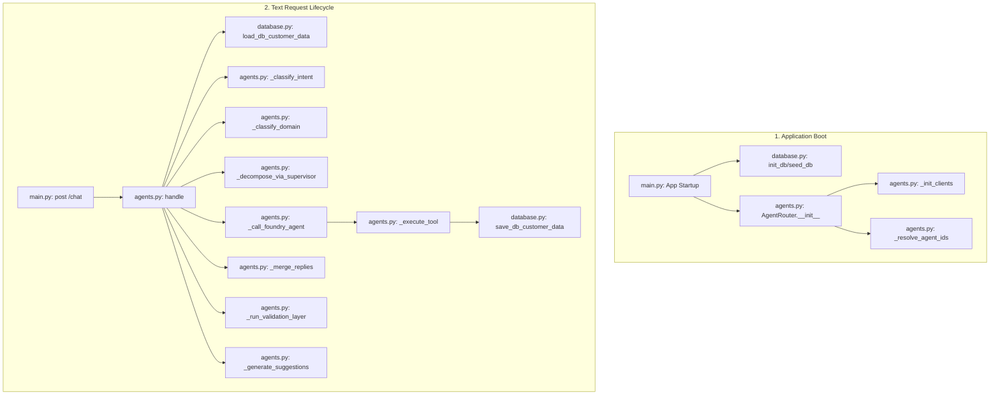
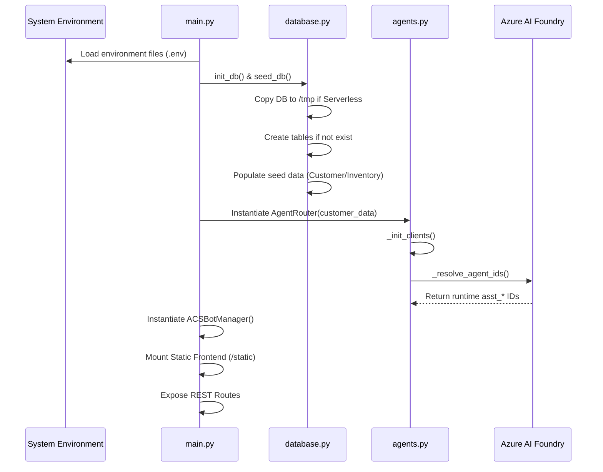
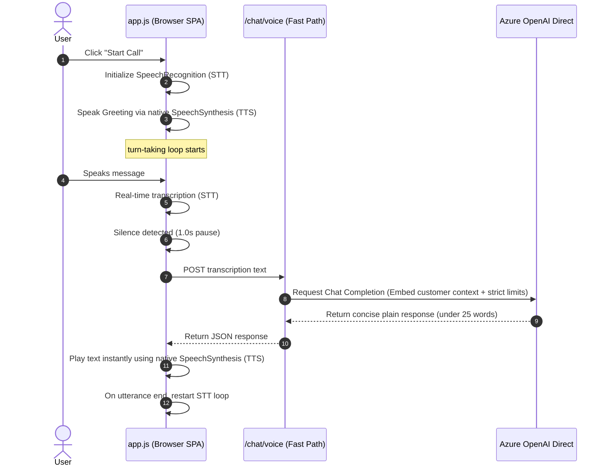
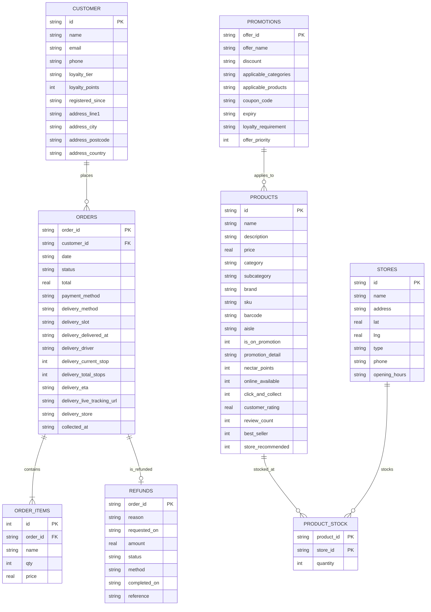
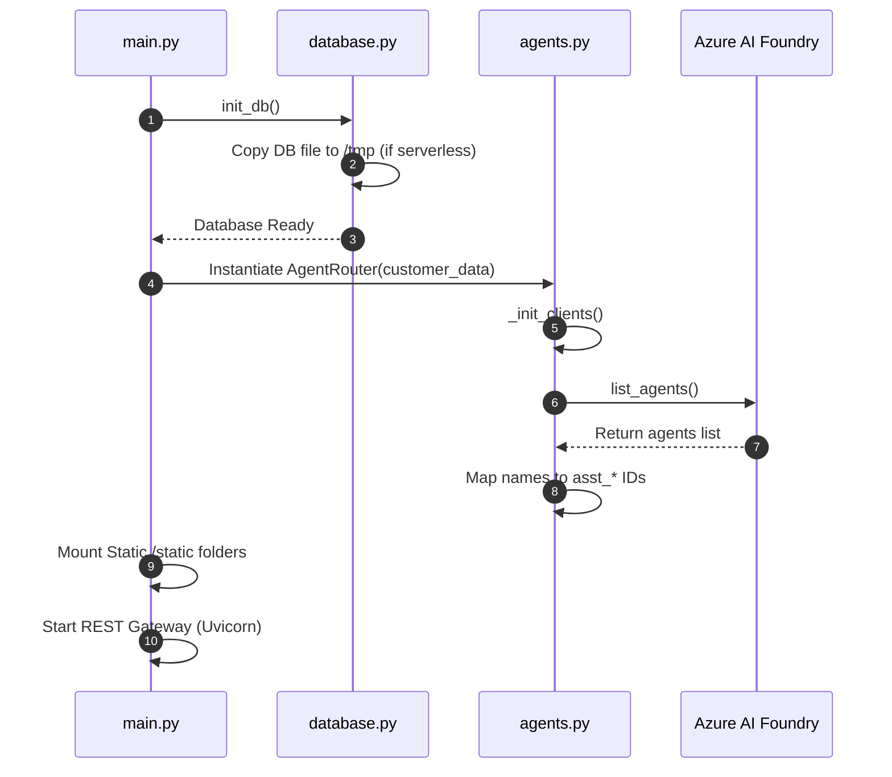
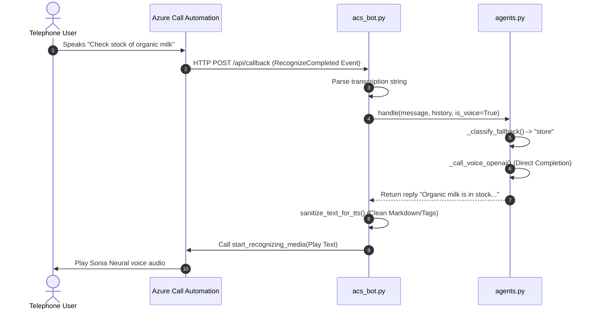

# Sainsbury's AI Assistant – Technical Onboarding Manual & Architectural Deep-Dive

Welcome to the team! This onboarding manual is designed to transition you into the primary maintainer of the Sainsbury's AI Assistant retail chatbot project. This document serves as a complete technical reference detailing the systems design, request lifecycles, database operations, agent orchestration, and code review comments for the entire codebase.

---

## 1. Executive Overview

### The Problem
Supermarket customer service departments face high volumes of queries regarding order statuses, delivery slots, missing items, damaged goods, refund requests, and product stock levels. Managing these inquiries manually is slow and costly. This project implements a decoupled, state-of-the-art **Multi-Agent customer service system** simulating real supermarket operations (using Sainsbury's as the theme), supporting text and real-time voice call pipelines.

### Overall Architecture
The application runs on a decoupled **Client-Server Architecture**:
1. **Frontend**: A Single Page Application (SPA) driven by vanilla HTML/CSS/JS that interacts with the browser's WebSpeech APIs for local Speech-to-Text (STT) and Text-to-Speech (TTS), plus a canvas analyzer for live micro-animations of sound waves.
2. **Backend**: A FastAPI Gateway managing routes, database access, speech services, telephony integrations, and a multi-agent framework.
3. **Multi-Agent Orchestration Layer**: Powered by **Azure AI Foundry** (with direct key-based Azure OpenAI endpoints as a low-latency fallback). It acts as the routing and reasoning brain.
4. **Data Layer**: A local SQLite database (`retail_chatbot.db`) containing seeded customer records, orders, items, refunds, store details, products, and promotions.

```mermaid
graph TB
    %% Client Tier
    subgraph Client [Client Browser - SPA]
        UI[Chat UI / Call Overlay]
        STT[WebSpeech API Recognition]
        Audio[Web Audio API Visualizer]
        TTS[SpeechSynthesis Engine]
    end

    %% API Gateway Tier
    subgraph Gateway [FastAPI Backend]
        API[FastAPI Server: main.py]
        ACS[ACS Call Manager: acs_bot.py]
        Voice_Svc[Audio Utilities: voice.py]
    end

    %% Orchestration Tier
    subgraph Orchestration [Multi-Agent Core: agents.py]
        Router[AgentRouter Control Node]
        Supervisor[Foundry Supervisor Agent]
        Order_A[Order Agent]
        Deliv_A[Delivery Agent]
        Refund_A[Refund Agent]
        Store_A[Store Agent]
        Gen_A[General Assistant Agent]
    end

    %% Data Tier
    subgraph Data [Data Layer]
        DB[(SQLite Database)]
        Helper[DB Handler: database.py]
    end

    %% Primary Flows
    UI -->|1. POST /chat /chat/voice| API
    STT -->|Transcribes user speech| UI
    Audio -->|Drives canvas animation| UI
    API -->|2. Invokes handle()| Router
    Router -->|3. Intent Classification| Supervisor
    Router -->|4. Parallel Dispatch| Order_A & Deliv_A & Refund_A & Store_A & Gen_A
    Order_A & Deliv_A & Refund_A & Store_A & Gen_A -->|5. SQLite query/mutation| Helper
    Helper --> DB
    Router -->|6. JSON response| API
    API -->|7. ChatResponse| UI
    UI -->|8. Audio speech playback| TTS
```

### Why This Architecture Was Chosen
- **Decoupled Client-Server**: Allows independent deployment of the frontend (e.g., Vercel Static Hosting) and the backend (FastAPI on serverless/containers).
- **Multi-Agent Separation of Concerns**: Isolates prompts and tools. The Delivery Agent knows only about logistics, the Refund Agent operates strictly on financial and policy rules. This prevents prompt bleed and minimizes token usage by loading target tool schemas only.
- **SQLite for Mock Data**: Simple, standalone, file-backed database requires no external servers. In serverless environments (Vercel/Lambda), the read-only database is automatically copied to the writeable `/tmp` partition at startup.
- **Browser-Native Voice Fast Path**: Bypasses slow telephony loops. Direct browser transcription (WebSpeech recognition) and speech synthesis (SpeechSynthesisUtterance) cut latency from 8s to under 1.5s.

### Design Patterns Used
1. **Singleton Pattern**: The `AgentRouter` and `ACSBotManager` are initialized as application-level singletons in [main.py](file:///c:/Projects/retail-chatbot/backend/main.py) to reuse client connections and cache agent ID resolutions.
2. **Mediator/Router Pattern**: The `AgentRouter` acts as the mediator between the raw incoming user requests, the intent classifiers, the specialist agents, and the local SQLite database helpers.
3. **Facade Pattern**: The `database.py` script provides a simple functional facade over complex SQL joins, parsing raw rows directly into neat dictionary trees (e.g. nested order items).
4. **Command/Tool Calling Pattern**: Azure AI Foundry agents execute tool calls by returning JSON schemas. The `AgentRouter` resolves these schemas and dispatches them to local functions, matching functions via string names.

### Tech Stack & Services
- **Backend Core**: FastAPI, Uvicorn, Pydantic, SQLite3 (Python native driver).
- **AI Services**: Azure AI Foundry Agents SDK, Azure OpenAI (`gpt-4o` deployment).
- **Voice/Telephony Services**: Azure Cognitive Services (Speech SDK for fallback server-side transcription and voice synthesis using the Sonia Neural en-GB voice), Azure Communication Services (Call Automation SDK).
- **Frontend**: Vanilla Javascript (ES6), HTML5, CSS3 Custom Properties (variables), Canvas API, Web Audio API.

---

## 2. Complete Request Lifecycle (Text Path)

Let's trace a realistic user query: **"Where is my order, and can I get a refund for the spoiled chicken in it?"**

```
User enters message -> sendFromInput() -> sendMessage() -> POST /chat 
  -> FastAPI app.post("/chat") -> AgentRouter.handle()
    -> database.py loads customer & order states
    -> _classify_intent() classifies intent as new_retail
    -> _decompose_via_supervisor() resolves two specialist sub-tasks
    -> asyncio.gather() runs Delivery and Refund agents in parallel
      -> Delivery Agent checks logistics tracker in DB
      -> Refund Agent calls issue_refund() tool to write refund completed status in SQLite
    -> _merge_replies() combines outputs via Supervisor
    -> _run_validation_layer() sanitizes Exposed IDs and markdown formatting
    -> append_product_grid_if_mentioned() detects "chicken" and attaches Product Grid JSON XML block
    -> _generate_suggestions() creates dynamic chip titles
    -> Response returned as JSON -> app.js renders markdown + product card UI
```

### Detailed Step-by-Step Trajectory

#### Step 1: Client Submission
1. The user types the message in [index.html](file:///c:/Projects/retail-chatbot/frontend/index.html) and clicks "Send" (triggers `sendFromInput()` in [app.js](file:///c:/Projects/retail-chatbot/frontend/js/app.js)).
2. `sendMessage(text)` checks if the input is non-empty, clears suggestions, removes the welcome card, appends the user message bubble to the screen, and pushes `{"role": "user", "content": text}` to the local `conversationHistory` array.
3. It sends an HTTP `POST` request to `http://localhost:8000/chat` containing:
   ```json
   {
     "message": "Where is my order, and can I get a refund for the spoiled chicken in it?",
     "conversation_history": [ ... ],
     "is_voice": false
   }
   ```

#### Step 2: FastAPI Routing
1. In [main.py](file:///c:/Projects/retail-chatbot/backend/main.py#L126), the `/chat` endpoint catches the request mapping to the `ChatRequest` Pydantic model.
2. It executes `await agent_router.handle(message=request.message, history=request.conversation_history, is_voice=request.is_voice)`.

#### Step 3: Intent & Domain Classification
1. The `AgentRouter` class in [agents.py](file:///c:/Projects/retail-chatbot/backend/agents.py#L2175) refreshes customer information from the database: `customer_data = self._load_customer_data()` (calling [database.py:load_db_customer_data()](file:///c:/Projects/retail-chatbot/backend/database.py#L647)).
2. It invokes `_classify_intent()`. Because the user history is empty or does not directly continue a choices prompt, the router classifies the intent. Since the query is complex, it runs a chat completion via Azure OpenAI. The model evaluates categories and returns `new_retail`.
3. It invokes `_classify_domain()`. Since the text contains retail words (`order`, `refund`, `chicken`), it yields `retail`.

#### Step 4: Product Direct Search Skip
1. It runs `_search_db_for_product_question()`. This method checks if the user is asking a purely informational query (e.g. calories/allergens). Since the query is transactional, it returns `None`, letting the system proceed to orchestration.

#### Step 5: Query Decomposition (Multi-Agent Routing)
1. `_decompose_via_supervisor()` triggers. Since the query contains multiple coordinate conjunctions (`and`, `also`), direct keyword routing is bypassed.
2. It calls the Azure AI Foundry **Supervisor Agent** (or its direct OpenAI fallback). The prompt instructs the supervisor to return a structured JSON array decomposing the query:
   ```json
   [
     {"agent": "delivery", "task_query": "Find the status and current location of the customer's active order."},
     {"agent": "refund", "task_query": "Process a refund request for the spoiled chicken item in their order."}
   ]
   ```

#### Step 6: Parallel Specialist Execution
1. The router executes `asyncio.gather(*[call_agent(t) for t in tasks])`.
2. **Delivery Agent Execution**:
   - Invokes `_call_foundry_agent(agent_id=delivery_agent_id, task_query="Find the status...", ...)` in [agents.py](file:///c:/Projects/retail-chatbot/backend/agents.py#L1330).
   - This creates a thread in Azure AI Foundry, pushes the customer data summary (Nectar points, address, active delivery tracking links) as the first message, appends the chat history, adds the task query, and starts the run.
   - The run completes. The Delivery Agent writes its response: *"Your order ORD-4921 is currently in transit. The driver is 4 stops away and is expected to arrive at 6:45 PM. You can follow them live using this tracking link..."*
3. **Refund Agent Execution**:
   - Invokes `_call_foundry_agent(agent_id=refund_agent_id, task_query="Process a refund...", ...)` in parallel.
   - The agent evaluates the order history in the context block, locates the item "Chicken Breast Fillets" under the delivered order (e.g., ORD-3012, or the active order if matching), and determines it is eligible for a refund.
   - It issues a tool call: `issue_refund(order_id="ORD-3012", reason="Spoiled chicken", amount=4.50)`.
   - The polling loop catches `requires_action`. It invokes `_execute_tool(func_name="issue_refund", func_args={...})` which maps to [agents.py:issue_refund()](file:///c:/Projects/retail-chatbot/backend/agents.py#L895).
   - `issue_refund` connects to SQLite via `database.py:save_db_customer_data()`, updates the order status to `refund_completed`, inserts a refund log row (e.g. generating reference `REF-59218`), and returns a success confirmation.
   - The Agent consumes this tool output, completes the run, and compiles its response: *"I have successfully refunded £4.50 for the spoiled chicken in your order. Your refund reference is REF-59218, and the money should appear back in your account in 3-5 days."*

#### Step 7: Reply Merging
1. The parallel replies are collected: `[delivery_reply, refund_reply]`.
2. `_merge_replies()` sends both parts back to the Supervisor Agent (or direct OpenAI merge endpoint) to compile a unified response:
   *"Certainly! I see that your upcoming delivery (ORD-4921) is in transit, with the driver currently 4 stops away and estimated to arrive at 6:45 PM. Regarding the spoiled chicken from your recent order, I have processed a refund of £4.50 directly back to your original payment method (Reference: REF-59218). Is there anything else I can help you check?"*

#### Step 8: Validation and Sanitization
1. The merged reply passes through `_run_validation_layer()`. This checks if raw database IDs like `CUST-9921` or `STR-12` leaked into the response (and removes them), converts markdown bullet lists to unicode `•`, and formats links.

#### Step 9: Proactive Product Grid Injection
1. `append_product_grid_if_mentioned()` scans the reply for grocery item names. It matches "chicken".
2. It queries the products table for "chicken", selects up to 3 chicken products (e.g., "Organic Chicken Breast 500g"), generates a JSON array, wraps it in a special `<product-grid>` XML tag, and appends it to the end of the text.

#### Step 10: Chip Generation
1. `_generate_suggestions()` runs in the background. It uses a quick OpenAI completion pass to analyze the conversation and outputs appropriate follow-up actions: `["Track my delivery", "Can I change my address?", "View refund policy"]`.
2. FastAPI packages this into a `ChatResponse` JSON payload and returns it to the browser.

#### Step 11: Frontend Rendering
1. The client receive the payload. `removeTyping()` destroys the loading placeholder.
2. `appendAIMessage()` is triggered. It separates the text from the `<product-grid>` XML block, maps the text through `formatAIText()` which converts markdown and URLs to styled HTML elements, parses the JSON inside `<product-grid>`, renders them as rich UI product cards with "Add to Basket" buttons, and appends the dynamic suggestion chips at the bottom.
3. The client sidebar is refreshed by calling `fetchCustomerData()` to show the updated Nectar point total and order refund status.

---

## 3. Folder Structure

The project has a clear decoupling of concerns across its directories:

```
c:\Projects\retail-chatbot\
├── api/                   # Hosting and Gateway deployment layers
├── backend/               # Main application backend, agents, and DB
├── frontend/              # Client SPA assets (HTML, CSS, JS)
└── mock_data/             # Local database file and assets
```

### `/backend`
- **Purpose**: Houses the FastAPI server, agentic framework, tool definitions, database models, and voice transcription utilities.
- **Responsibilities**: Initializes configurations, exposes web endpoints, manages connections to Azure AI Foundry, manages database read/write connections, and acts as the callback hook for telephony.
- **Dependencies**: Depends on `/mock_data` (for SQLite database path).
- **Dependents**: Imported by `/api/index.py` for serverless runtimes.

### `/api`
- **Purpose**: Serving wrapper for Vercel Serverless Function hosting.
- **Responsibilities**: Sets the Python environment paths and imports the ASGI app singleton from the backend directory.
- **Dependencies**: Depends on `/backend/main.py`.
- **Dependents**: Invoked directly by Vercel routing configs (`vercel.json`).

### `/frontend`
- **Purpose**: Provides the visual customer portal.
- **Responsibilities**: Renders the chatbot interface, handles call overlay UI state, runs local voice transcription, drives visualizer canvas animations, and plays speech.
- **Dependencies**: Bypasses local backend Python files; speaks strictly via HTTP REST to the `/chat`, `/chat/voice`, `/customer`, `/inventory`, and `/voice/transcribe` routes.

### `/mock_data`
- **Purpose**: The storage layer for the static SQLite data database.
- **Responsibilities**: Stores the database file (`retail_chatbot.db`) and caches test run results (`test_results.json`).
- **Dependencies**: Independent data layer.
- **Dependents**: Read and written to by `backend/database.py` and `backend/main.py`.

---

## 4. File-by-File Walkthrough

### Backend Modules

#### 1. [backend/main.py](file:///c:/Projects/retail-chatbot/backend/main.py)
- **Purpose**: The core application server bootstrapper.
- **Responsibilities**: Configures FastAPI, sets up CORS rules, mounts static frontend directory, triggers database migrations/seeding, and registers routes.
- **Imports/Exports**: Imports `AgentRouter` from `agents.py`, `transcribe_audio` from `voice.py`, and `ACSBotManager` from `acs_bot.py`.
- **Key Elements**: Initialises `agent_router` and `acs_bot_manager` singletons.
- **Potential Improvements**: Add middleware for authentication and rate-limiting. Move database initialization to a formal startup event handler (`lifespan`).

#### 2. [backend/agents.py](file:///c:/Projects/retail-chatbot/backend/agents.py)
- **Purpose**: The multi-agent orchestrator.
- **Responsibilities**: Translates chat messages, classifies intent and domain (retail vs. general), interacts with Azure AI Foundry SDK to construct runs and threads, runs local tool calls, validates outputs, and hosts the ultra-fast voice path direct OpenAI endpoint.
- **Imports/Exports**: Imports database CRUD functions from `database.py`. Imported by `main.py` and `acs_bot.py`.
- **Key Elements**: `AgentRouter` class.
- **Potential Improvements**: Split this 2400-line monolithic file into smaller submodules: `router.py`, `tools.py`, `validation.py`, and `prompts.py` for maintainability.

#### 3. [backend/database.py](file:///c:/Projects/retail-chatbot/backend/database.py)
- **Purpose**: Data Access Object (DAO) / Repository wrapper over SQLite.
- **Responsibilities**: Schema definitions (`init_db`), data seeding (`seed_db`), loading consolidated customer order objects, saving mutated profiles, and serving product catalog dictionaries.
- **Imports/Exports**: Imports seed data from `seed_data.py`. Imported by `main.py` and `agents.py`.
- **Key Elements**: `init_db()`, `seed_db()`, `load_db_customer_data()`, `save_db_customer_data()`.
- **Potential Improvements**: Switch to an ORM (SQLAlchemy or SQLModel) to remove raw SQL string injections. Implement connection pooling.

#### 4. [backend/voice.py](file:///c:/Projects/retail-chatbot/backend/voice.py)
- **Purpose**: Server-side audio processing.
- **Responsibilities**: Translates WAV audio files to text (STT) and text to audio bytes (TTS) using Azure Cognitive Services Speech SDK in a non-blocking thread pool.
- **Imports/Exports**: Imported by `main.py`.
- **Key Elements**: `transcribe_audio()`, `synthesize_speech()`.
- **Potential Improvements**: Implement audio caching (e.g. Redis) for common synthesized responses to save API cost and latency.

#### 5. [backend/acs_bot.py](file:///c:/Projects/retail-chatbot/backend/acs_bot.py)
- **Purpose**: Azure Communication Services (ACS) telephony gateway.
- **Responsibilities**: Handles WebRTC tokens, answers incoming phone calls, processes DTMF/Speech events from Call Automation, sanitizes output text for clean text-to-speech voice, and manages active call sessions.
- **Imports/Exports**: Imported by `main.py`.
- **Key Elements**: `ACSBotManager` class, `sanitize_text_for_tts()`.
- **Potential Improvements**: Implement DTMF fallback menus (e.g., "Press 1 for delivery, 2 for refunds") when speech recognition quality drops.

---

## 5. Dependency Graph

This graph outlines how different modules import and depend on each other:



---

## 6. Call Graph

This graph maps the functions executing starting from application startup through a user request:



---

## 7. Class Walkthrough

### 1. `AgentRouter` (in [backend/agents.py](file:///c:/Projects/retail-chatbot/backend/agents.py#L149))
- **Why it exists**: Serves as the system brain. It handles incoming prompts, coordinates classifier calls, queries database helpers, calls AI Foundry client threads, processes tool execution, sanitizes results, and builds follow-up questions.
- **Constructor**: `__init__(customer_data: dict)`: Caches customer info, sets up OpenAI clients, registers tools metadata definitions (`_tools_order`, `_tools_delivery`, `_tools_refund`, `_tools_store`), and resolves agents.
- **Key Methods**:
  - `handle(message, history, is_voice)`: public gateway implementing dual-path logic.
  - `_classify_intent()`, `_classify_domain()`: routes logic.
  - `_call_foundry_agent()`: creates thread, sends context, pulls runs, polls status, catches tool callbacks.
  - `_decompose_via_supervisor()`: uses the Supervisor-Agent to break requests down.
  - `_merge_replies()`: consolidates parallel results.
  - `search_products()`, `check_stock()`, `issue_refund()`, `update_customer_address()`: local tool callbacks.
- **SOLID Principles**:
  - **Single Responsibility Principle Violation**: It handles routing, LLM classifications, parsing, sanitizing, validation, AND acts as the tool provider. (Should be refactored into distinct classes).
  - **Open/Closed Principle Violation**: Adding new tool functionalities requires modifying this class directly to append schemas and `_execute_tool` mappings. (Should use a registry pattern instead).

### 2. `ACSBotManager` (in [backend/acs_bot.py](file:///c:/Projects/retail-chatbot/backend/acs_bot.py#L38))
- **Why it exists**: Manages VoIP call orchestration using Azure Communication Services.
- **Constructor**: Initializes identity and client automation resources, loads bot user ID, and establishes callback webhook destinations.
- **Key Methods**:
  - `get_token_for_user()`: Generates WebRTC tokens.
  - `answer_incoming_call(incoming_call_context)`: Hooks incoming call channels.
  - `handle_callback_events(events, agent_router)`: Processes call state loops.
  - `_speak_and_recognize(call_connection_client, text)`: Performs TTS playback + voice barge-in recognition.

---

## 8. Function Walkthrough

### 1. `AgentRouter.handle` (in [backend/agents.py](file:///c:/Projects/retail-chatbot/backend/agents.py#L2175))
- **Inputs**: `message` (str), `history` (list[dict]), `is_voice` (bool)
- **Outputs**: `dict` containing `reply`, `intent`, `sources`, and `suggestions`.
- **Exceptions**: Passes SQLite syntax exceptions and client connection errors back to `main.py` which returns HTTP 500.
- **Callers**: `main.py` (`/chat` and `/chat/voice` post endpoints) and `acs_bot.py` (telephony callback handler).
- **Complexity**: $O(N)$ where $N$ is history length, plus external call wait overhead.

### 2. `AgentRouter._call_foundry_agent` (in [backend/agents.py](file:///c:/Projects/retail-chatbot/backend/agents.py#L1330))
- **Inputs**: `agent_id` (str), `context` (str), `task_query` (str), `history` (list[dict]), `extra_instructions` (str)
- **Outputs**: Agent response text (str)
- **Exceptions**: Raises `RuntimeError` if client initialization is missing or if the run fails.
- **Complexity**: Variable. Bound by Azure run completion times and backoff polling loops (sleeps ranging from 0.1s to 0.4s).

### 3. `AgentRouter.search_products` (in [backend/agents.py](file:///c:/Projects/retail-chatbot/backend/agents.py#L597))
- **Inputs**: Search terms, category tags, sorting parameters, promo flags, etc.
- **Outputs**: Formatted catalog text + XML product grid payload.
- **Complexity**: $O(P)$ where $P$ is total products. Uses local list comprehension filtering.

---

## 9. Application Startup

When running `uvicorn main:app` or deploying to Vercel:



---

## 10. Configuration & Environment Variables

These variables must be configured in `.env` for the application to function correctly:

| Variable | Description | Default | Behavior if Missing |
| :--- | :--- | :--- | :--- |
| `AZURE_OPENAI_ENDPOINT` | Azure OpenAI base endpoint URL | None | Skips LLM classification, direct fallbacks, and merge engines. |
| `AZURE_AI_FOUNDRY_PROJECT_ENDPOINT` | Project endpoint in Azure AI Foundry | None | Disables AI Foundry Agents; fallback to direct Azure OpenAI completions. |
| `AZURE_AI_FOUNDRY_API_KEY` | Key for Azure OpenAI model deployment | None | Direct API connections fail; fallbacks using credentials trigger. |
| `AZURE_SPEECH_KEY` | Key for Speech STT/TTS | None | Disables server-side transcription and voice synthesizers. |
| `AZURE_SPEECH_REGION` | Region hosting Speech | `eastus` | Uses default `eastus` region. |
| `ACS_CONNECTION_STRING` | Connection string for ACS resource | None | Disables phone call mode completely. |
| `PUBLIC_CALLBACK_URL` | Ngrok/Pinggy tunnel public URL | None | Incoming calls fail to route callback events back to backend. |

---

## 11. Backend Architecture

- **API Layer**: Exposes routes via FastAPI. Handled in `main.py`.
- **Business Logic Layer**: Located in `agents.py` (within tool definitions like `issue_refund` and `search_products`).
- **Data Repository Layer**: Written as functional operations in `database.py`.
- **Async Execution**: Route handlers are `async def`. Sync SDK calls (like Azure Speech or AI Foundry polling) run in separate worker threads using `loop.run_in_executor(None, sync_func)` to prevent blocking the event loop.

---

## 12. Frontend Architecture

The frontend is a single-page application ([index.html](file:///c:/Projects/retail-chatbot/frontend/index.html)) styled with vanilla CSS ([styles.css](file:///c:/Projects/retail-chatbot/frontend/css/styles.css)) and logic handled by `app.js`.

### Client Voice Pipeline



- **State Management**: Managed using simple global JS state flags (`conversationHistory`, `isRecording`, `isInCallMode`, `callState`, `customer`, `orders`).
- **Voice Turn-Taking**: Uses browser SpeechRecognition. A silence timer fires when `SpeechRecognition.onresult` remains inactive for exactly 1.0 second in call mode, auto-submitting the turn.
- **Audio Interruption (Barge-in)**: If the user starts speaking while the browser is playing TTS (or from the fallback audio element), the `onresult` handler registers microphone inputs, instantly triggers `window.speechSynthesis.cancel()`, resets the call state to `LISTENING`, and clears variables to accept the user's interruption.

---

## 13. Database Schema

The SQLite schema is managed in `database.py`:



- **Query Optimization**: Queries use explicit limits. Database operations occur within single short-lived connection instances (`conn = get_connection()`) which are closed immediately after execution.

---

## 14. AI Architecture

1. **Foundry Integration**: Uses `azure.ai.agents.AgentsClient` connected via an Azure endpoint. Thread files and history are stored within the Azure Project cloud workspace.
2. **Context Delivery**: The customer data state is serialised into a structured key-value block:
   ```
   === CUSTOMER ORDER CONTEXT ===
   Customer: Jamie Taylor (ID: CUST-001)
   Loyalty: Gold - 4500 Nectar points
   ...
   ```
   This context is injected as the first message of every newly spawned thread.
3. **Tool Resolution**: When an agent decides to use a tool, it outputs a tool call JSON schema. The backend processes the call locally against the SQLite database and returns the result as string output to Azure AI Foundry to formulate the final conversational response.

---

## 15. Multi-Agent Workflow

- **Supervisor Agent**: Decomposes complex queries (e.g. tracking + refund requests) into an array of sub-tasks, dispatches them in parallel, and merges the responses.
- **Specialist Agents**:
  - `Order Agent`: Handles balances, loyalty details, recent transactions.
  - `Delivery Agent`: Manages slot updates, tracking ETA coordinates, driver calls. Has access to the `update_customer_address` tool.
  - `Refund Agent`: Inspects policies, updates refund logs in SQLite, handles returns. Has access to the `issue_refund` tool.
  - `Store Agent`: Locates stores, checks inventory stock availability, maps promotions. Has access to `check_stock` and `get_active_promotions` tools.
- **Shared Memory**: Replayed history maps the memory. The main context block updates after database writes to ensure the next thread run accesses current database states.

---

## 16. API Documentation

### 1. `GET /customer`
- **Description**: Returns the customer profile and nested orders.
- **Response Schema**:
  ```json
  {
    "customer": { "id": "CUST-001", "name": "Jamie Taylor", ... },
    "orders": [ { "order_id": "ORD-001", "items": [...], ... } ]
  }
  ```

### 2. `POST /chat`
- **Description**: Evaluates text request, maps agents, queries database tools, and returns the response.
- **Request Schema**:
  ```json
  {
    "message": "string",
    "conversation_history": [ { "role": "string", "content": "string" } ]
  }
  ```
- **Response Schema**:
  ```json
  {
    "reply": "string",
    "intent": "string",
    "sources": ["string"],
    "suggestions": ["string"]
  }
  ```

### 3. `POST /chat/voice`
- **Description**: Bypasses Foundry threads and classification algorithms. Calls the low-latency voice completion API model immediately.

---

## 17. Authentication & Security

- **Database Separation in Serverless**: Serverless runtimes are read-only. `database.py` intercepts requests, copies `retail_chatbot.db` to `/tmp` at startup, and performs write operations there.
- **Output Sanitization**: Prevents exposure of internal database records:
  - Markdown headings (`#`) and separators (`---`) are stripped out.
  - Database primary keys (`CUST-XXXX`, `STR-XXXX`) are removed using regular expressions unless explicitly requested.
  - Raw stock inventory integers are masked.
- **SQL Injection Prevention**: CRUD helpers in `database.py` execute using parameterized query tuples `(?, ?, ?)` rather than string formatting.

---

## 18. Error Handling

- **Speech Recognition Failure**: Browser native recognition fallbacks to serverless audio uploads:
  1. Captures mic input stream using Web Audio API script processors.
  2. Downsamples float audio buffer array to 16kHz mono.
  3. Packages PCM WAV files into a `FormData` block.
  4. Uploads to `/voice/transcribe`.
  5. The backend writes the block to a temporary file, transcribes via the Azure SDK, and returns the string text.
- **Foundry SDK Failover**: If the connection to Azure AI Foundry times out or fails (e.g. due to credential issues), the router intercepts the error, falls back to direct `AzureOpenAI.chat.completions` requests, binds tools dynamically, and executes them locally to keep the service running.

---

## 19. Performance

- **Latencies**:
  - Chat Path: ~3 - 7 seconds (due to classification, Supervisor decomposition, parallel runs, and merges).
  - Voice Path: **under 1.5 seconds** (skips thread runs; uses regex classification and direct OpenAI key completions).
- **Concurrency**: Thread executions run in parallel via `asyncio.gather`.
- **Speech Synthesis Playback**: Utterance synthesis runs native in the client browser, eliminating server-side audio file assembly delays.

---

## 20. Sequence Diagrams

### 1. Application Startup Sequence


### 2. Call callback Hook Flow (ACS Call Automation Callback)


---

## 21. Code Walkthrough

### 1. Polling Runs and Tool execution in `agents.py`
Let's inspect the core polling mechanism inside [agents.py](file:///c:/Projects/retail-chatbot/backend/agents.py#L1414-L1479):

```python
# Dynamic polling interval for real-time voice experience
current_poll = 0.1
while run.status not in terminal:
    if elapsed >= max_wait:
        print(f"[AgentRouter] Run timed out after {max_wait}s.")
        break

    await asyncio.sleep(current_poll)
    elapsed += current_poll
    
    # Backoff polling slightly to avoid overloading the API
    current_poll = min(current_poll + 0.05, 0.4)

    run = await loop.run_in_executor(
        None,
        lambda: self._agents_client.runs.get(
            thread_id=thread_id, run_id=run.id
        ),
    )

    # Handle tool calls
    if run.status == "requires_action":
        tool_outputs = []
        try:
            calls = run.required_action.submit_tool_outputs.tool_calls
        except AttributeError:
            calls = []

        for call in calls:
            func_name = call.function.name
            try:
                func_args = json.loads(call.function.arguments)
            except Exception:
                func_args = {}

            # Execute tool locally
            result = self._execute_tool(func_name, func_args)

            tool_outputs.append({
                "tool_call_id": call.id,
                "output":       result,
            })

        if tool_outputs:
            # Reload context after DB mutations
            updated_customer = self._load_customer_data()
            self.context = build_context_block(updated_customer)

            run = await loop.run_in_executor(
                None,
                lambda: self._agents_client.runs.submit_tool_outputs(
                    thread_id=thread_id,
                    run_id=run.id,
                    tool_outputs=tool_outputs,
                ),
            )
```

- **Line 2-10**: Adaptive polling starting at 100ms and backing off to 400ms. This prevents token rate-limit exhaust while keeping latency low.
- **Line 12**: Executes the SDK fetch (`runs.get`) within `loop.run_in_executor` to keep the FastAPI server responsive.
- **Line 15-37**: Intercepts the `requires_action` signal, parses parameters, runs the function locally, and returns the result array.
- **Line 39-47**: If tool executions mutate the customer database (e.g. changing address or issuing a refund), it updates the local context block before submitting output to ensure context sync.

---

## 22. Design Decisions

### 1. Browser-Side Voice turn-taking vs Server-Side Audio streaming
- **Chosen**: Client-side speech recognition (WebSpeech) and native speech synthesis (SpeechSynthesis) with a REST backup path.
- **Trade-off**: Lower hosting costs and under 1.5s latency, but recognition accuracy depends on the user's browser engine (Siri vs Chrome Google speech).

### 2. SQLite Database Copying to `/tmp`
- **Chosen**: Automatically duplicates the database file to `/tmp` in serverless environments.
- **Trade-off**: Solves write block failures in serverless hosting, but database mutations are local to that ephemeral instance. (In production, replace this with a managed relational database like Azure SQL or PostgreSQL).

---

## 23. Code Review & Refactoring Opportunities

As a Principal Engineer, here is my review of the codebase:

### 1. High Coupling in `AgentRouter`
- **Observation**: `AgentRouter` is a monolith. It handles tool execution, LLM calls, validation, and database access.
- **Refactoring Plan**: Extract classes:
  - `SpecialistAgent`: Defines prompt files and parameters.
  - `ToolDispatcher`: Registers and executes local tools.
  - `ResponseSanitizer`: Handles validation and formatting.

### 2. SQL String Injections
- **Observation**: Handlers in `database.py` use manual dictionary building and SQL updates, increasing maintenance complexity.
- **Refactoring Plan**: Introduce SQLAlchemy models to structure database entities.

### 3. Ephemeral Serverless Database
- **Observation**: SQLite writes to `/tmp` are lost when serverless instances recycle.
- **Refactoring Plan**: Replace the serverless SQLite copy pattern with a managed cloud database for production deployments.

---

## 24. Learning Roadmap

Master the codebase by following this roadmap:

### Step 1: Database Operations
- **What to study**: Read [database.py](file:///c:/Projects/retail-chatbot/backend/database.py) and [seed_data.py](file:///c:/Projects/retail-chatbot/backend/seed_data.py).
- **Goal**: Understand table relationships and how nested objects (customer order items) are loaded and saved.
- **Exercise**: Write a script to fetch a product by brand name and update its stock quantity in the database.

### Step 2: Intent Classification & Routing
- **What to study**: Read `_classify_intent` and `_classify_domain` in [agents.py](file:///c:/Projects/retail-chatbot/backend/agents.py).
- **Goal**: Understand domain keywords, LLM fallbacks, and multi-agent decomposition.
- **Exercise**: Add a keyword to `_RETAIL_KEYWORDS` and verify it routes correctly without triggering LLM classification.

### Step 3: Tool Call Processing
- **What to study**: Read `_execute_tool` and tool implementations like `issue_refund` in [agents.py](file:///c:/Projects/retail-chatbot/backend/agents.py).
- **Goal**: Understand how the AI client triggers database queries and updates.
- **Exercise**: Create a new tool schema `apply_discount_code` that mutates the database and hook it up to the router.

### Step 4: Frontend State and Speech APIs
- **What to study**: Read [app.js](file:///c:/Projects/retail-chatbot/frontend/js/app.js) and the SpeechRecognition / SpeechSynthesis implementations.
- **Goal**: Master voice mode transitions, silence turn-taking timers, and barge-in audio controls.
- **Exercise**: Modify the phone call native TTS fallback to adjust speech speed rate and pitch.

### Step 5: Advanced ACS Telephony Integrations
- **What to study**: Read [acs_bot.py](file:///c:/Projects/retail-chatbot/backend/acs_bot.py).
- **Goal**: Understand call answering, callback event processing, and media stream recognition loops.
- **Exercise**: Implement custom logging for `RecognizeFailed` events to record the failure reason.
