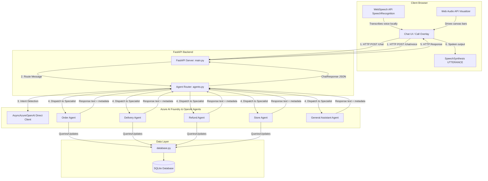

# Sainsbury's AI Assistant – Project Architecture & Team Review Guide

This guide details the system architecture, core working flows, and a 4-part work division plan to help your team present the project successfully in your review.

---

## 1. System Architecture

The project is built on a decoupled Client-Server architecture utilizing a **Multi-Agent Orchestration Framework** connected to a mock retail database.

### Architectural Diagram (Data & Control Flow)



---

## 2. Core Working of the Chatbot (Text Path)

The chatbot enables users to interact textually with a multi-agent system mimicking a retail customer service department.

```
[User Types Message] ──> [FastAPI POST /chat] ──> [AgentRouter Classifies Intent]
                                                                │
   ┌───────────────────┬───────────────────┬────────────────────┼───────────────────┐
   ▼                   ▼                   ▼                    ▼                   ▼
[Order Agent]      [Delivery Agent]    [Refund Agent]       [Store Agent]       [General Agent]
   │                   │                   │                    │                   │
   └───────────────────┴───────────────────┴─────────┬──────────┴───────────────────┘
                                                     ▼
                                          [Queries SQLite DB]
                                                     │
                                                     ▼
                                     [Returns JSON ChatResponse]
```

### Detailed Execution Steps:
1. **User Request**: The user enters a query (e.g. *"where is my order"*) into the chat field. The message is packaged into a JSON payload with the conversation history and sent via a `POST /chat` request to the backend.
2. **Intent Classification**: The `AgentRouter` receives the message. It executes a quick LLM classification pass to determine the **Intent** (e.g., `delivery`, `store`, `order`, `general`).
3. **Specialist Dispatch**: Once the domain is resolved, the router dispatches the conversation history and query to the dedicated specialist agent (e.g., the *Delivery Agent*).
4. **Data Retrieval & Tool Execution**: The specialist agent queries the local **SQLite database** using predefined Python tools to pull customer details, order statuses, delivery slots, or refund records.
5. **Response Generation**: The specialist agent returns the retrieved data and compiles a natural text response, including suggestions (chips) and markdown formatting.
6. **Client Render**: The backend returns the `ChatResponse` JSON. The frontend appends it to the chat screen and updates the dynamic customer sidebar (updating Nectar points and recent orders).

---

## 3. Core Working of the AI Calling (Voice Path)

The AI Calling feature utilizes a **direct browser-native voice pipeline** optimized for sub-2 second response latency, bypassing slow telephony networks and heavy server-side speech processing.

```
[Start Call] ──> [Native TTS Greeting] ──> [Browser SpeechRecognition (STT)]
                                                         │
                                                         ▼ (1.0s Silence Threshold)
[Instant Speech Playback (Native TTS)] <── [POST /chat/voice (Fast Path Routing)]
```

### Detailed Execution Steps:
1. **Initiation**: The user clicks **📞 Start Call**. The app instantly opens the overlay and reads a friendly greeting (*"Hello [Name], how can I help you today?"*) using the browser's native speech synthesis engine.
2. **Local Speech-to-Text (STT)**: The browser initializes the WebSpeech `SpeechRecognition` API. As the user talks, their microphone input is transcribed **locally in real-time** inside the browser. A Web Audio API analyzer measures input amplitude to animate the visualizer wave bars.
3. **Silence Detection (Turn-Taking)**: A timer listens for pauses in speaking. When the user stops speaking for exactly **1.0 second** (`PHONE_SILENCE_DURATION = 1000`), the turn is automatically submitted.
4. **Dedicated Fast-Path Routing (`/chat/voice`)**: The transcript is posted to `/chat/voice`. The backend bypasses the slow LLM intent classification pass completely, using rapid **regex keyword mapping** (e.g., mapping *"deliver"* or *"slot"* directly to the `delivery` agent) in **under 5ms**.
5. **Ultra-Fast LLM Voice Completions**: The backend router forwards the request to the agent using `AsyncAzureOpenAI` initialized directly via API keys (bypassing slow Entra ID token handshakes, shaving off 1.5s). The agent system prompt enforces strict rules:
   - Must be **1-2 short sentences** (under 25 words).
   - No lists, markdown, or headers.
   - **MUST always end with a friendly follow-up question** to mimic natural human speech (e.g. *"Is there anything else I can check?"*).
6. **Zero-Latency Text-to-Speech (TTS)**: The backend returns the text response. The browser bypasses the slow backend voice synthesis endpoint and immediately plays the reply using browser-native `window.speechSynthesis` with **0ms retrieval latency**.
7. **Listening Loop**: Once the speech synthesis ends, the `SpeechSynthesisUtterance.onend` handler automatically triggers `startListeningForCall()`, resetting the silence timer and restarting local speech recognition.

---

## 4. Team Work Division (4 Members)

To make your team review structured and show clean boundaries, you can divide the project into the following 4 roles:

### Member 1: Frontend UI/UX & Voice Engineer
* **Focus**: Client interface, Web APIs, and client-side state machine.
* **Core Responsibilities**:
  - Developed the chat visual panel and call overlay styles.
  - Implemented the WebSpeech `SpeechRecognition` pipeline for local Speech-To-Text.
  - Developed the Web Audio API analyzer to drive the voice visualizer canvas bars from active microphone levels.
  - Integrated the native browser `SpeechSynthesis` API with custom voice selection fallback.
  - Managed the phone states (`LISTENING`, `PROCESSING`, `SPEAKING`).

### Member 2: API Gateway & Integration Engineer
* **Focus**: FastAPI application, routing, and data synchronization.
* **Core Responsibilities**:
  - Maintained the FastAPI server framework (`main.py`).
  - Created JSON schemas (`ChatRequest`, `ChatResponse`) for robust API handshakes.
  - Implemented the `/chat` and `/chat/voice` HTTP post endpoints.
  - Configured CORS policies to support developer local testing.
  - Developed asynchronous routes and integrated system logging for request timings.

### Member 3: Agentic Orchestration & Prompt Engineer
* **Focus**: Agent routing, LLM connections, and persona prompts.
* **Core Responsibilities**:
  - Configured the multi-agent router (`AgentRouter` in [agents.py](file:///c:/Projects/retail-chatbot/backend/agents.py)) that coordinates specialist agents.
  - Integrated the key-based `AsyncAzureOpenAI` client connection to bypass Entra ID token retrieval handshakes.
  - Configured LLM instructions and boundaries for specialized agents (Order, Delivery, Refund, Store).
  - Designed the strict `voice_system_prompt` to constrain response length (1-2 sentences) and enforce conversational follow-up questions.

### Member 4: Database & Agent Tool Developer
* **Focus**: SQLite schema, query tools, and mock data.
* **Core Responsibilities**:
  - Managed the SQLite database schema and inventory tables.
  - Created utility files (`database.py`) to query customer profiles, loyalty points, order history, and store locations.
  - Developed Python tool helper functions executed by agentic assistants to fetch live data.
  - Populated the mock customer tables with sample parameters (e.g. loyalty points, delivery addresses).
